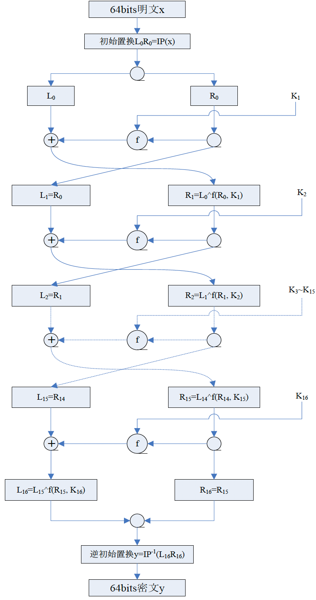
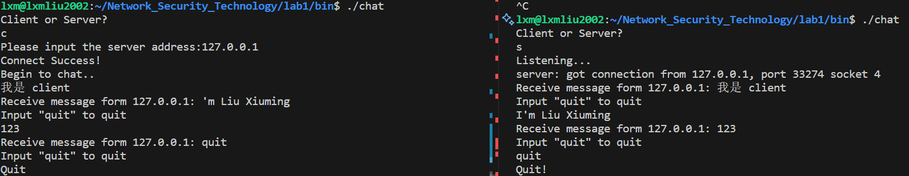
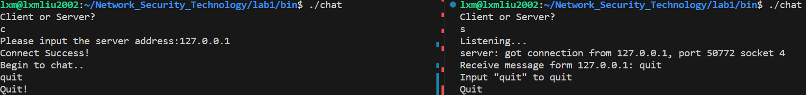
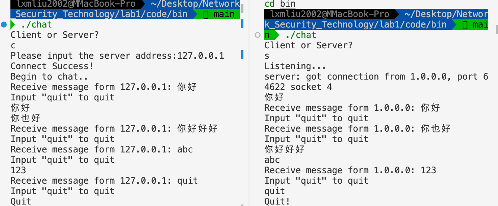

# <center>**网络安全技术实验报告**</center>

## <center>**Lab1** 基于 DES 加密的 TCP 聊天程序</center>

## <center> **网络空间安全学院 信息安全专业**</center>

## <center> **2112492 刘修铭 1027**</center>

# 一、实验要求

实现基于 DES 加密的 TCP 聊天程序，将“实验报告、源代码、可执行程序”打包后上传，并以自己的“学号-姓名”命名。


# 二、实验目标 

1. 在了解 DES 算法原理的基础上，编程实现对字符串的 DES 加密、解密操作
2. 在了解 TCP 和 Linux 平台下的 Socket 运行原理的基础上，编程实现简单的 TCP 通信
3. 将上述两部分结合到一起，编程实现通信内容事先通过 DES 加密的 TCP 聊天程序，要求双方事先互通密钥，在发送方通过该密钥加密，然后由接收方解密，保证在网络上传输的信息的保密性


# 三、实验内容

1. 实现 DES 加解密算法
2. 实现基于 TCP 协议的一个简易聊天室
3. 将二者结合，聊天室发送的内容需经过 DES 加密


# 四、实验步骤

## （一）DES 加解密算法实现

DES 明文分组长度为 64bit（不足 64 bit 的部分用 0 补齐），密文分组长度也是 64bit。加密过程要经过 16 圈迭代。初始密钥长度为 64 bit，但其中有 8 bit 奇偶校验位，因此有效密钥长度是 56 bit，子密钥生成算法产生 16 个 48 bit 的子密钥，在 16 圈迭代中使用。解密与加密采用相同的算法，并且所使用的密钥也相同，只是各个子密钥的使用顺序不同。

DES 算法包括初始置换 $IP$、逆初始置换 $IP^{-1}$、16 轮迭代以及子密钥生成。



### 1. 相关静态数组

在 DES.hpp 文件中，首先定义了 DES 加解密需要用到的一些静态数组，如初始置换、逆置换、置换 P 盒、扩展 S 盒等。

此部分数值与实验手册完全相同，为了避免报告冗长，此处不作展示。

### 2. DES 类的定义

编程实现中，封装了 CDesOperate 类用于进行 DES 操作，各个成员的信息均在代码中写出。

```c++
/**
 * @brief DES加密解密操作类
 */
class CDesOperate
{
private:
    ULONG32 m_arrOutKey[16][2]; /**< 存储16轮加密解密的子密钥 */
    ULONG32 m_arrBufKey[2];     /**< 存储加密解密操作的密钥 */

    /**
     * @brief 处理数据
     * @param left 左半部分数据
     * @param choice 选择参数
     * @return 处理结果
     */
    INT32 HandleData(ULONG32 *left, ULONG8 choice);

    /**
     * @brief 生成数据
     * @param left 左半部分数据
     * @param right 右半部分数据
     * @param number 轮数
     * @return 生成结果
     */
    INT32 MakeData(ULONG32 *left, ULONG32 *right, ULONG32 number);

    /**
     * @brief 生成密钥
     * @param keyleft 密钥左半部分
     * @param keyright 密钥右半部分
     * @param number 轮数
     * @return 生成结果
     */
    INT32 MakeKey(ULONG32 *keyleft, ULONG32 *keyright, ULONG32 number);

    /**
     * @brief 生成初始密钥
     * @param keyP 密钥
     * @return 生成结果
     */
    INT32 MakeFirstKey(ULONG32 *keyP);

public:
    /**
     * @brief 构造函数
     */
    CDesOperate();

    /**
     * @brief 析构函数
     */
    ~CDesOperate();

    /**
     * @brief DES加密
     * @param pPlaintext 明文数据
     * @param nPlaintextLength 明文长度
     * @param pCipherBuffer 密文缓冲区
     * @param nCipherBufferLength 密文缓冲区长度
     * @param pKey 密钥
     * @param nKeyLength 密钥长度
     * @return 加密结果
     */
    INT32 Encry(char *pPlaintext, int nPlaintextLength,
                char *pCipherBuffer, int &nCipherBufferLength, char *pKey, int nKeyLength);

    /**
     * @brief DES解密
     * @param pCipher 密文数据
     * @param nCipherBufferLength 密文长度
     * @param pPlaintextBuffer 明文缓冲区
     * @param nPlaintextBufferLength 明文缓冲区长度
     * @param pKey 密钥
     * @param nKeyLength 密钥长度
     * @return 解密结果
     */
    INT32 Decry(char *pCipher, int nCipherBufferLength,
                char *pPlaintextBuffer, int &nPlaintextBufferLength, char *pKey, int nKeyLength);
};
```

### 3. MakeData 函数

`MakeDate` 函数实现了 DES 算法中 16 轮加密或解密迭代中的每一轮的操作，除了初始置换和逆初始置换。

首先，函数根据预定义的扩展置换表 `des_E` 将右半部分数据 `right` 进行扩展置换，得到一个 48 位的数据 `exdes_P`。接着，将这个 48 位的数据与轮密钥 `m_arrOutKey[number]` 进行异或操作，得到一个结果。然后，将这个结果分割为 8 个 6 位的数据，并通过预定义的 S 盒进行替换操作，得到新的 6 位数据。这些 6 位数据再合并成一个 32 位的数据，并通过最终置换表 `des_P` 进行置换，得到最终的右半部分数据 `right`。接着，将右半部分数据 `right` 与左半部分数据 `left` 进行异或操作，并将原右半部分数据赋给左半部分数据，完成这一轮的数据处理。最后返回处理结果。

```c++
/**
 * @brief 生成数据：16 轮加密或解密迭代中的每一轮除去初始置换和逆初始置换的中间操作
 * @param left 左半部分数据
 * @param right 右半部分数据
 * @param number 轮数
 * @return 生成结果
 */
INT32 CDesOperate::MakeData(ULONG32 *left, ULONG32 *right, ULONG32 number)
{
    ULONG32 exdes_P[2] = {0};
    ULONG8 rexpbuf[8] = {0};
    ULONG32 oldright = *right;

    int j = 0;

    for (j = 0; j < 48; j++)
    {
        if (j < 24)
        {
            if (*right & pc_by_bit[des_E[j] - 1])
            {
                exdes_P[0] |= pc_by_bit[j];
            }
        }
        else
        {
            if (*right & pc_by_bit[des_E[j] - 1])
            {
                exdes_P[1] |= pc_by_bit[j - 24];
            }
        }
    }
    for (j = 0; j < 2; j++)
    {
        exdes_P[j] ^= m_arrOutKey[number][j];
    }

    exdes_P[1] >>= 8;
    rexpbuf[7] = (ULONG8)(exdes_P[1] & 0x0000003fL);
    exdes_P[1] >>= 6;
    rexpbuf[6] = (ULONG8)(exdes_P[1] & 0x0000003fL);
    exdes_P[1] >>= 6;
    rexpbuf[5] = (ULONG8)(exdes_P[1] & 0x0000003fL);
    exdes_P[1] >>= 6;
    rexpbuf[4] = (ULONG8)(exdes_P[1] & 0x0000003fL);
    exdes_P[0] >>= 8;
    rexpbuf[3] = (ULONG8)(exdes_P[0] & 0x0000003fL);
    exdes_P[0] >>= 6;
    rexpbuf[2] = (ULONG8)(exdes_P[0] & 0x0000003fL);
    exdes_P[0] >>= 6;
    rexpbuf[1] = (ULONG8)(exdes_P[0] & 0x0000003fL);
    exdes_P[0] >>= 6;
    rexpbuf[0] = (ULONG8)(exdes_P[0] & 0x0000003fL);
    exdes_P[0] = 0;
    exdes_P[1] = 0;

    *right = 0;
    for (j = 0; j < 7; j++)
    {
        *right |= des_S[j][rexpbuf[j]];
        *right <<= 4;
    }
    *right |= des_S[j][rexpbuf[j]];

    ULONG32 datatmp = 0;
    for (j = 0; j < 32; j++)
    {
        if (*right & pc_by_bit[des_P[j] - 1])
        {
            datatmp |= pc_by_bit[j];
        }
    }
    *right = datatmp;

    *right ^= *left;
    *left = oldright;

    return SUCCESS;
}
```

### 4. HandleData 函数

`HandleData` 函数接受左半部分数据 `left` 和一个选择参数 `choice`，然后执行一次完整的加密或解密操作。

首先，函数将左半部分数据 `left` 的值赋给指针 `right` 所指向的右半部分数据。然后通过一系列位操作和数据交换，根据具体的选择参数，调用 `MakeDate` 函数执行加密或解密的相关操作，包括使用不同的轮密钥进行数据处理，并在处理过程中，根据预定义的置换表将数据进行置换。最后，再次进行数据交换，并将结果返回。

这个函数实现了根据 choice 参数进行加密或解密操作，具有较好的代码重用性。而这个操作也得益于 DES 的算法。解密流程与加密流程基本一致，仍为先进行初始置换，中间 16 轮利用 16 个密钥迭代加密，最后再进行逆置换。唯一不同的地方就是生成的 16 个密钥的使用顺序，二者真好相反。故而在解密时，只需要倒序遍历密钥即可。

```c++
/**
 * @brief 处理数据：执行一次完整的加密或解密操作
 * @param left 左半部分数据
 * @param choice 选择参数
 * @return 处理结果
 */
INT32 CDesOperate::HandleData(ULONG32 *left, ULONG8 choice)
{
    INT32 number = 0;
    ULONG32 *right = &left[1];
    ULONG32 tmp = 0;
    ULONG32 tmpbuf[2] = {0};
    for (int j = 0; j < 64; j++)
    {
        if (j < 32)
        {
            if (pc_first[j] > 32)
            {
                if (*right & pc_by_bit[pc_first[j] - 1])
                {
                    tmpbuf[0] |= pc_by_bit[j];
                }
            }
            else
            {
                if (*left & pc_by_bit[pc_first[j] - 1])
                {
                    tmpbuf[0] |= pc_by_bit[j];
                }
            }
        }
        else
        {
            if (pc_first[j] > 32)
            {
                if (*right & pc_by_bit[pc_first[j] - 1])
                {
                    tmpbuf[1] |= pc_by_bit[j - 32];
                }
            }
            else
            {
                if (*left & pc_by_bit[pc_first[j] - 1])
                {
                    tmpbuf[1] |= pc_by_bit[j - 32];
                }
            }
        }
    }
    *left = tmpbuf[0];
    *right = tmpbuf[1];
    tmpbuf[0] = 0;
    tmpbuf[1] = 0;
    switch (choice)
    {
    case 0:
        // num 代表轮数，用于选择轮密钥
        // 加密时 0 -> 15
        for (int num = 0; num < 16; num++)
        {
            MakeData(left, right, (ULONG32)num);
        }
        break;
    case 1:
        // 解密时 15 -> 0
        for (int num = 15; num >= 0; num--)
        {
            MakeData(left, right, (ULONG32)num);
        }
        break;
    default:
        break;
    }
    INT32 temp;
    temp = *left;
    *left = *right;
    *right = temp;

    for (int j = 0; j < 64; j++)
    {
        if (j < 32)
        {
            if (pc_last[j] > 32)
            {
                if (*right & pc_by_bit[pc_last[j] - 1])
                {
                    tmpbuf[0] |= pc_by_bit[j];
                }
            }
            else
            {
                if (*left & pc_by_bit[pc_last[j] - 1])
                {
                    tmpbuf[0] |= pc_by_bit[j];
                }
            }
        }
        else
        {
            if (pc_last[j] > 32)
            {
                if (*right & pc_by_bit[pc_last[j] - 1])
                {
                    tmpbuf[1] |= pc_by_bit[j];
                }
            }
            else
            {
                if (*left & pc_by_bit[pc_last[j] - 1])
                {
                    tmpbuf[1] |= pc_by_bit[j];
                }
            }
        }
    }
    *left = tmpbuf[0];
    *right = tmpbuf[1];

    return SUCCESS;
}
```

### 5. **MakeKey** 函数 

`MakeKey` 函数实现了 DES 算法中生成 16 个子密钥的过程。函数接受初始密钥的左半部分 `keyleft`、右半部分 `keyright`，以及当前轮数 `number`，然后生成相应的子密钥。

首先，函数初始化了一个临时的 32 位数组 `tmpkey`，用于存储生成的子密钥。然后根据预定义的左移位数表 `lefttable`，将密钥左右半部分进行左移操作，并根据不同的轮数确定左移的位数。接着，根据预定义的 `keychoose` 表，将左右半部分的数据进行置换和合并，生成最终的子密钥。生成的子密钥存储在 `m_arrOutKey` 数组中，根据当前轮数 `number` 定位存储位置。最后返回生成结果。

```c++
/**
 * @brief 生成密钥：生成 16 个子密钥
 * @param keyleft 密钥左半部分
 * @param keyright 密钥右半部分
 * @param number 轮数
 * @return 生成结果
 */
INT32 CDesOperate::MakeKey(ULONG32 *keyleft, ULONG32 *keyright, ULONG32 number)
{
    ULONG32 tmpkey[2] = {0};
    ULONG32 *Ptmpkey = (ULONG32 *)tmpkey;
    ULONG32 *Poutkey = (ULONG32 *)&m_arrOutKey[number];
    ULONG32 leftandtab[3] = {0x0, 0x80000000, 0xc0000000};
    memset((ULONG8 *)tmpkey, 0, sizeof(tmpkey));
    Ptmpkey[0] = *keyleft & leftandtab[lefttable[number]];
    Ptmpkey[1] = *keyright & leftandtab[lefttable[number]];
    if (lefttable[number] == 1)
    {
        Ptmpkey[0] >>= 27;
        Ptmpkey[1] >>= 27;
    }
    else
    {
        Ptmpkey[0] >>= 26;
        Ptmpkey[1] >>= 26;
    }
    Ptmpkey[0] &= 0xfffffff0;
    Ptmpkey[1] &= 0xfffffff0;
    *keyleft <<= lefttable[number];
    *keyright <<= lefttable[number];
    *keyleft |= Ptmpkey[0];
    *keyright |= Ptmpkey[1];
    Ptmpkey[0] = 0;
    Ptmpkey[1] = 0;
    for (int j = 0; j < 48; j++)
    {
        if (j < 24)
        {
            if (*keyleft & pc_by_bit[keychoose[j] - 1])
            {
                Poutkey[0] |= pc_by_bit[j];
            }
        }
        else
        {
            /*j>=24*/
            if (*keyright & pc_by_bit[(keychoose[j] - 28)])
            {
                Poutkey[1] |= pc_by_bit[j - 24];
            }
        }
    }
    return SUCCESS;
}
```

### 6. MakeFirstKey 函数

`MakeFirstKey` 函数用于生成 DES 算法的初始密钥。该函数接受一个 64 位的密钥 `keyP`，并生成符合 DES 算法要求的初始密钥，最后调用 `MakeKey` 函数生成 DES 加密需要的所有密钥。

首先，函数定义了一个临时的 64 位数组 `tempKey` 和一个存储初始密钥的 64 位数组 `m_arrBufKey`。然后，将输入的密钥 `keyP` 复制到临时数组 `tempKey` 中。接下来，通过循环遍历密钥左右两部分的置换表 `keyleft` 和 `keyright`，将临时密钥 `tempKey` 中的相应位数按照置换表中的位置，放置到初始密钥数组 `m_arrBufKey` 中，以生成初始密钥。通过调用 `MakeKey` 函数，利用生成的初始密钥生成 16 个子密钥。最终返回生成结果。

```c++
/**
 * @brief 生成初始密钥
 * @param keyP 密钥
 * @return 生成结果
 */
INT32 CDesOperate::MakeFirstKey(ULONG32 *keyP)
{
    ULONG32 tempKey[2] = {0};
    ULONG32 *pFirstKey = (ULONG32 *)m_arrBufKey;
    ULONG32 *pTempKey = (ULONG32 *)tempKey;
    memcpy((ULONG8 *)&tempKey, (ULONG8 *)keyP, 8);
    for (int j = 0; j < 28; j++)
    {
        if (keyleft[j] > 32)
        {
            if (pTempKey[1] & pc_by_bit[keyleft[j] - 1])
            {
                pFirstKey[0] |= pc_by_bit[j];
            }
        }
        else
        {
            if (pTempKey[0] & pc_by_bit[keyleft[j] - 1])
            {
                pFirstKey[0] |= pc_by_bit[j];
            }
        }
        if (keyright[j] > 32)
        {
            if (pTempKey[1] & pc_by_bit[keyright[j] - 1])
            {
                pFirstKey[1] |= pc_by_bit[j];
            }
        }
        else
        {
            if (pTempKey[0] & pc_by_bit[keyright[j] - 1])
            {
                pFirstKey[1] |= pc_by_bit[j];
            }
        }
    }
    for (int j = 0; j < 16; j++)
    {
        MakeKey(&pFirstKey[0], &pFirstKey[1], j);
    }
    return SUCCESS;
}
```

### 7. Encry 函数

`Encry` 函数实现了 DES 算法的加密过程。函数接受明文数据 `pPlaintext`、明文长度 `nPlaintextLength`、密文缓冲区 `pCipherBuffer`、密文缓冲区长度 `nCipherBufferLength`、密钥 `pKey` 以及密钥长度 `nKeyLength`。

首先，函数检查密钥长度是否为8字节，若不是则返回加密失败。然后调用 `MakeFirstKey` 函数生成加密需要的所有密钥。接下来计算出将明文数据按照 DES 算法处理后所需的密文缓冲区长度，并进行相应的缓冲区长度检查和初始化。将明文数据按照 8 字节为一组转换为 64 位的数据块，并利用 `HandleData` 函数执行 DES 算法中的数据处理，即加密操作。处理后的密文数据存储在 `pCipherBuffer` 中。最后，释放可能分配的临时缓冲区，并返回加密结果。

```c++
/**
 * @brief DES 加密
 * @param pPlaintext 明文数据
 * @param nPlaintextLength 明文长度
 * @param pCipherBuffer 密文缓冲区
 * @param nCipherBufferLength 密文缓冲区长度
 * @param pKey 密钥
 * @param nKeyLength 密钥长度
 * @return 加密结果
 */
INT32 CDesOperate::Encry(char *pPlaintext, int nPlaintextLength, char *pCipherBuffer, int &nCipherBufferLength, char *pKey, int nKeyLength)
{
    if (nKeyLength != 8)
    {
        return 0;
    }
    MakeFirstKey((ULONG32 *)pKey);

    int nLenthofLong = ((nPlaintextLength + 7) / 8) * 2;
    if (nCipherBufferLength < nLenthofLong * 4)
    {
        nCipherBufferLength = nLenthofLong * 4;
    }
    memset(pCipherBuffer, 0, nCipherBufferLength);
    ULONG32 *pOutPutSpace = (ULONG32 *)pCipherBuffer;
    ULONG32 *pSource;
    if (nPlaintextLength != sizeof(ULONG32) * nLenthofLong)
    {
        pSource = new ULONG32[nLenthofLong];
        memset(pSource, 0, sizeof(ULONG32) * nLenthofLong);
        memcpy(pSource, pPlaintext, nPlaintextLength);
    }
    else
    {
        pSource = (ULONG32 *)pPlaintext;
    }

    ULONG32 gp_msg[2] = {0, 0};
    for (int i = 0; i < (nLenthofLong / 2); i++)
    {
        gp_msg[0] = pSource[2 * i];
        gp_msg[1] = pSource[2 * i + 1];
        HandleData(gp_msg, (ULONG8)0);
        pOutPutSpace[2 * i] = gp_msg[0];
        pOutPutSpace[2 * i + 1] = gp_msg[1];
    }
    if (pPlaintext != (char *)pSource)
    {
        delete[] pSource;
    }

    return SUCCESS;
}
```

### 8. Decry 函数

`Decry` 函数实现了 DES 算法的解密过程。函数接受密文数据 `pCipher`、密文长度 `nCipherBufferLength`、明文缓冲区 `pPlaintextBuffer`、明文缓冲区长度 `nPlaintextBufferLength`、密钥 `pKey` 以及密钥长度 `nKeyLength`。

首先，函数检查密钥长度是否为 8 字节，若不是则返回解密失败。然后，调用 `MakeFirstKey` 函数生成初始密钥。接下来，初始化明文缓冲区，并将密文数据按照 8 字节为一组转换为 64 位的数据块。然后利用 `HandleData` 函数执行 DES 算法中的数据处理，即解密操作。解密后的明文数据存储在 `pPlaintextBuffer` 中。最后返回解密结果。

与加密函数不同的是，解密函数在调用 `HandleData` 函数时，需将 `choice` 参数设置为 `1` 表示用于解密。

```c++
/**
 * @brief DES 解密
 * @param pCipher 密文数据
 * @param nCipherBufferLength 密文长度
 * @param pPlaintextBuffer 明文缓冲区
 * @param nPlaintextBufferLength 明文缓冲区长度
 * @param pKey 密钥
 * @param nKeyLength 密钥长度
 * @return 解密结果
 */
INT32 CDesOperate::Decry(char *pCipher, int nCipherBufferLength, char *pPlaintextBuffer, int &nPlaintextBufferLength, char *pKey, int nKeyLength)
{
    if (nKeyLength != 8)
    {
        return 0;
    }
    MakeFirstKey((ULONG32 *)pKey);

    memset(pPlaintextBuffer, 0, nPlaintextBufferLength);

    ULONG32 *pOutPutSpace = (ULONG32 *)pPlaintextBuffer;
    ULONG32 *pSource = (ULONG32 *)pCipher;

    ULONG32 gp_msg[2] = {0, 0};
    for (int i = 0; i < (nCipherBufferLength / 8); i++)
    {
        gp_msg[0] = pSource[2 * i];
        gp_msg[1] = pSource[2 * i + 1];
        HandleData(gp_msg, (ULONG8)1);
        pOutPutSpace[2 * i] = gp_msg[0];
        pOutPutSpace[2 * i + 1] = gp_msg[1];
    }

    return SUCCESS;
}
```


## （二）基于 TCP 协议的聊天室实现

本人上学期已经修读过<u>***计算机网络***</u>课程，故而对于 Socket 编程掌握度较好，此部分编程实现的难度相对较小，直接调用相关 Socket 编程函数即可。

需要注意的是，本次实验要求使用 TCP 协议完成，故而需选择**<u>*流式套接字（SOCK_STREAM）*</u>**。

下面简要介绍一下该部分的编程实现。

1. 根据实验手册说明，首先创建几个全局变量，用于控制 BufferSize 与存储原文、密文等。

   ```c++
   #define BUFFERSIZE 64
   char strSocketBuffer[BUFFERSIZE];
   char strDecryBuffer[BUFFERSIZE];
   char strStdinBuffer[BUFFERSIZE];
   char strEncryBuffer[BUFFERSIZE];
   ```

2. 接着编写了一个函数用于接收指定长度的数据，用于后续的消息接收。

   ```c++
   /**
    * @brief 接收指定长度的数据
    * 
    * @param s 套接字描述符
    * @param buf 接收数据的缓冲区指针
    * @param len 接收数据的长度
    * @param flags 接收数据的标志位
    * @return ssize_t 成功接收的数据长度，如果出错则返回-1
    */
   ssize_t TotalRecv(int s, void *buf, size_t len, int flags)
   {
       size_t nCurSize = 0;
       while (nCurSize < len)
       {
           ssize_t nRes = recv(s, ((char *)buf) + nCurSize, len - nCurSize, flags);
           if (nRes < 0 || nRes + nCurSize > len)
           {
               return -1;
           }
           nCurSize += nRes;
       }
       return nCurSize;
   }
   ```

3. 按照实验手册说明编写了 SecretChat 函数，用于实现两个参与者的秘密通信。此函数中调用了前面编写的 `DES` 加解密函数对通信的信息进行加解密。

   ```c++
   /**
    * @brief 实现两个参与方之间的秘密聊天，通过网络连接进行通信
    * 
    * @param nSock 网络连接的套接字描述符
    * @param pRemoteName 远程参与方的名称
    * @param pKey 用于安全通信的加密密钥
    */
   void SecretChat(int nSock, char *pRemoteName, char *pKey)
   {
       CDesOperate cDes;
       if (strlen(pKey) != 8)
       {
           cout << "Key length error";
           exit(errno);
       }
       pid_t nPid;
       nPid = fork();
       if (nPid != 0)
       {
           while (true)
           {
               bzero(&strSocketBuffer, BUFFERSIZE);
               int nLength = 0;
               nLength = TotalRecv(nSock, strSocketBuffer, BUFFERSIZE, 0);
               if (nLength != BUFFERSIZE)
               {
                   break;
               }
               else
               {
                   int nLen = BUFFERSIZE;
                   cDes.Decry(strSocketBuffer, BUFFERSIZE, strDecryBuffer, nLen, pKey, 8);
                   strDecryBuffer[BUFFERSIZE - 1] = 0;
                   if (strDecryBuffer[0] != 0 && strDecryBuffer[0] != '\n')
                   {
                       cout << "Receive message form " << pRemoteName << ": " << strDecryBuffer;
                       cout << "Input \"quit\" to quit" << endl;
                       if (0 == memcmp("quit", strDecryBuffer, 4))
                       {
                           cout << "Quit" << endl;
                           return;
                       }
                   }
               }
           }
       }
       else
       {
           while (true)
           {
               bzero(&strStdinBuffer, BUFFERSIZE);
               while (strStdinBuffer[0] == 0)
               {
                   if (fgets(strStdinBuffer, BUFFERSIZE, stdin) == NULL)
                   {
                       continue;
                   }
               }
               int nLen = BUFFERSIZE;
               cDes.Encry(strStdinBuffer, BUFFERSIZE, strEncryBuffer, nLen, pKey, 8);
               if (send(nSock, strEncryBuffer, BUFFERSIZE, 0) != BUFFERSIZE)
               {
                   perror("Send");
               }
               else
               {
                   if (0 == memcmp("quit", strStdinBuffer, 4))
                   {
                       cout << "Quit!" << endl;
                       return;
                   }
               }
           }
       }
   }
   ```

4. 最后则是 `main` 函数，对 Socket 进行初始化设置，并根据用户的身份不同进行相关操作，同时完成了一些错误处理，方便用户进行调试。

   1. 首先进行模式输入

      ```c++
      char mode;
      cout << "Client or Server?" << endl;
      cin >> mode;
      ```

   2. 接着按照输入的模式不同进行不同的处理

      1. 如果是 `client`，则引导用户输入服务器的 IP 地址，与之进行连接，并调用 SecretChat 开始与之进行通信。

         ```c++
         if (mode == 'c')
         {
             std::cout << "Please input the server address:";
         
             char strIpAddr[16];
             cin >> strIpAddr;
         
             int nConnectSocket;
             if ((nConnectSocket = socket(AF_INET, SOCK_STREAM, 0)) == -1)
             {
                 perror("Socket");
                 exit(errno);
             }
         
             struct sockaddr_in sDestAddr;
             sDestAddr.sin_family = AF_INET;
             sDestAddr.sin_port = htons(8888);
             sDestAddr.sin_addr.s_addr = inet_addr(strIpAddr);
         
             if (connect(nConnectSocket, (struct sockaddr *)&sDestAddr, sizeof(struct sockaddr)) != 0)
             {
                 perror("Connect");
                 exit(errno);
             }
             else
             {
                 std::cout << "Connect Success!" << endl
                           << "Begin to chat.." << endl;
                 SecretChat(nConnectSocket, strIpAddr, pKey);
             }
             close(nConnectSocket);
         }
         ```

      2. 如果是 `server`，则进行套接字的绑定，并监听等待客户端连接。连接成功后则调用 SecretChat 函数进行秘密通信。

         >  套接字地址绑定时用到的 `INADDR_ANY` 是一个特殊的值，通常用于绑定套接字到所有可用的接口，而不仅仅是一个特定的IP地址，允许服务器在所有的网络接口上接收客户端的连接，而不仅仅是在一个特定的IP地址上。

         ```c++
         else if (mode == 's')
         {
             cout << "Listening..." << endl;
         
             int nListenSocket, nAcceptSocket;
             if ((nListenSocket = socket(AF_INET, SOCK_STREAM, 0)) == -1)
             {
                 perror("Socket");
                 exit(errno);
             }
         
             struct sockaddr_in sLocalAddr, sRemoteAddr;
             sLocalAddr.sin_family = AF_INET;
             sLocalAddr.sin_port = htons(8888);
             sLocalAddr.sin_addr.s_addr = INADDR_ANY;
         
             if (bind(nListenSocket, (struct sockaddr *)&sLocalAddr, sizeof(struct sockaddr)) == -1)
             {
                 perror("Bind");
                 exit(errno);
             }
             if (listen(nListenSocket, 5) == -1)
             {
                 perror("Listen");
                 exit(errno);
             }
         
             socklen_t nLength;
             nAcceptSocket = accept(nListenSocket, (struct sockaddr *)&sRemoteAddr, &nLength);
             close(nListenSocket);
         
             cout << "server: got connection from " << inet_ntoa(sRemoteAddr.sin_addr) << ", port ";
             cout << ntohs(sRemoteAddr.sin_port) << " socket " << nAcceptSocket << endl;
         
             SecretChat(nAcceptSocket, inet_ntoa(sRemoteAddr.sin_addr), pKey);
         
             close(nAcceptSocket);
         }
         ```

      3. 否则将输出错误信息，并提示重新进行模式选择

         ```c++
         else
         {
             cout << "Invalid mode! Please try again!" << endl;
             goto Chat;
         }
         ```


# 五、实验遇到的问题及其解决方法

## （一）编译工具 cmake 的使用

之前都是在本地 Windows 系统上进行简单的编程，涉及的文件数量有限，编译较为简单。

本学期开始，为了以后项目开发的需要，本人调整编程风格，向规范看齐，规范设置 include、src、build 等文件夹，同时借助 camke 跨平台编译工具，生成 makefile 文件，一键完成对项目的整体编译，免去复杂指令进行编译等问题。

> 为了验证 cmake 工具的完备性，本人除在 Ububtu 上进行验证外，还在 Mac 系统上进行了同步实验，测试结果见*<u>**六、实验结论**</u>*。


## （二）DES 算法的理解

上学期密码学简单了解过 DES 加解密算法，但未编程实现。这次需要吃透 DES 算法，并自己动手进行编程实现，有一定的挑战性。

本人在实验前通过查阅 CSDN、知乎、GitHub、bilibili 等网站，同时阅读实验参考手册，对 DES 进行了充分的了解，对于后续编程具有极大的帮助。


## （三）实验系统的部署

本人是第一次在 Linux 系统上进行 Socket 编程。但是突遭横祸，Ubuntu 虚拟机无法启动，重装也无济于事。在此情况下，果断改用 WSL，对多系统编程有一定帮助。


# 六、实验结论

本人进行了简单的聊天测试。如图，确定好客户端与服务器端的身份后，即可完成通信连接，即可进行双工通信。

本人测试了中文、英文及阿拉伯数字，客户端与服务器端均能够正常发送与接收。

按照聊天机制设定，输入 `quit`，可以看到成功退出聊天室。



另一方输入 `quit`，也可以结束聊天。



除 Ubuntu 外，本人也在 Mac 系统上进行了测试，结果如下，说明功能的完成性与完备性。



本次实验的完成，说明了本人对于 DES 加解密机制的掌握情况，也说明本人对于 Linux 系统上的 Socket 编程的正确性。


# 七、实验收获

经过本次实验，本人对于 DES 的加解密机制有了充分的了解，对于密码有了进一步的掌握。同时，对于 Linux 系统上的 Socket 编程等有了进一步掌握，有助于后续的实验开发。除此之外，还学习到了 cmake 跨平台编译工具，对于日后项目开发有较大帮助。


# 八、文件组织说明

本次实验使用 cmake 进行编译组织。在根目录下有一个 `report.pdf` 为本次实验的实验报告，另有一个文件夹 `code`，存放本次实验用到的所有代码。

*  `./code/Readme.md` 为编译及运行说明
* `./code/bin/chat` 为可执行文件，直接运行即可
* `./code/build` 文件夹为编译文件夹，存放编译用的代码，与 `CMakeLists.txt` 及 `Makefile` 配合使用
* `./code/include` 文件夹存放编写的 DES 算法代码
* `./code/src` 文件夹则为主要的 cpp 代码

```shell
.
├── code
│   ├── CMakeLists.txt
│   ├── Readme.md
│   ├── bin
│   │   └── chat
│   ├── build
│   ├── include
│   │   └── DES.hpp
│   └── src
│       ├── CMakeLists.txt
│       └── main.cpp
└── report.pdf
```


# 九、实验参考

本次实验除参考下发的实验文档外，还参考了如下教程：

[https://blog.csdn.net/weixin_61823031/article/details/123053269](https://blog.csdn.net/weixin_61823031/article/details/123053269)
[https://zhuanlan.zhihu.com/p/315795886](https://zhuanlan.zhihu.com/p/315795886)
[https://github.com/Drummerboy458/DES-](https://github.com/Drummerboy458/DES-)
[https://blog.csdn.net/baiye1203/article/details/110623598](https://blog.csdn.net/baiye1203/article/details/110623598)
[https://www.iteye.com/resource/lzq824912291-2491506](https://www.iteye.com/resource/lzq824912291-2491506)
[https://github.com/KuGmonkey/TCP_DES](https://github.com/KuGmonkey/TCP_DES)
[https://github.com/OREOo-o/Des-encryption-for-TCP-chat](https://github.com/OREOo-o/Des-encryption-for-TCP-chat)
[https://blog.51cto.com/u_15169172/4859590](https://blog.51cto.com/u_15169172/4859590)
