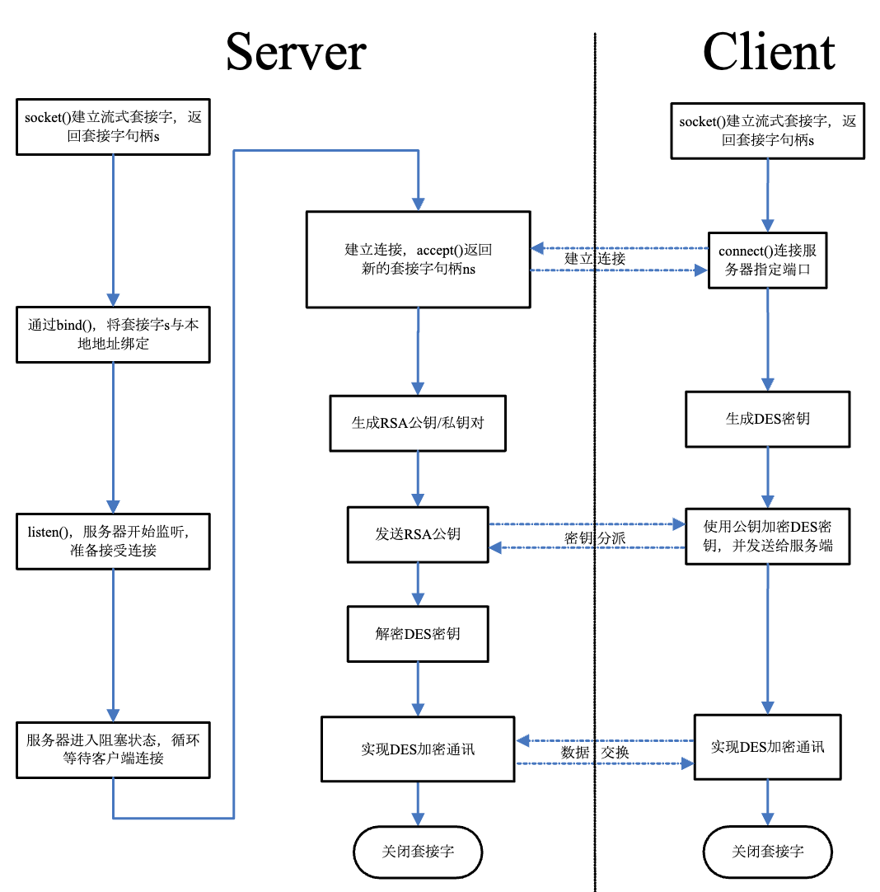
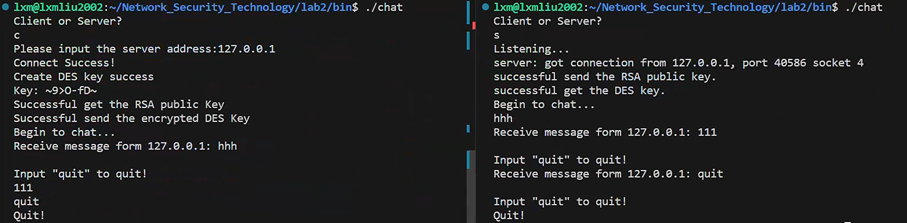
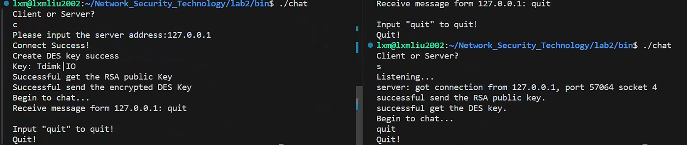
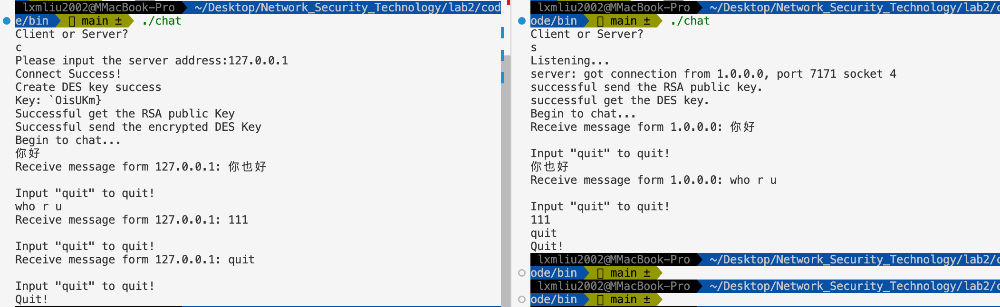

# <center>**网络安全技术实验报告**</center>

<center>Lab2 基于 RSA 算法自动分配密钥的加密聊天程序</center>

<center> 网络空间安全学院 信息安全专业</center>

<center> 2112492 刘修铭 1027</center>

## 实验要求

实现使用 RSA 算法自动分配密钥的聊天程序，将“实验报告、源代码、可执行程序”打包后上传，并以自己的“学号-姓名”命名。


## 实验目标 

1. 加深对 RSA 算法基本工作原理的理解。 
1. 掌握基于 RSA 算法的保密通信系统的基本设计方法。 
1. 掌握在 Linux 操作系统实现 RSA 算法的基本编程方法。 
1. 了解 Linux 操作系统异步 IO 接口的基本工作原理。


## 实验内容

本章训练要求读者在第三章“基于 DES 加密的 TCP 通信”的基础上进行二次开发，使原有的程序可以实现全自动生成 DES 密钥以及基于 RSA 算法的密钥分配。 

1. 要求在 Linux 操作系统中完成基于 RSA 算法的保密通信程序的编写。 
2. 程序必须包含 DES 密钥自动生成、RSA 密钥分配以及 DES 加密通讯三个部分。 
3. 要求程序实现全双工通信，并且加密过程对用户完全透明。 
4. 用能力的同学可以使用 select 模型或者异步 IO 模型对“基于 DES 加密的 TCP 通信”一章中 socket 通讯部分代码进行优化。


## 实验步骤

在客户端与服务器建立连接后，客户端首先生成一个随机的 DES 密钥，在第二章的程序里要求密钥长度为 64 位，所以使用长度为 8 的字符串充当密钥；同时，服务端生成一个随机的 RSA 公钥/私钥对，并将 RSA 公钥通过刚刚建立起来的 TCP 连接发送到客户端主机；客户端主机在收到该 RSA 公钥后，使用公钥加密自己生成的 DES 密钥，并将加密后的结果发送给服务器端；服务器端使用自己保留的私钥解密客户端发过来的 DES 密钥 ，最后双方使用该密钥进行保密通信。程序执行图如下：



### RSA 加解密算法实现

RSA 加密算法是一种典型的公钥加密算法。RSA 算法的可靠性建立在分解大整数的困难性上。假如找到一种 快速分解大整数算法的话，那么用 RSA 算法的安全性会极度下降。但是存在此类算法的可能性很小。目前只有使用短密钥进行加密的 RSA 加密结果才可能被穷举解破。只要其钥匙的长度足够长，用 RSA 加密的信息的安全性就可以保证。

RSA 密码体系使用了乘方运算。明文以分组为单位进行加密，每个分组的二进制值均小于 n，也就是说分组的大小必须小于或者等于 $\log_2 n $，在实际应用中，分组的大小是 k 位，则 $2^k<n<2^{k+1}$ 。

#### 数据结构

本次实验中，将 RSA 算法包装成了类 `cRsaSection`，同时定义了两个结构体，用于进行辅助。函数概述及各个成员的相关信息已在注释中给出。

> 其中 `CRandom` 类相较于实验手册作出一定改动，详情见 <u>**5.1 非静态成员引用必须与特定对象相对**</u>。

```c++
/**
 * @brief RSA 结构体
 *
 * 用于存储 RSA 算法中的公钥和模数
 */
struct PublicKey
{
    ULONG64 nE; /**< 公钥 */
    ULONG64 nN; /**< 模数 */
};

/**
 * @brief RSA 密钥结构体
 *
 * 该结构体用于存储 RSA 算法所需的密钥信息。
 */
struct RsaParam
{
    ULONG64 e;
    ULONG64 n;
    ULONG64 d;
    ULONG64 f;
    ULONG64 p;
    ULONG64 q;
    ULONG64 s;
};

// class CRandom
// {
// public:
//     CRandom()
//     {
//         srand((unsigned)time(NULL));
//     }
//     unsigned long Random(unsigned long n)
//     {
//         return rand() % n;
//     }
// };

/**
 * @class cRsaSection
 * @brief 表示 RSA 加密和解密操作的部分。
 *
 * `cRsaSection`类提供了生成 RSA 密钥、使用 RSA 算法加密和解密数据的功能。
 * 它还包括执行 RSA 加密和解密所需的数学运算的方法。
 */
class cRsaSection
{
public:
    RsaParam m_cParament;
    // CRandom m_cRadom;

    /**
     * @brief cRsaSection 构造函数。
     *
     * @return 无
     */
    cRsaSection();

    /**
     * @brief GetPublicKey函数返回一个PublicKey对象。
     *
     * @return PublicKey 包含nE和nN值的PublicKey对象。
     */
    PublicKey GetPublicKey();

    /**
     * @brief 计算两个数字的模 n 乘法。
     *
     * @param a 第一个数字
     * @param b 第二个数字
     * @param n 模值
     *
     * @return (a % n) * (b % n) % n 的结果
     */
    static ULONG64 MulMod(ULONG64 a, ULONG64 b, ULONG64 n);

    /**
     * @brief 使用 PowMod 算法计算 (base ^ pow) % n 的结果。
     *
     * @param base 基数
     * @param pow 幂
     * @param n 模数
     *
     * @return (base ^ pow) % n 的结果
     */
    static ULONG64 PowMod(ULONG64 base, ULONG64 pow, ULONG64 n);

    /**
     * @brief 对给定数字进行 Rabin-Miller 素性检测。
     *
     * @param n 要测试素性的数字的引用
     *
     * @return 如果数字可能是质数，则为 1，否则为 0
     */
    static long RabinMillerKnl(ULONG64 &n);

    /**
     * @brief 对给定数字进行 Rabin-Miller 素数测试。
     *
     * @param n 要测试素数性质的数字
     * @param loop 测试的迭代次数
     *
     * @return 如果数字绝对是合数，则返回 0，如果可能是质数，则返回 1
     */
    static long RabinMiller(ULONG64 &n, long loop);

    /**
     * @brief 生成指定位数的随机质数。
     *
     * @param bits 用于生成质数的位数
     *
     * @return 生成的随机质数
     */
    static ULONG64 RandomPrime(char bits);

    /**
     * @brief 使用欧几里德算法计算两个数的最大公约数(GCD)。
     *
     * @param p 第一个数的引用
     * @param q 第二个数的引用
     *
     * @return 两个数的最大公约数
     */
    static ULONG64 Gcd(ULONG64 &p, ULONG64 &q);

    /**
     * @brief 计算欧几里德算法以找到模乘逆。
     *
     * @param e 第一个参数
     * @param t_n 第二个参数
     *
     * @return 模乘逆
     */
    static ULONG64 Euclid(ULONG64 e, ULONG64 t_n);

    /**
     * @brief 使用 RSA 算法计算给定无符号短整数值的加密。
     *
     * @param nSorce 要加密的值
     * @param cKey 用于加密的公钥
     *
     * @return 加密后的值
     */
    static ULONG64 Encry(unsigned short nScore, PublicKey &cKey);

    /**
     * @brief 使用RSA加密解密算法对输入值进行解密。
     *
     * @param nSorce 要解密的值
     *
     * @return 解密后的值
     */
    unsigned short Decry(ULONG64 nScore);
};
```

#### 模乘运算和模幂运算

首先定义了两个计算函数，用于模乘和模幂运算。其中，模幂运算为了提高运行速度，保证数据不溢出，选用快速幂运算，使用位运算进行处理。

```c++
/**
 * @brief 计算两个数字的模 n 乘法。
 *
 * @param a 第一个数字
 * @param b 第二个数字
 * @param n 模值
 *
 * @return (a % n) * (b % n) % n 的结果
 */
inline ULONG64 cRsaSection::MulMod(ULONG64 a, ULONG64 b, ULONG64 n)
{
    return (a % n) * (b % n) % n;
}

/**
 * @brief 使用 PowMod 算法计算 (base ^ pow) % n 的结果。
 *
 * @param base 基数
 * @param pow 幂
 * @param n 模数
 *
 * @return (base ^ pow) % n 的结果
 */
ULONG64 cRsaSection::PowMod(ULONG64 base, ULONG64 pow, ULONG64 n)
{
    ULONG64 a = base, b = pow, c = 1;
    while (b)
    {
        while (!(b & 1))
        {
            b >>= 1;
            a = MulMod(a, a, n);
        }
        b--;
        c = MulMod(a, c, n);
    }
    return c;
}
```

#### 随机大素数的生成

随机生成的大素数的性质，某种情况下直接决定 RSA 算法的安全性。因此，一个性质好的大素数至关重要。此处定义了一个 `RandomPrime`，用于随机大素数的生成，并在其中调用 `RabinMiller` 函数进行素性检验。由于 Rabin-Miller 的检验方法为概率算法，一个奇合数有四分之一的概率通过检验，因此此处重复进行 30 次检验，全部通过时才认为其通过素性检验。本次实验中基于 Fermat 定理编写了素性检验函数。

```c++
/**
 * @brief 对给定数字进行 Rabin-Miller 素性检测。
 *
 * @param n 要测试素性的数字
 *
 * @return 如果数字可能是质数，则为 1，否则为 0
 */
long cRsaSection::RabinMillerKnl(ULONG64 &n)
{
    ULONG64 a, q, k, v;
    q = n - 1;
    k = 0;
    while (!(q & 1))
    {
        ++k;
        q >>= 1;
    }
    a = 2 + rand() % (n - 3);
    v = PowMod(a, q, n);
    if (v == 1)
    {
        return 1;
    }

    for (int j = 0; j < k; j++)
    {
        unsigned int z = 1;
        for (int w = 0; w < j; w++)
        {
            z *= 2;
        }
        if (PowMod(a, z * q, n) == n - 1)
        {
            return 1;
        }
    }
    return 0;
}

/**
 * @brief 对给定数字进行 Rabin-Miller 素数测试。
 *
 * @param n 要测试素数性质的数字
 * @param loop 测试的迭代次数
 *
 * @return 如果数字绝对是合数，则返回 0，如果可能是质数，则返回 1
 */
long cRsaSection::RabinMiller(ULONG64 &n, long loop = 100)
{
    for (long i = 0; i < loop; i++)
    {
        if (!RabinMillerKnl(n))
        {
            return 0;
        }
    }
    return 1;
}

/**
 * @brief 生成指定位数的随机质数。
 *
 * @param bits 用于生成质数的位数
 *
 * @return 生成的随机质数
 */
ULONG64 cRsaSection::RandomPrime(char bits)
{
    ULONG64 base;
    do
    {
        base = (unsigned long)1 << (bits - 1); // 保证最高位是 1
        base += rand() % (base);               // 再加上一个随机数
        base |= 1;                             // 保证最低位是 1,即保证是奇数
    } while (!RabinMiller(base, 30));          // 进行拉宾－米勒测试 30 次
    return base;                               // 全部通过认为是质数
}
```

#### 求取最大公约数

接着使用欧几里德算法，完成了对最大公约数的求取函数编写。

```c++
/**
 * @brief 使用欧几里德算法计算两个数的最大公约数(GCD)。
 *
 * @param p 第一个数的引用
 * @param q 第二个数的引用
 *
 * @return 两个数的最大公约数
 */
ULONG64 cRsaSection::Gcd(ULONG64 &p, ULONG64 &q)
{
    ULONG64 a = p > q ? p : q;
    ULONG64 b = p < q ? p : q;
    ULONG64 t;
    if (p == q)
    {
        return p; // 两数相等,最大公约数就是本身
    }
    else
    {
        while (b) // 辗转相除法,gcd(a,b)=gcd(b,a-qb)
        {
            a = a % b;
            t = a;
            a = b;
            b = t;
        }
        return a;
    }
}
```

#### 私钥生成

根据 RSA 算法定义，对于给定的公钥，需要生成对应的私钥用于解密。而私钥生成的过程，正是求取乘法逆元的过程。本次实验中，使用欧几里德算法进行乘法逆元的求取。

根据第三节介绍的基础知识，d 必须满足 $(d\times e-1)\%\phi(n)=0$ ，所以，已知 $e$ 和 $\phi(n)$ 求 $d$ 的过程等价于寻找二元方程 $e\times d-\phi(n)\times i=1$ 的最大整数解（$i$ 为另一未知量）。

```c++
/**
 * @brief 计算欧几里德算法以找到模乘逆。
 *
 * @param e 第一个参数
 * @param t_n 第二个参数
 *
 * @return 模乘逆
 */
ULONG64 cRsaSection::Euclid(ULONG64 e, ULONG64 t_n)
{
    ULONG64 Max = 0xffffffffffffffff - t_n;
    ULONG64 i = 1;

    while (1)
    {
        if (((i * t_n) + 1) % e == 0)
        {
            return ((i * t_n) + 1) / e;
        }
        i++;
        ULONG64 Tmp = (i + 1) * t_n;
        if (Tmp > Max)
        {
            return 0;
        }
    }
    return 0;
}
```

#### 密钥分配

##### 加密函数 Encry

`Encry` 函数是加密函数，使用公钥，通过模幂运算实现计算 $C = 𝑀^e\ mod\ n $ 的加密过程，由于公钥本身并不始终保存在类的成员变量里，所以加密函数设计为 static，并通过参数传递公钥。

```c++
/**
 * @brief 使用 RSA 算法计算给定无符号短整数值的加密。
 *
 * @param nSorce 要加密的值
 * @param cKey 用于加密的公钥
 *
 * @return 加密后的值
 */
ULONG64 cRsaSection::Encry(unsigned short nSorce, PublicKey &cKey)
{
    return PowMod(nSorce, cKey.nE, cKey.nN);
}
```

##### 解密函数 Decry

`Decry` 函数是解密函数，使用私钥，实现 $𝑀 = 𝐶^d\ 𝑚𝑜𝑑\ 𝑛$ 的计算。其中，私钥由保存在类成员变量中的结构实体 m_cParament 提供。 

```c++
/**
 * @brief 使用RSA加密解密算法对输入值进行解密。
 *
 * @param nSorce 要解密的值
 *
 * @return 解密后的值
 */
unsigned short cRsaSection::Decry(ULONG64 nSorce)
{
    ULONG64 nRes = PowMod(nSorce, m_cParament.d, m_cParament.n);
    unsigned short *pRes = (unsigned short *)&(nRes);
    if (pRes[1] != 0 || pRes[3] != 0 || pRes[2] != 0)
    { // error
        return 0;
    }
    else
    {
        return pRes[0];
    }
}
```

#### 公钥获取函数 GetPublicKey

`GetPublicKey` 函数用于算法公钥的获取，即提取 PublicKey 结构体中的数据。

> 加密函数的输入和解密函数输出为短整形变量，这是因为虽然理论上 RSA 可以加密，解密任意小于 n 的整数（n 为 64 位），但是在中间计算中仍可能生成大于 n 的临时变量。本程序为了简化编写并未使用专业大整数函数库，这就造成如果加密函数输入过大在进行乘法操作时溢出。故限制加密函数解密函数输入输出范围为短整形。

```c++
/**
 * @brief GetPublicKey函数返回一个PublicKey对象。
 *
 * @return PublicKey 包含nE和nN值的PublicKey对象。
 */
PublicKey cRsaSection::GetPublicKey()
{
    PublicKey cTmp;
    cTmp.nE = this->m_cParament.e;
    cTmp.nN = this->m_cParament.n;
    return cTmp;
}
```

#### 公私钥的生成函数 RsaGetParam

`RsaGetParam` 作为一个初始化函数，随机生成两个素数，用于 RSA 参数的初始化。

```c++
/**
 * @brief 生成公私钥
 *
 * @return RsaParam RSA 参数
 */
RsaParam RsaGetParam(void)
{
    RsaParam Rsa = {0};
    ULONG64 t;
    Rsa.p = cRsaSection::RandomPrime(16); // 随机生成两个素数
    Rsa.q = cRsaSection::RandomPrime(16);
    Rsa.n = Rsa.p * Rsa.q;
    Rsa.f = (Rsa.p - 1) * (Rsa.q - 1);
    do
    {
        Rsa.e = rand() % (65536);
        Rsa.e |= 1;
    } while (cRsaSection::Gcd(Rsa.e, Rsa.f) != 1);
    Rsa.d = cRsaSection::Euclid(Rsa.e, Rsa.f);
    Rsa.s = 0;
    t = Rsa.n >> 1;
    while (t)
    {
        Rsa.s++;
        t >>= 1;
    }
    return Rsa;
}
```

至此， RSA 算法的相关功能得以全部实现。


### DES 加解密算法实现

DES 算法部分与 Lab 1 中完全相同，未做任何改动，在此不再阐述，详情见附件 `Lab1 report.pdf`。


### 使用 Select 机制进行并行通信

为了提升程序效率，Linux 提供了 select 函数接口，用以同时管理若干个套接字或者句柄上的 IO 操作，通过该 API，程序可以同时监控多个 socket 或者句柄上的 IO 操作，进而可以免去开启多个进程的系统开销。

基于 Select 机制对 Lab1 中编写的 SecretChat 函数进行改写。对变量初始化之后，进行 while 循环监控 socket 和标准输入。在排除超时和出错的可能后，程序通过两个 if 分别判断套接字和标准输入上是否发生 IO 操作，如有发生，则调用 recv() 进行读取，并处理获得的数据。

```c++
/**
 * @brief 实现两个参与方之间的秘密聊天，通过网络连接进行通信
 *
 * @param nSock 网络连接的套接字描述符
 * @param pRemoteName 远程参与方的名称
 * @param pKey 用于安全通信的加密密钥
 */
void SecretChat(int nSock, char *pRemoteName, char *pKey)
{
    CDesOperate cDes;
    if (strlen(pKey) != 8)
    {
        cout << "Key length error";
        exit(errno);
    }

    fd_set cHandleSet;
    struct timeval tv;
    int nRet;
    while (1)
    {
        FD_ZERO(&cHandleSet);
        FD_SET(nSock, &cHandleSet);
        FD_SET(0, &cHandleSet);
        tv.tv_sec = 1;
        tv.tv_usec = 0;
        nRet = select(nSock > 0 ? nSock + 1 : 1, &cHandleSet, NULL, NULL, &tv);
        if (nRet < 0)
        {
            cout << "Select ERROR!" << endl;
            break;
        }
        if (0 == nRet)
        {
            continue;
        }
        if (FD_ISSET(nSock, &cHandleSet))
        {
            bzero(&strSocketBuffer, BUFFERSIZE);
            int nLength = 0;
            nLength = TotalRecv(nSock, strSocketBuffer, BUFFERSIZE, 0);
            if (nLength != BUFFERSIZE)
            {
                break;
            }
            else
            {
                int nLen = BUFFERSIZE;
                cDes.Decry(strSocketBuffer, BUFFERSIZE, strDecryBuffer, nLen, pKey, 8);
                strDecryBuffer[BUFFERSIZE - 1] = 0;
                if (strDecryBuffer[0] != 0 && strDecryBuffer[0] != '\n')
                {
                    cout << "Receive message form " << pRemoteName << ": " << strDecryBuffer << endl;
                    cout << "Input \"quit\" to quit!" << endl;
                    if (0 == memcmp("quit", strDecryBuffer, 4))
                    {
                        cout << "Quit!" << endl;
                        break;
                    }
                }
            }
        }
        if (FD_ISSET(0, &cHandleSet))
        {
            bzero(&strStdinBuffer, BUFFERSIZE);
            while (strStdinBuffer[0] == 0)
            {
                if (fgets(strStdinBuffer, BUFFERSIZE, stdin) == NULL)
                {
                    continue;
                }
            }
            int nLen = BUFFERSIZE;
            cDes.Encry(strStdinBuffer, BUFFERSIZE, strEncryBuffer, nLen, pKey, 8);
            if (send(nSock, strEncryBuffer, BUFFERSIZE, 0) != BUFFERSIZE)
            {
                perror("send");
            }
            else
            {
                if (0 == memcmp("quit", strStdinBuffer, 4))
                {
                    cout << "Quit!" << endl;
                    break;
                }
            }
        }
    }
}
```

在 `main` 主函数中，较 Lab1 相比，主要添加了 RSA 公私钥的生成与分发部分。

1. 服务器端

   在完成对 socket 相关的初始化操作后，就调用相关函数对 RSA 算法进行设置。首先调用 GetPublicKey 函数生成公私钥，接着将公钥发送给客户端，然后接受客户端的消息。当收到消息后，进行数据长度的检查，如果通过，则认为成功接收到 DES 的密钥，并以此密钥调用 SecretChat 函数进行秘密通信。

   ```c++
   cRsaSection cRsaSection;
   PublicKey cRsaPublicKey = cRsaSection.GetPublicKey();
   
   if (send(nAcceptSocket, (char *)&cRsaPublicKey, sizeof(PublicKey), 0) != sizeof(PublicKey))
   {
       perror("Send");
       exit(errno);
   }
   else
   {
       cout << "successful send the RSA public key." << endl;
   }
   char *strDesKey = new char[8];
   memset(strDesKey, 0, 8);
   ULONG64 nEncryptDesKey[4];
   if (4 * sizeof(ULONG64) != TotalRecv(nAcceptSocket, (char *)nEncryptDesKey, 4 * sizeof(ULONG64), 0))
   {
       perror("TotalRecv DES key error");
       exit(errno);
   }
   else
   {
       cout << "successful get the DES key." << endl;
       unsigned short *pDesKey = (unsigned short *)strDesKey;
       for (int i = 0; i < 4; i++)
       {
           pDesKey[i] = cRsaSection.Decry(nEncryptDesKey[i]);
       }
   }
   cout << "Begin to chat..." << endl;
   SecretChat(nAcceptSocket, inet_ntoa(sRemoteAddr.sin_addr), strDesKey);
   ```

2. 客户端

   在完成对 socket 的相关初始化后，对 RSA 进行参数设置。首先创建一个 PublicKey 实例，接着接收来自服务器端的消息，进行数据检查后，将其作为 RSA 的公钥。服务器端基于接收到的公钥对 DES 密钥进行加密，然后发送给服务器端，客户端就以该密钥调用 SecretChat 函数进行秘密通信。

   ```c++
   PublicKey cRsaPublicKey;
   if (sizeof(cRsaPublicKey) == TotalRecv(nConnectSocket, (char *)&cRsaPublicKey, sizeof(cRsaPublicKey), 0))
   {
       cout << "Successful get the RSA public Key" << endl;
   }
   else
   {
       perror("Get RSA public key ");
       exit(errno);
   }
   ULONG64 nEncryptDesKey[4];
   unsigned short *pDesKey = (unsigned short *)strDesKey;
   for (int i = 0; i < 4; i++)
   {
       nEncryptDesKey[i] = cRsaSection::Encry(pDesKey[i], cRsaPublicKey);
   }
   if (sizeof(unsigned long long) * 4 != send(nConnectSocket, (char *)nEncryptDesKey, sizeof(unsigned long long) * 4, 0))
   {
       cout << "Send DES key Error" << endl;
       exit(0);
   }
   else
   {
       cout << "Successful send the encrypted DES Key" << endl;
   }
   cout << "Begin to chat..." << endl;
   SecretChat(nConnectSocket, strIpAddr, strDesKey);
   ```


## 实验遇到的问题及其解决方法

### 非静态成员引用必须与特定对象相对

在进行编程时，多次遇到该问题。经过查询得知，在 C++ 中，非静态成员函数或变量需要通过对象来访问。即无法直接在类的定义中引用非静态成员，而需要通过对象来访问它们。基于此，将 `CRsaOperate` 类中的函数均定义为静态函数。

而对于实验指导书中给出的 `CRandom` 类的 `Random` 函数，经过分析，该函数意为求取 base 范围内的随机数，故而将该类进行改写，直接调用 `rand` 函数进行求取。

```c++
rand() % base
```


### Select 机制

之前未接触过 Select 机制，故而对于使用 Select 机制进行并行通信较为陌生。在编程之前，本人通过 CSDN 等，对 Select 机制进行查询掌握，以此进行程序编写。


## 实验结论

与 Lab1 相同，本人进行了简单的聊天测试。如图，确定好客户端与服务器端的身份后，即可完成通信连接，即可进行双工通信。

本人测试了中文、英文及阿拉伯数字，客户端与服务器端均能够正常发送与接收。

按照聊天机制设定，输入 `quit`，可以看到成功退出聊天室。



另一方输入 `quit`，也可以结束聊天。



除 Ubuntu 外，本人也在 Mac 系统上进行了测试，结果如下，说明功能的完成性与完备性。



本次实验的完成，说明了本人对于 DES 与 RSA 加解密机制的掌握情况，也说明本人对于 Linux 系统上的 Socket 编程的正确性。


## 实验收获

经过本次实验，本人对于 RSA 的加解密机制有了充分的了解，并对 RSA 算法有了初步了解，对于密码有了进一步的掌握。同时，对于 Linux 系统上的 Socket 编程等有了进一步掌握，有助于后续的实验开发。除此之外，巩固了前面学习的 cmake 跨平台编译工具，对于日后项目开发有较大帮助。

这多次的编程，让本人对 WSL 对使用愈发熟练，逐渐替代 VM ware 作为 Ubuntu 主力。


## 文件组织说明

本次实验使用 cmake 进行编译组织。在根目录下有一个 `report.pdf` 为本次实验的实验报告，另有一个文件夹 `code`，存放本次实验用到的所有代码。

*  `./code/Readme.md` 为编译及运行说明
* `./code/bin/chat` 为可执行文件，直接运行即可
* `./code/build` 文件夹为编译文件夹，存放编译用的代码，与 `CMakeLists.txt` 及 `Makefile` 配合使用
* `./code/include` 文件夹存放编写的 DES 算法代码
* `./code/src` 文件夹则为主要的 cpp 代码
* `./Lab1 report.pdf` 为 Lab1 的实验报告，用于对 DES 算法进行说明

```shell
.
├── code
│   ├── CMakeLists.txt
│   ├── Readme.md
│   ├── bin
│   │   └── chat
│   ├── build
│   ├── include
│   │   ├── DES.hpp
│   │   └── RSA.hpp
│   └── src
│       ├── CMakeLists.txt
│       └── main.cpp
├── report.pdf
└── Lab1 report.pdf
```


## 实验参考

吴功宜主编.网络安全高级软件编程技术.清华大学出版社.2010

[https://blog.csdn.net/qq_33886316/article/details/109709669](https://blog.csdn.net/qq_33886316/article/details/109709669)

[https://blog.csdn.net/Fdog_/article/details/114963352](https://blog.csdn.net/Fdog_/article/details/114963352)

[https://blog.csdn.net/littlezls/article/details/117744825](https://blog.csdn.net/littlezls/article/details/117744825)

[https://blog.csdn.net/A642960662/article/details/123123007](https://blog.csdn.net/A642960662/article/details/123123007)
