# <center>**网络安全技术实验报告**</center>

<center>Lab3 基于 MD5 算法的文件完整性校验程序</center>

<center> 网络空间安全学院 信息安全专业</center>

<center> 2112492 刘修铭 1027</center>

## 实验要求

实现基于 MD5 算法的文件完整性校验程序，将“实验报告、源代码、可执行程序”打包后上传，并以自己的“学号-姓名”命名。


## 实验目标 

1. 深入理解 MD5 算法的基本原理。 
2. 掌握利用 MD5 算法生成数据摘要的所有计算过程。 
3. 掌握 Linux 系统中检测文件完整性的基本方法。 
4. 熟悉 Linux 系统中文件的基本操作方法


## 实验内容

1. 准确地实现 MD5 算法的完整计算过程。 
2. 对于任意长度的字符串能够生成 128 位 MD5 摘要。 
3. 对于任意大小的文件能够生成 128 位 MD5 摘要。 
4. 通过检查 MD5 摘要的正确性来检验原文件的完整性。


## 实验步骤

### MD5 类的设计与实现

按照实验指导手册说明，并基于个人编程实现，给出如下 MD5 类的实现，各个成员的含义已在注释中给出。

```c++
class MD5
{
public:
    MD5();
    MD5(const string &str);
    MD5(ifstream &in);
    void Update(const BYTE *input, size_t length); // 对给定长度的输入流进行 MD5 运算
    void Update(const string &str);                // 对给定长度的字符串进行 MD5 运算
    void Update(ifstream &in);                     // 对文件中的内容进行 MD5 运算
    const BYTE *GetDigest();                       // 将 MD5 摘要以字节流形式输出
    string Tostring();                             // 将 MD5 摘要以字符串形式输出
    void Reset();                                  // 重置初始变量

private:
    void Stop();                                                  // 用于终止摘要计算过程，输出摘要
    void Transform(const BYTE block[64]);                         // 对消息分组进行 MD5 计算
    void Encode(const DWORD *input, BYTE *output, size_t length); // 将双字流转换为字节流
    void Decode(const BYTE *input, DWORD *output, size_t length); // 将字节流转换为双字流
    string BytesToHexString(const BYTE *input, size_t length);    // 将字节流按照十六进制字符串形式输出

    DWORD state[4];        // 用于表示 4 个初始向量
    DWORD count[2];        // 用于计数，count[0] 表示低位，count[1] 表示高位
    BYTE buffer_block[64]; // 用于保存计算过程中按块划分后剩下的比特流
    BYTE digest[16];       // 用于保存 128 比特长度的摘要
    bool is_finished;      // 用于标志摘要计算过程是否结束

    static const BYTE padding[64]; // 用于保存消息后面填充的数据块
    static const char hex[16];     // 用于保存 16 进制的字符
};
```

下面将分别说明各个函数的实现思路。

参考实验指导手册，设置了如下的宏定义及常量，用于 MD5 算法实现。

```c++
#define F(x, y, z) (((x) & (y)) | ((~x) & (z)))                // F function
#define G(x, y, z) (((x) & (z)) | ((y) & (~z)))                // G function
#define H(x, y, z) ((x) ^ (y) ^ (z))                           // H function
#define I(x, y, z) ((y) ^ ((x) | (~z)))                        // I function
#define ROTATE_LEFT(x, n) (((x) << (n)) | ((x) >> (32 - (n)))) // 32 bit num x cycle left shift

#define FF(a, b, c, d, x, s, ac)            \
    {                                       \
        (a) += F((b), (c), (d)) + (x) + ac; \
        (a) = ROTATE_LEFT((a), (s));        \
        (a) += (b);                         \
    }
#define GG(a, b, c, d, x, s, ac)            \
    {                                       \
        (a) += G((b), (c), (d)) + (x) + ac; \
        (a) = ROTATE_LEFT((a), (s));        \
        (a) += (b);                         \
    }
#define HH(a, b, c, d, x, s, ac)            \
    {                                       \
        (a) += H((b), (c), (d)) + (x) + ac; \
        (a) = ROTATE_LEFT((a), (s));        \
        (a) += (b);                         \
    }
#define II(a, b, c, d, x, s, ac)            \
    {                                       \
        (a) += I((b), (c), (d)) + (x) + ac; \
        (a) = ROTATE_LEFT((a), (s));        \
        (a) += (b);                         \
    }

#define T(i) 4294967296 * abs(sin(i))

const BYTE MD5::padding[64] = {0x80};
const char MD5::hex[16] = {
    '0', '1', '2', '3',
    '4', '5', '6', '7',
    '8', '9', 'a', 'b',
    'c', 'd', 'e', 'f'};
```

接着编写了三个构造函数，用于对不同的输入进行 MD5 计算。每个构造函数分别调用对应参数的 `Update` 函数，用于进行计算。

```c++
MD5::MD5()
{
    Reset();
}

MD5::MD5(const string &str)
{
    Reset();
    Update(str);
}

MD5::MD5(ifstream &in)
{
    Reset();
    Update(in);
}
```

接着实现了三个 `Update` 函数，用于进行 MD5 计算，此处以输入定长字符串为例进行解释说明，未指定长度的字符串和输入流均可以转换成定长字符串类型使用。流程图如下：

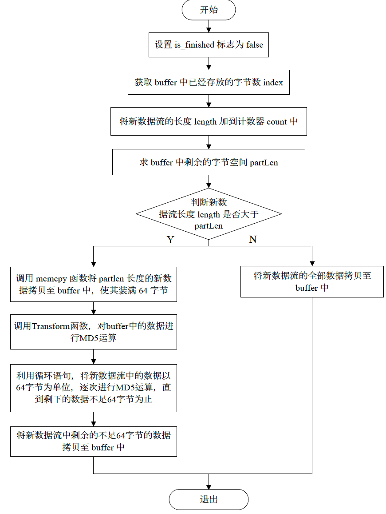

* 首先声明 DWORD 类型的变量 i、index、partLen，并将标识 is_finished 设置为 false，表示 MD5 计算未完成。
* 接着根据输入数据流的长度更新 MD5 计算的计数器 count，其中 count[0] 记录低 32 位， count[1] 记录高 32 位。首先将 count[0] 左移 3 位，相当于乘以 8，然后加上新数据流的长度，如果发生了进位，则将 count[1] 加 1。
* 然后计算当前缓冲区中剩余空间的长度 partLen。如果输入数据流长度大于等于剩余空间长度 partLen，则将部分数据拷贝到缓冲区中，并进行 MD5 变换处理。如果输入数据流长度超过了剩余空间长度，则将剩余部分数据拷贝到缓冲区中，同时对缓冲区中的数据进行 MD5 变换处理。
* 最后将输入数据流中剩余的数据拷贝到缓冲区中，以备下一次更新计算。

```c++
void MD5::Update(const BYTE *input, size_t length)
{
    DWORD i, index, partLen;
    is_finished = false;                     // 设置停止标识
    index = (DWORD)((count[0] >> 3) & 0x3f); // 计算 buffer 已经存放的字节数

    // 更新计数器 count，将新数据流的长度加上计数器原有的值
    if ((count[0] += ((DWORD)length << 3)) < ((DWORD)length << 3)) // 判断是否进位
    {
        count[1]++;
    }
    count[1] += ((DWORD)length >> 29);

    partLen = 64 - index; // 求出 buffer 中剩余的长度

    // 将数据块逐块进行 MD5 运算
    if (length >= partLen)
    {
        memcpy(&buffer_block[index], input, partLen);
        Transform(buffer_block);
        for (i = partLen; i + 63 < length; i += 64)
        {
            Transform(&input[i]);
        }
        index = 0;
    }
    else
    {
        i = 0;
    }
    memcpy(&buffer_block[index], &input[i], length - i); // 将不足 64 字节的数据复制到 buffer_block 中
}

void MD5::Update(const string &str)
{
    Update((const BYTE *)str.c_str(), str.length());
}

void MD5::Update(ifstream &in)
{
    streamsize length;
    char buffer[1024];
    while (!in.eof())
    {
        in.read(buffer, 1024);
        length = in.gcount();
        if (length > 0)
        {
            Update((const BYTE *)buffer, length);
        }
    }
    in.close();
}
```

然后编写了一个 `Transform` 函数，对 64 字节数据块进行 MD5 计算。相关实现思路参见实验指导手册，在此不做阐述。

```c++
void MD5::Transform(const BYTE block[64])
{
    DWORD a = state[0], b = state[1], c = state[2], d = state[3], x[16];
    Decode(block, x, 64);

    /* 第 1 轮 */
    FF(a, b, c, d, x[0], 7, T(1));
    FF(d, a, b, c, x[1], 12, T(2));
    FF(c, d, a, b, x[2], 17, T(3));
    FF(b, c, d, a, x[3], 22, T(4));
    FF(a, b, c, d, x[4], 7, T(5));
    FF(d, a, b, c, x[5], 12, T(6));
    FF(c, d, a, b, x[6], 17, T(7));
    FF(b, c, d, a, x[7], 22, T(8));
    FF(a, b, c, d, x[8], 7, T(9));
    FF(d, a, b, c, x[9], 12, T(10));
    FF(c, d, a, b, x[10], 17, T(11));
    FF(b, c, d, a, x[11], 22, T(12));
    FF(a, b, c, d, x[12], 7, T(13));
    FF(d, a, b, c, x[13], 12, T(14));
    FF(c, d, a, b, x[14], 17, T(15));
    FF(b, c, d, a, x[15], 22, T(16));

    /* 第 2 轮 */
    GG(a, b, c, d, x[1], 5, T(17));
    GG(d, a, b, c, x[6], 9, T(18));
    GG(c, d, a, b, x[11], 14, T(19));
    GG(b, c, d, a, x[0], 20, T(20));
    GG(a, b, c, d, x[5], 5, T(21));
    GG(d, a, b, c, x[10], 9, T(22));
    GG(c, d, a, b, x[15], 14, T(23));
    GG(b, c, d, a, x[4], 20, T(24));
    GG(a, b, c, d, x[9], 5, T(25));
    GG(d, a, b, c, x[14], 9, T(26));
    GG(c, d, a, b, x[3], 14, T(27));
    GG(b, c, d, a, x[8], 20, T(28));
    GG(a, b, c, d, x[13], 5, T(29));
    GG(d, a, b, c, x[2], 9, T(30));
    GG(c, d, a, b, x[7], 14, T(31));
    GG(b, c, d, a, x[12], 20, T(32));

    // /* 第 3 轮 */
    HH(a, b, c, d, x[5], 4, T(33));
    HH(d, a, b, c, x[8], 11, T(34));
    HH(c, d, a, b, x[11], 16, T(35));
    HH(b, c, d, a, x[14], 23, T(36));
    HH(a, b, c, d, x[1], 4, T(37));
    HH(d, a, b, c, x[4], 11, T(38));
    HH(c, d, a, b, x[7], 16, T(39));
    HH(b, c, d, a, x[10], 23, T(40));
    HH(a, b, c, d, x[13], 4, T(41));
    HH(d, a, b, c, x[0], 11, T(42));
    HH(c, d, a, b, x[3], 16, T(43));
    HH(b, c, d, a, x[6], 23, T(44));
    HH(a, b, c, d, x[9], 4, T(45));
    HH(d, a, b, c, x[12], 11, T(46));
    HH(c, d, a, b, x[15], 16, T(47));
    HH(b, c, d, a, x[2], 23, T(48));

    // /* 第 4 轮 */
    II(a, b, c, d, x[0], 6, T(49));
    II(d, a, b, c, x[7], 10, T(50));
    II(c, d, a, b, x[14], 15, T(51));
    II(b, c, d, a, x[5], 21, T(52));
    II(a, b, c, d, x[12], 6, T(53));
    II(d, a, b, c, x[3], 10, T(54));
    II(c, d, a, b, x[10], 15, T(55));
    II(b, c, d, a, x[1], 21, T(56));
    II(a, b, c, d, x[8], 6, T(57));
    II(d, a, b, c, x[15], 10, T(58));
    II(c, d, a, b, x[6], 15, T(59));
    II(b, c, d, a, x[13], 21, T(60));
    II(a, b, c, d, x[4], 6, T(61));
    II(d, a, b, c, x[11], 10, T(62));
    II(c, d, a, b, x[2], 15, T(63));
    II(b, c, d, a, x[9], 21, T(64));

    state[0] += a;
    state[1] += b;
    state[2] += c;
    state[3] += d;
}
```

除此之外，还编写了几个函数用于初始化 MD5 计算器、对数据结构进行转化以及设置输出流等。

```c++
string MD5::Tostring()
{
    return BytesToHexString(GetDigest(), 16);
}

const BYTE *MD5::GetDigest()
{
    if (!this->is_finished)
    {
        this->is_finished = true;
        Stop();
    }
    return this->digest;
}

void MD5::Reset()
{
    state[0] = 0x67452301;
    state[1] = 0xefcdab89;
    state[2] = 0x98badcfe;
    state[3] = 0x10325476;
    count[0] = 0;
    count[1] = 0;
    memset(buffer_block,0,64);
    memset(digest,0,16);
    is_finished = false;
}

void MD5::Stop()
{
    BYTE bits[8];
    DWORD tmp_state[4];
    DWORD tmp_count[2];

    memcpy(tmp_state, state, 16);
    memcpy(tmp_count, count, 8);
    Encode(count, bits, 8);

    DWORD index = (count[0] / 8) % 64;
    DWORD padLen;
    if (index < 56)
    {
        padLen = 56 - index;
    }
    else
    {
        padLen = 120 - index;
    }

    Update(padding, padLen);
    Update(bits, 8);
    Encode(state, digest, 16);
    memcpy(state, tmp_state, 16);
    memcpy(count, tmp_count, 8);
}

void MD5::Encode(const DWORD *input, BYTE *output, size_t length)
{
    for (size_t i = 0; i * 4 < length; i++)
    {
        for (size_t k = 0; k < 4; k++)
        {
            output[i * 4 + k] = (BYTE)((input[i] >> (k * 8)) & 0xff);
        }
    }
}

void MD5::Decode(const BYTE *input, DWORD *output, size_t length)
{
    const BYTE *inputPtr = input;
    const BYTE *inputEnd = input + length;

    while (inputPtr < inputEnd)
    {
        *output = *((const DWORD *)inputPtr);
        output++;
        inputPtr += sizeof(DWORD);
    }
}

string MD5::BytesToHexString(const BYTE *input, size_t length)
{
    string tmp;
    for (size_t i = 0; i < length; i++)
    {
        int t = input[i];
        int a = t / 16;
        int b = t % 16;
        tmp.append(1, hex[a]);
        tmp.append(1, hex[b]);
    }
    return tmp;
}
```

### 文件完整性检验的设计与实现

此部分主要在 `main.cpp` 中进行编写。主要思路是根据用户输入的参数进行功能的调用，并对产生的错误进行处理。

* 首先，如果参数数量过少或者过多，则输出错误信息并退出。

  ```c++
  if (argc < 2 || argc > 4)
  {
      cout << "Parameter Error !" << endl;
      return -1;
  }
  ```

* 如果参数数量为 2 且参数值为 -h，则输出 MD5 的使用方法。

  ```c++
  else if ((argc == 2) && (strcmp(argv[1], "-h") == 0))
  {
      cout << "MD5 usage:\t[-h]\t--help information\n";
      cout << "\t\t[-t]\t--test MD5 application\n";
      cout << "\t\t[-c]\t[file path of the file computed]\n";
      cout << "\t\t\t--compute MD5 of the given file\n";
      cout << "\t\t[-v]\t[file path of the file validated]\n";
      cout << "\t\t\t--validate the integrality of a given file by manual input MD5 value\n";
      cout << "\t\t[-f]\t[file path of the file validated]  [file path of the .md5 file]\n";
      cout << "\t\t\t--validate the integrality of a given file by read MD5 value from .md5 file\n";
  }
  ```

* 如果参数数量为 2 且参数值为 -t，则输出 MD5 的测试样例。

  ```c++
  else if ((argc == 2) && (strcmp(argv[1], "-t") == 0))
  {
      string strlist[] = {"",
                          "a",
                          "abc",
                          "message digest",
                          "abcdefghijklmnopqrstuvwxyz",
                          "ABCDEFGHIJKLMNOPQRSTUVWXYZabcdefghijklmnopqrstuvwxyz0123456789",
                          "12345678901234567890123456789012345678901234567890123456789012345678901234567890"};
      for (int i = 0; i < 7; i++)
      {
          cout << "MD5(\"" << strlist[i] << "\") = " << MD5(strlist[i]).Tostring() << endl;
      }
  }
  ```

* 如若参数数量为 3 且参数值为 -c，表示计算给定路径的文件的 MD5值。

  ```c++
  else if ((argc == 3) && (strcmp(argv[1], "-c") == 0))
  {
      if (argv[2] == NULL)
      {
          cout << "Error arameter!" << endl;
          return -1;
      }
      string pFilePath = argv[2];
      ifstream File_1(pFilePath);
      cout << "The MD5 value of file(\"" << pFilePath << "\") is " << MD5(File_1).Tostring() << endl;
  }
  ```

* 如果参数数量为 3 且参数值为 -v，表示对文件的 MD5 值进行手动匹配验证。

  ```c++
  else if ((argc == 3) && (strcmp(argv[1], "-v") == 0))
  {
      if (argv[2] == NULL)
      {
          cout << "Error arameter!" << endl;
          return -1;
      }
      cout << "Please input the MD5 value of file(\"" << argv[2] << "\")..." << endl;
      char InputMD5[33];
      cin >> InputMD5;
      InputMD5[32] = '\0';
      string pFilePath = argv[2];
      ifstream File_2(pFilePath);
      string str = MD5(File_2).Tostring();
      cout << "The MD5 of the file(\"" << argv[2] << "\") is " << str << endl;
      const char *pResult = str.c_str();
      if (strcmp(InputMD5, pResult) != 0)
      {
          cout << "The file is incomplete!" << endl;
          return 0;
      }
      else
      {
          cout << "The file is complete!" << endl;
          return 0;
      }
  }
  ```

* 如果参数数量为 4 且参数值为 -f，表示基于 .md5 文件对给定的文件进行验证。

  ```c++
  else if ((argc == 4) && (strcmp(argv[1], "-f") == 0))
  {
      if (argv[2] == NULL || argv[3] == NULL)
      {
          cout << "Error arameter!" << endl;
          return -1;
      }
      string pFilePath = argv[3];
      ifstream File_3(pFilePath);
      char Record[50];
      File_3.getline(Record, 50);
      char *pMD5 = strtok(Record, "");
      char *pFileName = strtok(NULL, "");
      pFilePath = argv[2];
      ifstream File_4(pFilePath);
      string str = MD5(File_4).Tostring();
      cout << "The MD5 of the file(\"" << argv[2] << "\") is " << str << endl;
      const char *pResult = str.c_str();
      if (strcmp(pMD5, pResult) != 0)
      {
          cout << "The file is incomplete!" << endl;
          return 0;
      }
      else
      {
          cout << "The file is complete!" << endl;
          return 0;
      }
  }
  ```

* 如果参数非法，则提示错误并退出。

  ```c++
  else
  {
      cout << "Parameter Error !" << endl;
      return -1;
  }
  ```

  

## 实验结论

输入 `./MD5`，可以看到，由于输入参数较少，输出错误信息。

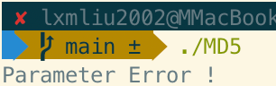

输入 `./MD5 -h`，可以看到，输出得到其用法说明。

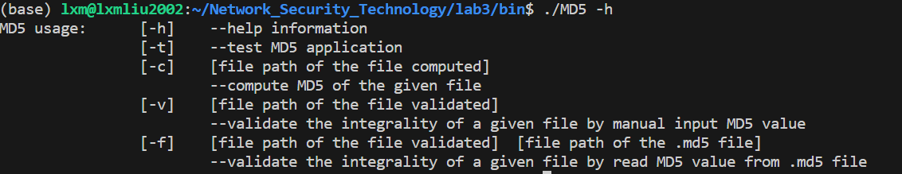

输入 `./MD5 -t`，可以看到，输出测试用例的 MD5 值。将其与实验手册上的值进行对比，可以确定

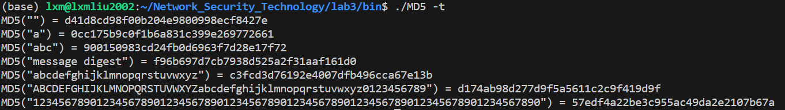

输入 `./MD5 -c ./nankai.txt`，可以看到，输出得到该文件的 MD5 值。

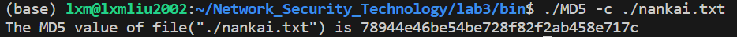

使用在线计算器，得到如下的 MD5 值，可以看到二者是相同的，说明程序编写成功。

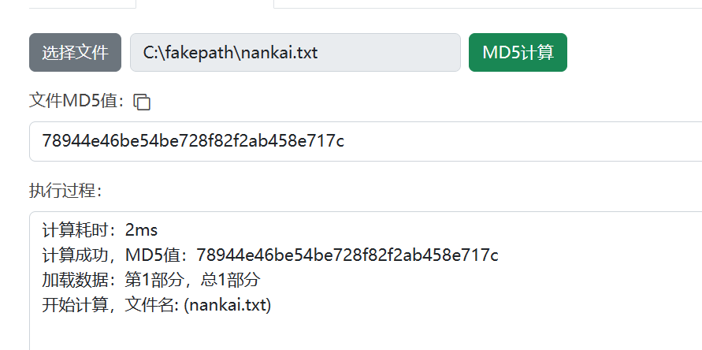

输入 `./MD5 -v ./nankai.txt`，然后输入文件的 MD5 值，可以看到，经过计算对比，该文件是完整的。

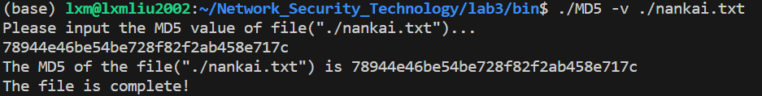

对文件进行删改。

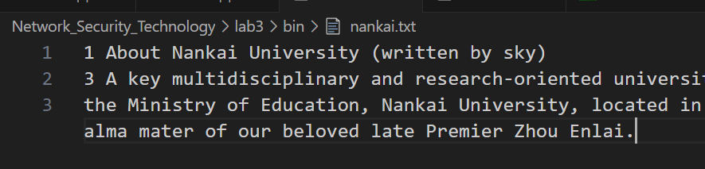

使用原来的 MD5 值进行对比，可以看到，文件不再完整。

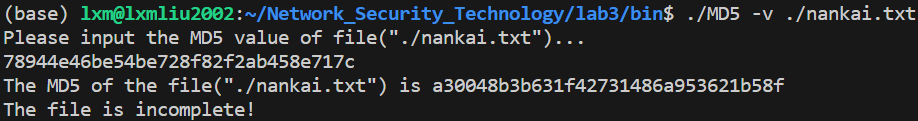

输入 `./MD5 -f ./nankai.txt ./nankai.md5`，可以看到，经过计算对比，该文件是完整的。

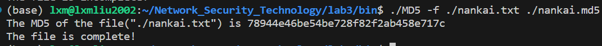

输入 `./MD5 1`，可以看到，由于输入参数非法，输出错误信息。

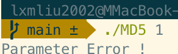


## 实验遇到的问题及其解决方法

本次实验中遇到的最大问题就是对 MD5 算法的不了解。但是经过仔细阅读实验指导书，以及查阅相关博客，最终还是完成了项目编写。


## 实验收获

对 MD5 算法有了深入了解，对 cmake 编译组件进一步熟练。


## 文件组织说明

本次实验使用 cmake 进行编译组织。在根目录下有一个 `report.pdf` 为本次实验的实验报告，另有一个文件夹 `code`，存放本次实验用到的所有代码。

*  `./code/Readme.md` 为编译及运行说明
* `./code/bin/MD5` 为可执行文件，直接运行即可
* `./code/build` 文件夹为编译文件夹，存放编译用的代码，与 `CMakeLists.txt` 及 `Makefile` 配合使用
* `./code/include` 文件夹存放编写的 MD5 算法代码
* `./code/src` 文件夹则为主要的 cpp 代码

```shell
.
├── code
│   ├── CMakeLists.txt
│   ├── Readme.md
│   ├── bin
│   │   ├── MD5
│   │   ├── nankai.txt
│   │   └── nankai.md5
│   ├── build
│   │   └── Makefile
│   ├── include
│   │   └── MD5.hpp
│   └── src
│       ├── CMakeLists.txt
│       └── main.cpp
└── report.pdf
```


## 实验参考

吴功宜主编.网络安全高级软件编程技术.清华大学出版社.2010

[https://zhuanlan.zhihu.com/p/351883327](https://zhuanlan.zhihu.com/p/351883327)
