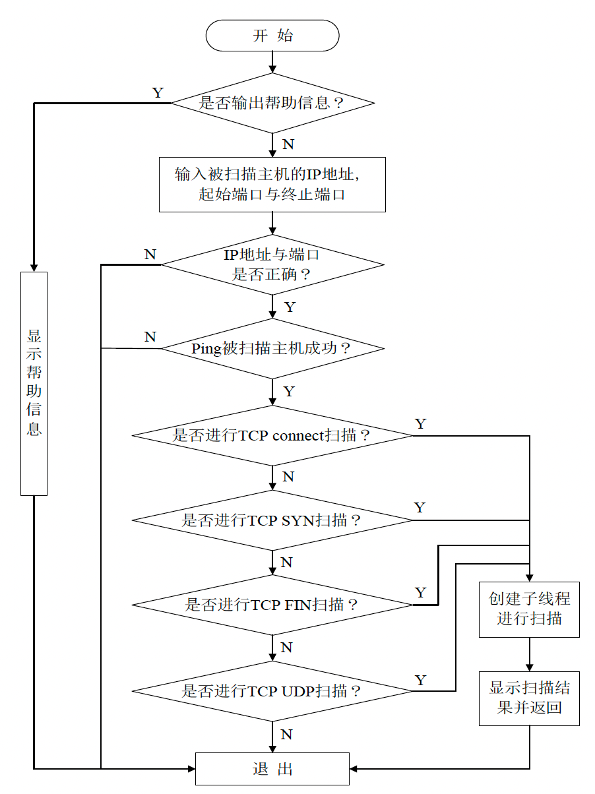
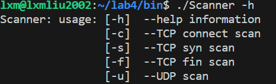
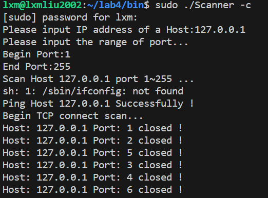

# <center>**网络安全技术实验报告**</center>

<center>Lab4 端口扫描器的设计与实现</center>

<center> 网络空间安全学院 信息安全专业</center>

<center> 2112492 刘修铭 1027</center>

## 实验要求

端口扫描器的设计与实现，将“实验报告、源代码、可执行程序”打包后上传，并以自己的“学号-姓名”命名。


## 实验目标 

1. 掌握端口扫描器的基本设计方法。
2. 理解 ping 程序，TCP connect 扫描，TCP SYN 扫描，TCP FIN 扫描以及 UDP 扫描的工作原理。
3. 熟练掌握 Linux 环境下的套接字编程技术。
4. 掌握 Linux 环境下多线程编程的基本方法


## 实验内容

1. 编写端口扫描程序，提供 TCP connect 扫描，TCP SYN 扫描，TCP FIN 扫描以及 UDP 扫描 4 种基本扫描方式。
2. 设计并实现 ping 程序，探测目标主机是否可达。


## 实验原理

### Ping 程序

ping 程序是日常网络管理中经常使用的程序。它用于确定本地主机与网络中其它主机的通信情况。因为只是简单地探测某一 IP 地址所对应的主机是否存在，因此它的原理十分简单。扫描发起主机向目标主机发送一个要求回显（type = 8，即为 ICMP_ECHO）的 ICMP 数据包，目标主机在收到请求后，会返回一个回显（type = 0，即为 ICMP_ECHOREPLY）的 ICMP 数据包。扫描发起主机可以通过是否接收到响应的 ICMP 数据包来判断目标主机是否存在。

在本次实验中，在向目标主机发起端口扫描之前使用 ping 程序确定目标主机是否存在。如果 ping 目标主机成功，则继续后面的扫描工作；否则，放弃对目标主机的扫描。

### TCP 扫描

#### connect 扫描

TCP connect 扫描非常简单。扫描发起主机只需要调用系统 API connect 尝试连接目标主机的指定端口，如果 connect 成功，意味着扫描发起主机与目标主机之间至少经历了一次完整的 TCP 三次握手建立连接过程，被测端口开放；否则，端口关闭。

虽然在编程时不需要程序员手动构造 TCP 数据包，但是 connect 扫描的效率非常低下。由于 TCP 协议是可靠协议，connect 系统调用不会在尝试发送第一个 SYN 包未得到响应的情况下就放弃，而是会经过多次尝试后才彻底放弃，因此需要较长的时间。此外，connect 失败会在系统中造成大量连接失败日志，容易被管理员发现。

#### SYN 扫描

TCP SYN 扫描是使用最广泛的扫描方式，其原理就是向待扫描端口发送 SYN 数据包。如果扫描发起主机能够收到ACK | SYN 数据包，则表示端口开放；如果收到 RST 数据包，则表示端口关闭。如果未收到任何数据包，且确定目标主机存在，那么发送给被测端口的 SYN 数据包可能被防火墙等安全设备过滤。因为 SYN 扫描不需要完成 TCP 连接的三次握手过程，所以它又被称为半开放扫描。

SYN 扫描的最大优点就是速度快。在 Internet 中，如果不考虑防火墙的影响，SYN 扫描每秒钟可以扫描数千个端口。但是由于其扫描行为较为明显，SYN 扫描容易被入侵检测系统发现，也容易被防火墙屏蔽。同时构造原始的 TCP 数据包也需要较高的系统权限（**<u>在 Linux 中仅限于 root 账户</u>**）。

#### FIN 扫描

TCP FIN 扫描会向目标主机的被测端口发送一个 FIN 数据包。如果目标主机没有任何响应且确定该主机存在，那么表示目标主机正在监听这个端口，端口是开放的；如果目标主机返回一个 RST 数据包且确定该主机存在，那么表示目标主机没有监听这个端口，端口是关闭的。

FIN 扫描具有良好的隐蔽性，不会留下日志。但是它的应用具有很大的局限性，由于不同系统实现网络协议栈的细节不同，FIN 扫描**<u>只能扫描 Linux/UNIX 系统</u>**。对于 Windows 系统而言，由于无论端口开放与否，都会返回 RST 数据包，因此对端口的状态无法进行判断。

### UDP 扫描

一般情况下，当向一个关闭的 UDP 端口发送数据时，目标主机会返回一个 ICMP 不可达（ICMP port unreachable）的错误。UDP 扫描就是利用了上述原理，向被扫描端口发送 0 字节的 UDP 数据包，如果收到一个 ICMP 不可达响应，那么就认为端口是关闭的；而对于那些长时间没有响应的端口，则认为是开放的。

但是，因为大部分系统都限制了 ICMP 差错报文的产生速度，所以针对特定主机的大范围 UDP 端口扫描的速度非常缓慢。此外，UDP 协议和 ICMP 协议是不可靠协议，没有收到响应的情况也可能是由于数据包丢失造成的，因此扫描程序必须对同一端口进行多次尝试后才能得出正确的结论。


## 实验步骤

header.h 中包含了端口扫描器的基本结构体和函数声明。TCPConnectScan.cpp 、TCPFINScan.cpp、TCPSYNScan.cpp、UDPScan.cpp 和main.cpp 中分别实现了TCP connect 扫描、TCP FIN 扫描、TCP SYN 扫描、UDP 扫描以及ping 程序的实现。


按照前面实验设定，给出本次实验的主要流程图。



1. 程序判断是否需要输出帮助信息，若是，则输出端口扫描器程序的帮助信息，然后退出；否则，继续执行下面的步骤。
2. 用户输入被扫描主机的 IP 地址，扫描起始端口和终止端口。
3. 判断 IP 地址与端口号是否错误，若错误，则提示用户并退出；否则，继续下面的步骤。
4. 调用 Ping 函数，判断被扫描主机是否可达，若不可达，则提示用户并退出；否则，继续下面的步骤。
5. 判断是否进行 TCP connect 扫描，若是，则开启 TCP connect 扫描子线程，从起始端口到终止端口对目标主机进行扫描，并把扫描结果显示出来；否则，继续执行下面的步骤。
6. 判断是否进行 TCP SYN 扫描，若是，则开启 TCP SYN 扫描子线程，从起始端口到终止端口对目标主机进行扫描，并把扫描结果显示出来。否则，继续执行下面的步骤。
7. 判断是否进行 TCP FIN 扫描，若是，则开启 TCP FIN 扫描子线程，从起始端口到终止端口对目标主机进行扫描，并把扫描结果显示出来。否则，继续执行下面的步骤。
8. 判断是否进行 UDP 扫描，若是，则开启 UDP 扫描子线程，从起始端口到终止端口对目标主机进行扫描，并把扫描结果显示出来。否则，继续执行下面的步骤。
9. 等待所有扫描子线程返回后退出。

在流程中先后调用了 ping 程序，TCP connect 扫描，TCP SYN 扫描，TCP FIN 扫描，以及 UDP 扫描 5 个功能模块。下面将详细介绍这些模块的设计与实现方法。

### 相关数据结构

在 `defs.h` 文件中，按照本次编程需要，添加了许多头文件的引用。如下图所示，本次编程需要用到许多协议头，因此需要对应引入其头文件。


```c++
#include <iostream>
#include <stdio.h>
#include <error.h>
#include <cstring>
#include <string>
#include <pthread.h>
#include <unistd.h>
#include <netinet/ip.h>
#include <netinet/ip_icmp.h>
#include <netinet/tcp.h>
#include <netinet/udp.h>
#include <netinet/in.h>
#include <sys/socket.h>
#include <arpa/inet.h>
#include <sys/types.h>
#include <sys/time.h>
#include <fcntl.h>
```

接着定义了一些数据结构，便于后续编程使用。

1. TCPConThrParam 定义了用于 TCP 连接扫描的线程参数，包含了要扫描的目标主机的IP地址 HostIP，扫描的起始端口 BeginPort 和结束端口 EndPort。
2. TCPConHostThrParam 定义了用于 TCP 连接扫描的单个主机的线程参数，包含了要连接的目标主机的 IP 地址 HostIP 和端口号 HostPort。
3. UDPThrParam 定义了用于 UDP 端口扫描的线程参数，包含了要扫描的目标主机的 IP 地址 HostIP，扫描的起始端口 BeginPort 和结束端口 EndPort，以及本地主机的 IP 地址 LocalHostIP。
4. UDPScanHostThrParam 定义了用于 UDP 端口扫描的单个主机的线程参数，包含了要扫描的目标主机的 IP 地址 HostIP 和端口号 HostPort，以及本地主机的 IP 地址 LocalHostIP 和本地端口号 LocalPort。
5. TCPSYNThrParam 定义了用于 TCP SYN 扫描的线程参数，包含了要扫描的目标主机的 IP 地址 HostIP，扫描的起始端口 BeginPort 和结束端口 EndPort，以及本地主机的 IP 地址 LocalHostIP。
6. TCPSYNHostThrParam 定义了用于 TCP SYN 扫描的单个主机的线程参数，包含了要扫描的目标主机的 IP 地址 HostIP 和端口号 HostPort，以及本地主机的 IP 地址 LocalHostIP 和本地端口号 LocalPort。
7. TCPFINThrParam 定义了用于 TCP FIN 扫描的线程参数，具有与 TCPSYNThrParam 类似的结构。
8. TCPFINHostThrParam 定义了用于 TCP FIN 扫描的单个主机的线程参数，具有与 TCPSYNHostThrParam 类似的结构。

```c++
struct TCPConThrParam
{
	string HostIP;
	unsigned BeginPort;
	unsigned EndPort;
};
struct TCPConHostThrParam
{
	string HostIP;
	unsigned HostPort;
};
struct UDPThrParam
{
	string HostIP;
	unsigned BeginPort;
	unsigned EndPort;
	unsigned LocalHostIP;
};
struct UDPScanHostThrParam
{
	string HostIP;
	unsigned HostPort;
    unsigned LocalPort;
	unsigned LocalHostIP;
};
struct TCPSYNThrParam
{
	string HostIP;
	unsigned BeginPort;
	unsigned EndPort;
	unsigned LocalHostIP;
};
struct TCPSYNHostThrParam
{
	string HostIP;
	unsigned HostPort;
    unsigned LocalPort;
	unsigned LocalHostIP;
};
struct TCPFINThrParam
{
	string HostIP;
	unsigned BeginPort;
	unsigned EndPort;
	unsigned LocalHostIP;
};
struct TCPFINHostThrParam
{
	string HostIP;
	unsigned HostPort;
    unsigned LocalPort;
	unsigned LocalHostIP;
};
struct ipicmphdr 
{ 
	struct iphdr ip; 
	struct icmphdr icmp; 
}; 
struct pseudohdr
{  
	unsigned long saddr; 
	unsigned long daddr; 
	char useless; 
	unsigned char protocol; 
	unsigned short length; 
};
```

### ICMP 探测指定主机

Ping 程序用于测量本地主机与目标主机之间的网络通信情况。Ping 程序首先发送一个ICMP请求数据包给目标主机。如果目标主机返回一个 ICMP 响应数据包，那么表示两台主机之间的通信状况良好，可以继续后面的扫描操作；否则，整个程序将退出。其流程图如下：


1. 通过创建一个原始套接字来建立与目标主机的连接，使用 socket() 函数创建了一个原始套接字，并指定了协议类型为 ICMP（通过 SOCK_RAW 和 IPPROTO_ICMP 参数）。
2. 设置了 ICMP 报文的一些必要字段，比如 IP 头部、ICMP 头部、时间戳等。然后使用 sendto() 函数发送 ICMP Echo 请求。
3. 将套接字设置为非阻塞模式，并开始等待接收 ICMP Echo 回复。它使用 recvfrom() 函数来接收 ICMP 回复，并检查接收到的数据是否符合预期，即源 IP 地址与目标 IP 地址匹配，并且 ICMP 类型为 ICMP Echo Reply。
4. 函数在收到预期的 ICMP Echo 回复或者超时后退出循环，并返回相应的结果。

```c++
bool Ping(string HostIP, unsigned LocalHostIP)
{
    string SrcIP, DstIP, LocalIP;
    int PingSock, on, ret, Addrlen;
    unsigned short LocalPort;
    struct sockaddr_in PingHostAddr, FromAddr;
    struct in_addr in_LocalhostIP;
    char *SendBuf;
    char RecvBuf[1024];
    unsigned short SendBufSize;
    struct iphdr *ip;
    struct icmphdr *icmp;
    struct ip *Recvip;
    struct icmp *Recvicmp;
    struct timeval *tp;
    struct timeval TpStart, TpEnd;
    float TimeUse;
    bool flags;
    PingSock = socket(AF_INET, SOCK_RAW, IPPROTO_ICMP);
    if (PingSock < 0)
    {
        cout << "Creat Ping socket error !" << endl;
        printf("Errno: %d\n", errno);
        return false;
    }
    LocalPort = 10086;
    on = 1;
    ret = setsockopt(PingSock, 0, IP_HDRINCL, &on, sizeof(on));
    if (ret < 0)
    {
        cout << "Bind Ping socket option error !" << endl;
        return false;
    }
    SendBufSize = sizeof(struct iphdr) + sizeof(struct icmphdr) + sizeof(struct timeval);
    SendBuf = (char *)malloc(SendBufSize);
    memset(SendBuf, 0, sizeof(SendBuf));
    ip = (struct iphdr *)SendBuf;
    ip->ihl = 5;
    ip->version = 4;
    ip->tos = 0;
    ip->tot_len = htons(SendBufSize);
    ip->id = rand();
    ip->ttl = 64;
    ip->frag_off = 0x40;
    ip->protocol = IPPROTO_ICMP;
    ip->check = 0;
    ip->saddr = LocalHostIP;
    ip->daddr = inet_addr(&HostIP[0]);
    icmp = (struct icmphdr *)(ip + 1);
    icmp->type = ICMP_ECHO;
    icmp->code = 0;
    icmp->un.echo.id = htons(LocalPort);
    icmp->un.echo.sequence = 0;
    tp = (struct timeval *)&SendBuf[28];
    gettimeofday(tp, NULL);
    icmp->checksum = in_cksum((u_short *)icmp, sizeof(struct icmphdr) + sizeof(struct timeval));
    PingHostAddr.sin_family = AF_INET;
    PingHostAddr.sin_addr.s_addr = inet_addr(&HostIP[0]);
    Addrlen = sizeof(struct sockaddr_in);
    ret = sendto(PingSock, SendBuf, SendBufSize, 0, (struct sockaddr *)&PingHostAddr, sizeof(PingHostAddr));
    if (ret < 0)
    {
        cout << "Send ping packet failed !" << endl;
        return false;
    }
    if (fcntl(PingSock, F_SETFL, O_NONBLOCK) == -1)
    {
        cout << "Set socket in non-blocked model fail !" << endl;
        return false;
    }
    gettimeofday(&TpStart, NULL);
    flags = false;
    do
    {
        ret = recvfrom(PingSock, RecvBuf, 1024, 0, (struct sockaddr *)&FromAddr, (socklen_t *)&Addrlen);
        if (ret > 0)
        {
            Recvip = (struct ip *)RecvBuf;
            Recvicmp = (struct icmp *)(RecvBuf + (Recvip->ip_hl * 4));
            SrcIP = inet_ntoa(Recvip->ip_src);
            DstIP = inet_ntoa(Recvip->ip_dst);
            in_LocalhostIP.s_addr = LocalHostIP;
            LocalIP = inet_ntoa(in_LocalhostIP);
            if (SrcIP == HostIP && DstIP == LocalIP && Recvicmp->icmp_type == ICMP_ECHOREPLY)
            {
                cout << "Ping Host " << HostIP << " Successfully !" << endl;
                flags = true;
                break;
            }
        }
        gettimeofday(&TpEnd, NULL);
        TimeUse = (1000000 * (TpEnd.tv_sec - TpStart.tv_sec) + (TpEnd.tv_usec - TpStart.tv_usec)) / 1000000.0;
        if (TimeUse < 3)
        {
            continue;
        }
        else
        {
            flags = false;
            break;
        }
    } while (true);
    return flags;
}
```

在此，引入一个辅助函数用于计算校验和。

```c++
unsigned short in_cksum(unsigned short *ptr, int nbytes)
{
    register long sum;
    u_short oddbyte;
    register u_short answer;
    sum = 0;
    while (nbytes > 1)
    {
        sum += *ptr++;
        nbytes -= 2;
    }
    if (nbytes == 1)
    {
        oddbyte = 0;
        *((u_char *)&oddbyte) = *(u_char *)ptr;
        sum += oddbyte;
    }
    sum = (sum >> 16) + (sum & 0xffff);
    sum += (sum >> 16);
    answer = ~sum;
    return (answer);
}
```

### TCP connect 扫描

TCP Connect 扫描时通过调用流套接字（SOCK_STREAM）的 connect 函数实现的。该函数尝试连接被测主机的指定端口，若连接成功，则表示端口开启；否则，表示端口关闭。在实际编程中为了提高效率，采用了创建子线程同时扫描目标主机多个端口的方法。

在此，为了保证多线程的正常运行，创建了两个线程锁。为了维护系统中的线程数目，使用变量 TCPConThrdNum 来记录已经创建的子线程数。

```c++
int TCPConThrdNum;
pthread_mutex_t TCPConPrintlocker = PTHREAD_MUTEX_INITIALIZER;
pthread_mutex_t TCPConScanlocker = PTHREAD_MUTEX_INITIALIZER;
```

在此部分，实现了两个函数。线程函数 Thread_TCPconnectHost 是整个 TCP connect 扫描的核心部分。线程函数 Thread_TCPconnectScan 通过调用它来创建连接目标主机指定端口的子线程。

1. Thread_TCPconnectHost 函数用于在单独的线程中尝试连接到指定主机的指定端口。接收一个指向 TCPConHostThrParam 结构体的指针作为参数，该结构体包含了要连接的主机 IP 地址和端口号。首先创建一个TCP套接字，然后尝试连接到目标主机和端口。连接成功后，输出信息表示端口开放，否则输出信息表示端口关闭。最后释放参数内存，关闭套接字，并更新全局变量 TCPConThrdNum。

   ```c++
   void *Thread_TCPconnectHost(void *param)
   {
       struct TCPConHostThrParam *p;
       string HostIP;
       unsigned HostPort;
       int ConSock;
       struct sockaddr_in HostAddr;
       int ret;
       p = (struct TCPConHostThrParam *)param;
       HostIP = p->HostIP;
       HostPort = p->HostPort;
       ConSock = socket(AF_INET, SOCK_STREAM, 0);
       if (ConSock < 0)
       {
           pthread_mutex_lock(&TCPConPrintlocker);
           cout << "Create TCP connect Socket failed! " << endl;
           pthread_mutex_unlock(&TCPConPrintlocker);
       }
       memset(&HostAddr, 0, sizeof(HostAddr));
       HostAddr.sin_family = AF_INET;
       HostAddr.sin_addr.s_addr = inet_addr(&HostIP[0]);
       HostAddr.sin_port = htons(HostPort);
       ret = connect(ConSock, (struct sockaddr *)&HostAddr, sizeof(HostAddr));
       if (ret == -1)
       {
           pthread_mutex_lock(&TCPConPrintlocker);
           cout << "Host: " << HostIP << " Port: " << HostPort << " closed ! " << endl;
           pthread_mutex_unlock(&TCPConPrintlocker);
       }
       else
       {
           pthread_mutex_lock(&TCPConPrintlocker);
           cout << "Host: " << HostIP << " Port: " << HostPort << " open ! " << endl;
           pthread_mutex_unlock(&TCPConPrintlocker);
       }
       delete p;
       close(ConSock);
       pthread_mutex_lock(&TCPConScanlocker);
       TCPConThrdNum--;
       pthread_mutex_unlock(&TCPConScanlocker);
   }
   ```

2. Thread_TCPconnectScan 函数用于执行 TCP 连接扫描的线程。接收一个指向 TCPConThrParam 结构体的指针作为参数，该结构体包含了要扫描的目标主机IP地址、起始端口和结束端口。遍历指定范围内的端口，为每个端口创建一个线程，并调用 Thread_TCPconnectHost 函数。同时，通过检查全局变量 TCPConThrdNum 控制线程的数量，确保并发线程数不超过 100。最后等待所有线程执行完成并输出信息，然后退出线程。

   ```c++
   void *Thread_TCPconnectScan(void *param)
   {
       struct TCPConThrParam *p;
       string HostIP;
       unsigned BeginPort, EndPort, TempPort;
       pthread_t subThreadID;
       pthread_attr_t attr;
       int ret;
       p = (struct TCPConThrParam *)param;
       HostIP = p->HostIP;
       BeginPort = p->BeginPort;
       EndPort = p->EndPort;
       TCPConThrdNum = 0;
       for (TempPort = BeginPort; TempPort <= EndPort; TempPort++)
       {
           TCPConHostThrParam *pConHostParam = new TCPConHostThrParam;
           pConHostParam->HostIP = HostIP;
           pConHostParam->HostPort = TempPort;
           pthread_attr_init(&attr);
           pthread_attr_setdetachstate(&attr, PTHREAD_CREATE_DETACHED);
           ret = pthread_create(&subThreadID, &attr, Thread_TCPconnectHost, pConHostParam);
           if (ret == -1)
           {
               cout << "Can't create the TCP connect Host thread !" << endl;
           }
           pthread_attr_destroy(&attr);
           pthread_mutex_lock(&TCPConScanlocker);
           TCPConThrdNum++;
           pthread_mutex_unlock(&TCPConScanlocker);
           while (TCPConThrdNum > 100)
           {
               sleep(3);
           }
       }
       while (TCPConThrdNum != 0)
       {
           sleep(1);
       }
       cout << "TCP Connect Scan thread exit !" << endl;
       pthread_exit(NULL);
   }
   ```

主流程与这两个函数之间的关系如下图所示。


### TCP SYN 扫描

在此，为了保证多线程的正常运行，创建了两个线程锁。为了维护系统中的线程数目，使用变量 TCPConThrdNum 来记录已经创建的子线程数。并引入了校验和计算函数。

```c++
int TCPSynThrdNum;
pthread_mutex_t TCPSynPrintlocker = PTHREAD_MUTEX_INITIALIZER;
pthread_mutex_t TCPSynScanlocker = PTHREAD_MUTEX_INITIALIZER;
extern unsigned short in_cksum(unsigned short *ptr, int nbytes);
```

和 TCP connect 扫描一样，TCP SYN 扫描也包含了两个线程函数：Thread_TCPSynScan 和 Thread_TCPSYNHost。Thread_TCPSynScan 是主线程函数，负责遍历目标主机的被测端口，并调用Thread_TCPSYNHost 函数创建多个扫描子线程。Thread_TCPSYNHost 函数用于完成对目标主机指定端口的 TCP SYN 扫描。

线程函数 Thread_TCPSYNHost 是整个 TCP SYN 扫描的核心部分。线程函数 Thread_TCPSynScan 通过调用它来创建子线程，向目标主机的指定端口发送SYN 数据包，并根据目标主机的响应判断端口的状态。其流程图如下：


1. 接收 TCPSYNHostThrParam 结构体指针作为参数
2. 创建用于发送 TCP 数据包的原始套接字。
3. 构造 TCP 头部，并设置 SYN 标志（连接请求标志）。
4. 将 SYN 数据包发送到目标主机和目标端口。
5. 从目标主机读取响应数据包。分析响应标志（SYN/ACK 或 RST）以确定端口状态：
   1. SYN/ACK：端口可能被过滤（无法确定）。
   2. RST：端口已关闭。
6. 打印扫描结果，包括目标主机 IP、端口号以及打开/关闭状态。

```c++
void *Thread_TCPSYNHost(void *param)
{
    struct TCPSYNHostThrParam *p;
    string HostIP;
    unsigned HostPort, LocalPort, LocalHostIP;
    int SynSock;
    int len;
    char sendbuf[8192];
    char recvbuf[8192];
    struct sockaddr_in SYNScanHostAddr;
    p = (struct TCPSYNHostThrParam *)param;
    HostIP = p->HostIP;
    HostPort = p->HostPort;
    LocalPort = p->LocalPort;
    LocalHostIP = p->LocalHostIP;
    memset(&SYNScanHostAddr, 0, sizeof(SYNScanHostAddr));
    SYNScanHostAddr.sin_family = AF_INET;
    SYNScanHostAddr.sin_addr.s_addr = inet_addr(&HostIP[0]);
    SYNScanHostAddr.sin_port = htons(HostPort);
    SynSock = socket(PF_INET, SOCK_RAW, IPPROTO_TCP);
    if (SynSock < 0)
    {
        pthread_mutex_lock(&TCPSynPrintlocker);
        cout << "Can't creat raw socket !" << endl;
        pthread_mutex_unlock(&TCPSynPrintlocker);
    }
    struct pseudohdr *ptcph = (struct pseudohdr *)sendbuf;
    struct tcphdr *tcph = (struct tcphdr *)(sendbuf + sizeof(struct pseudohdr));
    ptcph->saddr = LocalHostIP;
    ptcph->daddr = inet_addr(&HostIP[0]);
    ptcph->useless = 0;
    ptcph->protocol = IPPROTO_TCP;
    ptcph->length = htons(sizeof(struct tcphdr));
    tcph->th_sport = htons(LocalPort);
    tcph->th_dport = htons(HostPort);
    tcph->th_seq = htonl(123456);
    tcph->th_ack = 0;
    tcph->th_x2 = 0;
    tcph->th_off = 5;
    tcph->th_flags = TH_SYN;
    tcph->th_win = htons(65535);
    tcph->th_sum = 0;
    tcph->th_urp = 0;
    tcph->th_sum = in_cksum((unsigned short *)ptcph, 20 + 12);
    len = sendto(SynSock, tcph, 20, 0, (struct sockaddr *)&SYNScanHostAddr, sizeof(SYNScanHostAddr));
    if (len < 0)
    {
        pthread_mutex_lock(&TCPSynPrintlocker);
        cout << "Send TCP SYN Packet error !" << endl;
        pthread_mutex_unlock(&TCPSynPrintlocker);
    }
    len = read(SynSock, recvbuf, 8192);
    if (len <= 0)
    {
        pthread_mutex_lock(&TCPSynPrintlocker);
        cout << "Read TCP SYN Packet error !" << endl;
        pthread_mutex_unlock(&TCPSynPrintlocker);
    }
    else
    {
        struct ip *iph = (struct ip *)recvbuf;
        int i = iph->ip_hl * 4;
        struct tcphdr *tcph = (struct tcphdr *)&recvbuf[i];
        string SrcIP = inet_ntoa(iph->ip_src);
        string DstIP = inet_ntoa(iph->ip_dst);
        struct in_addr in_LocalhostIP;
        in_LocalhostIP.s_addr = LocalHostIP;
        string LocalIP = inet_ntoa(in_LocalhostIP);
        unsigned SrcPort = ntohs(tcph->th_sport); 
        unsigned DstPort = ntohs(tcph->th_dport);
        if (HostIP == SrcIP && LocalIP == DstIP && SrcPort == HostPort && DstPort == LocalPort)
        {
            if (tcph->th_flags == TH_SYN || tcph->th_flags == TH_ACK)
            {
                pthread_mutex_lock(&TCPSynPrintlocker);
                cout << "Host: " << SrcIP << " Port: " << ntohs(tcph->th_sport) << " closed !" << endl;
                pthread_mutex_unlock(&TCPSynPrintlocker);
            }
            if (tcph->th_flags == TH_RST)
            {
                pthread_mutex_lock(&TCPSynPrintlocker);
                cout << "Host: " << SrcIP << " Port: " << ntohs(tcph->th_sport) << " open !" << endl;
                pthread_mutex_unlock(&TCPSynPrintlocker);
            }
        }
    }
    delete p;
    close(SynSock);
    pthread_mutex_lock(&TCPSynScanlocker);
    TCPSynThrdNum--;
    pthread_mutex_unlock(&TCPSynScanlocker);
}
```

Thread_TCPSynScan 函数调用 Thread_TCPSYNHost 函数创建多个扫描子线程负责遍历目标主机的被测端口。其流程如下：

1. 接收 TCPSYNThrParam 结构体指针作为参数。
2. 定义目标主机 IP、起始端口、结束端口和本地主机 IP。
3. 创建一个工作线程池（最大 100 个线程），遍历指定范围内的每个端口。
4. 对于每个端口，创建一个新的线程 Thread_TCPSYNHost 来执行实际的扫描。
5. 等待工作线程完成扫描后再退出。

```c++
void *Thread_TCPSynScan(void *param)
{
    struct TCPSYNThrParam *p;
    string HostIP;
    unsigned BeginPort, EndPort, TempPort, LocalPort, LocalHostIP;
    pthread_t listenThreadID, subThreadID;
    pthread_attr_t attr, lattr;
    int ret;
    p = (struct TCPSYNThrParam *)param;
    HostIP = p->HostIP;
    BeginPort = p->BeginPort;
    EndPort = p->EndPort;
    LocalHostIP = p->LocalHostIP;
    TCPSynThrdNum = 0;
    LocalPort = 1024;
    for (TempPort = BeginPort; TempPort <= EndPort; TempPort++)
    {
        struct TCPSYNHostThrParam *pTCPSYNHostParam = new TCPSYNHostThrParam;
        pTCPSYNHostParam->HostIP = HostIP;
        pTCPSYNHostParam->HostPort = TempPort;
        pTCPSYNHostParam->LocalPort = TempPort + LocalPort;
        pTCPSYNHostParam->LocalHostIP = LocalHostIP;
        pthread_attr_init(&attr);
        pthread_attr_setdetachstate(&attr, PTHREAD_CREATE_DETACHED);
        ret = pthread_create(&subThreadID, &attr, Thread_TCPSYNHost, pTCPSYNHostParam);
        if (ret == -1)
        {
            cout << "Can't create the TCP SYN Scan Host thread !" << endl;
        }
        pthread_attr_destroy(&attr);
        pthread_mutex_lock(&TCPSynScanlocker);
        TCPSynThrdNum++;
        pthread_mutex_unlock(&TCPSynScanlocker);
        while (TCPSynThrdNum > 100)
        {
            sleep(3);
        }
    }
    while (TCPSynThrdNum != 0)
    {
        sleep(1);
    }
    cout << "TCP SYN scan thread exit !" << endl;
    pthread_exit(NULL);
}
```

### TCP FIN 扫描

TCP FIN 扫描的代码与 TCP SYN 扫描的代码基本相同。都利用原始套接字构造 TCP 数据包发送给目标主机的被测端口。不同的只是将 TCP 头 flags 字段的 FIN 位置 1。另外在接收 TCP 响应数据包时也略有不同。和前面两种扫描一样，TCP FIN 扫描也由两个线程函数构成。它们分别是 Thread_TCPFinScan 和 Thread_TCPFINHost。

在此，为了保证多线程的正常运行，创建了两个线程锁。为了维护系统中的线程数目，使用变量 TCPConThrdNum 来记录已经创建的子线程数。并引入了校验和计算函数。

```c++
int TCPFinThrdNum;
pthread_mutex_t TCPFinPrintlocker = PTHREAD_MUTEX_INITIALIZER;
pthread_mutex_t TCPFinScanlocker = PTHREAD_MUTEX_INITIALIZER;
extern unsigned short in_cksum(unsigned short *ptr, int nbytes);
```

线程函数 Thread_TCPFINHost 的流程与线程函数 Thread_TCPSYNHost 基本相同。在填充 TCP FIN 数据包的时候，将 TCP 头的 flags 字段的 FIN 位设置为 1。调用 sendto 函数发送完数据包之后，将套接字 FinRevSock 设置为非阻塞模式。这样 recvfrom 函数不会一直阻塞，直到接收到一个数据包为止，而是通过一个外部循环控制等待响应数据包的时间。如果超时，则退出循环。在收到一个数据包以后，如果该数据包的源地址等于目标主机地址、目的地址等于本机 IP 地址、源端口等于被扫描端口且目的端口等于本机端口，那么该数据包为响应数据包。如果该数据包 TCP 头的 flags 字段的 RST 位为 1，那么就表示被扫描端口关闭；否则，继续等待响应数据包。如果等待时间超过 3 秒，那么就认为被扫描端口是开启的。

1. 接收 TCPFINHostThrParam 结构体指针作为参数。
2. 创建用于发送和接收 TCP 数据包的原始套接字。
3. 构造 TCP 头部，并设置 FIN 标志（断开连接请求标志）。
4. 将 FIN 数据包发送到目标主机和目标端口。
5. 设置接收套接字为非阻塞模式，以便于超时判断。
6. 循环等待响应数据包，并分析其来源 IP、端口等信息。
   1. 如果收到来自目标主机、目标端口的 RST 响应，则表明端口已关闭。
   2. 如果在规定时间内未收到任何响应，则端口可能开放（但该方法无法完全确定）。
7. 打印扫描结果，包括目标主机 IP、端口号以及打开/关闭状态。

```c++
void *Thread_TCPFINHost(void *param)
{
    struct TCPFINHostThrParam *p;
    string HostIP, SrcIP, DstIP, LocalIP;
    unsigned HostPort, LocalPort, SrcPort, DstPort, LocalHostIP;
    struct sockaddr_in FINScanHostAddr, FromAddr, FinRevAddr;
    struct in_addr in_LocalhostIP;
    int FinSock, FinRevSock;
    int len, FromAddrLen;
    char sendbuf[8192];
    char recvbuf[8192];
    struct timeval TpStart, TpEnd;
    float TimeUse;
    p = (struct TCPFINHostThrParam *)param;
    HostIP = p->HostIP;
    HostPort = p->HostPort;
    LocalPort = p->LocalPort;
    LocalHostIP = p->LocalHostIP;
    memset(&FINScanHostAddr, 0, sizeof(FINScanHostAddr));
    FINScanHostAddr.sin_family = AF_INET;
    FINScanHostAddr.sin_addr.s_addr = inet_addr(&HostIP[0]);
    FINScanHostAddr.sin_port = htons(HostPort);
    FinSock = socket(PF_INET, SOCK_RAW, IPPROTO_TCP);
    if (FinSock < 0)
    {
        pthread_mutex_lock(&TCPFinPrintlocker);
        cout << "Can't creat raw socket !" << endl;
        pthread_mutex_unlock(&TCPFinPrintlocker);
    }
    FinRevSock = socket(PF_INET, SOCK_RAW, IPPROTO_TCP);
    if (FinRevSock < 0)
    {
        pthread_mutex_lock(&TCPFinPrintlocker);
        cout << "Can't creat raw socket !" << endl;
        pthread_mutex_unlock(&TCPFinPrintlocker);
    }
    struct pseudohdr *ptcph = (struct pseudohdr *)sendbuf;
    struct tcphdr *tcph = (struct tcphdr *)(sendbuf + sizeof(struct pseudohdr));
    ptcph->saddr = LocalHostIP;
    ptcph->daddr = inet_addr(&HostIP[0]);
    ptcph->useless = 0;
    ptcph->protocol = IPPROTO_TCP;
    ptcph->length = htons(sizeof(struct tcphdr));
    tcph->th_sport = htons(LocalPort);
    tcph->th_dport = htons(HostPort);
    tcph->th_seq = htonl(123456);
    tcph->th_ack = 0;
    tcph->th_x2 = 0;
    tcph->th_off = 5;
    tcph->th_flags = TH_FIN;
    tcph->th_win = htons(65535);
    tcph->th_sum = 0;
    tcph->th_urp = 0;
    tcph->th_sum = in_cksum((unsigned short *)ptcph, 20 + 12);
    len = sendto(FinSock, tcph, 20, 0, (struct sockaddr *)&FINScanHostAddr, sizeof(FINScanHostAddr));
    if (len < 0)
    {
        pthread_mutex_lock(&TCPFinPrintlocker);
        cout << "Send TCP FIN Packet error !" << endl;
        pthread_mutex_unlock(&TCPFinPrintlocker);
    }
    if (fcntl(FinRevSock, F_SETFL, O_NONBLOCK) == -1)
    {
        pthread_mutex_lock(&TCPFinPrintlocker);
        cout << "Set socket in non-blocked model fail !" << endl;
        pthread_mutex_unlock(&TCPFinPrintlocker);
    }
    FromAddrLen = sizeof(struct sockaddr_in);
    gettimeofday(&TpStart, NULL);
    do
    {
        len = recvfrom(FinRevSock, recvbuf, sizeof(recvbuf), 0, (struct sockaddr *)&FromAddr, (socklen_t *)&FromAddrLen);
        if (len > 0)
        {
            SrcIP = inet_ntoa(FromAddr.sin_addr);
            if (SrcIP == HostIP)
            {
                struct ip *iph = (struct ip *)recvbuf;
                int i = iph->ip_hl * 4;
                struct tcphdr *tcph = (struct tcphdr *)&recvbuf[i];
                SrcIP = inet_ntoa(iph->ip_src);
                DstIP = inet_ntoa(iph->ip_dst);
                in_LocalhostIP.s_addr = LocalHostIP;
                LocalIP = inet_ntoa(in_LocalhostIP);
                unsigned SrcPort = ntohs(tcph->th_sport);
                unsigned DstPort = ntohs(tcph->th_dport);
                if (HostIP == SrcIP && LocalIP == DstIP && SrcPort == HostPort && DstPort == LocalPort)
                {
                    if (tcph->th_flags == 0x14)
                    {
                        pthread_mutex_lock(&TCPFinPrintlocker);
                        cout << "Host: " << SrcIP << " Port: " << ntohs(tcph->th_sport) << " closed !" << endl;
                        pthread_mutex_unlock(&TCPFinPrintlocker);
                    }
                }
                break;
            }
        }
        gettimeofday(&TpEnd, NULL);
        TimeUse = (1000000 * (TpEnd.tv_sec - TpStart.tv_sec) + (TpEnd.tv_usec - TpStart.tv_usec)) / 1000000.0;
        if (TimeUse < 5)
        {
            continue;
        }
        else
        {
            pthread_mutex_lock(&TCPFinPrintlocker);
            cout << "Host: " << HostIP << " Port: " << HostPort << " open !" << endl;
            pthread_mutex_unlock(&TCPFinPrintlocker);
            break;
        }
    } while (true);
    delete p;
    close(FinSock);
    close(FinRevSock);
    pthread_mutex_lock(&TCPFinScanlocker);
    TCPFinThrdNum--;
    pthread_mutex_unlock(&TCPFinScanlocker);
}
```

线程函数 Thread_TCPFinScan 负责遍历端口号，创建 TCP FIN 扫描子线程。它的流程与 TCP SYN 扫描相同，这里不再赘述。

```c++
void *Thread_TCPFinScan(void *param)
{
    struct TCPFINThrParam *p;
    string HostIP;
    unsigned BeginPort, EndPort, TempPort, LocalPort, LocalHostIP;
    pthread_t listenThreadID, subThreadID;
    pthread_attr_t attr, lattr;
    int ret;
    p = (struct TCPFINThrParam *)param;
    HostIP = p->HostIP;
    BeginPort = p->BeginPort;
    EndPort = p->EndPort;
    LocalHostIP = p->LocalHostIP;
    TCPFinThrdNum = 0;
    LocalPort = 1024;
    for (TempPort = BeginPort; TempPort <= EndPort; TempPort++)
    {
        struct TCPFINHostThrParam *pTCPFINHostParam = new TCPFINHostThrParam;
        pTCPFINHostParam->HostIP = HostIP;
        pTCPFINHostParam->HostPort = TempPort;
        pTCPFINHostParam->LocalPort = TempPort + LocalPort;
        pTCPFINHostParam->LocalHostIP = LocalHostIP;
        pthread_attr_init(&attr);
        pthread_attr_setdetachstate(&attr, PTHREAD_CREATE_DETACHED);
        ret = pthread_create(&subThreadID, &attr, Thread_TCPFINHost, pTCPFINHostParam);
        if (ret == -1)
        {
            cout << "Can't create the TCP FIN Scan Host thread !" << endl;
        }
        pthread_attr_destroy(&attr);
        pthread_mutex_lock(&TCPFinScanlocker);
        TCPFinThrdNum++;
        pthread_mutex_unlock(&TCPFinScanlocker);
        while (TCPFinThrdNum > 100)
        {
            sleep(3);
        }
    }
    while (TCPFinThrdNum != 0)
    {
        sleep(1);
    }
    cout << "TCP FIN scan thread exit !" << endl;
    pthread_exit(NULL);
}
```

### UDP 扫描

UDP 扫描是通过线程函数 Thread_UDPScan 和普通函数 UDPScanHost 实现的。与前面介绍的 TCP 扫描不同， UDP 扫描没有采用创建多个子线程同时扫描多个端口的方式。这是因为目标主机返回的 ICMP 不可达数据包没有包含目标主机的源端口号，扫描器无法判断 ICMP 响应是从哪个端口发出的。因此，如果让多个子线程同时扫描端口，会造成无法区分 ICMP 响应数据包与其对应端口的情况。这样，判断被扫描端口是开启还是关闭就显得毫无意义了。为了保证扫描的准确性，必须牺牲程序的运行效率，逐次地扫描目标主机的被测端口。

与前面介绍的 TCP 扫描一样，线程函数 Thread_UDPScan 负责遍历目标主机端口，调用函数 UDPScanHost 对指定端口进行扫描。在从起始端口（BeginPort）到终止端口（EndPort）的遍历中，逐次对当前端口（TempPort）进行 UDP 扫描。

```c++
void UDPScanHost(struct UDPScanHostThrParam *p)
{
    string HostIP;
    unsigned HostPort, LocalPort, LocalHostIP;
    int UDPSock;
    struct sockaddr_in UDPScanHostAddr, FromHostAddr;
    int n, FromLen;
    int on, ret;
    struct icmp *icmp;
    struct ipicmphdr hdr;
    struct iphdr *ip;
    struct udphdr *udp;
    struct pseudohdr *pseudo;
    char packet[sizeof(struct iphdr) + sizeof(struct udphdr)];
    char SendBuf[2];
    char RecvBuf[100];
    int HeadLen;
    struct timeval TimeOut;
    struct timeval TpStart, TpEnd;
    float TimeUse;
    HostIP = p->HostIP;
    HostPort = p->HostPort;
    LocalPort = p->LocalPort;
    LocalHostIP = p->LocalHostIP;
    UDPSock = socket(AF_INET, SOCK_RAW, IPPROTO_ICMP);
    if (UDPSock < 0)
    {
        pthread_mutex_lock(&UDPPrintlocker);
        cout << "Can't creat raw icmp socket !" << endl;
        pthread_mutex_unlock(&UDPPrintlocker);
    }
    on = 1;
    ret = setsockopt(UDPSock, IPPROTO_IP, IP_HDRINCL, &on, sizeof(on));
    if (ret < 0)
    {
        pthread_mutex_lock(&UDPPrintlocker);
        cout << "Can't set raw socket !" << endl;
        pthread_mutex_unlock(&UDPPrintlocker);
    }
    memset(&UDPScanHostAddr, 0, sizeof(UDPScanHostAddr));
    UDPScanHostAddr.sin_family = AF_INET;
    UDPScanHostAddr.sin_addr.s_addr = inet_addr(&HostIP[0]);
    UDPScanHostAddr.sin_port = htons(HostPort);
    memset(packet, 0x00, sizeof(packet));
    ip = (struct iphdr *)packet;
    udp = (struct udphdr *)(packet + sizeof(struct iphdr));
    pseudo = (struct pseudohdr *)(packet + sizeof(struct iphdr) - sizeof(struct pseudohdr));
    udp->source = htons(LocalPort);
    udp->dest = htons(HostPort);
    udp->len = htons(sizeof(struct udphdr));
    udp->check = 0;
    pseudo->saddr = LocalHostIP;
    pseudo->daddr = inet_addr(&HostIP[0]);
    pseudo->useless = 0;
    pseudo->protocol = IPPROTO_UDP;
    pseudo->length = udp->len;
    udp->check = in_cksum((u_short *)pseudo, sizeof(struct udphdr) + sizeof(struct pseudohdr));
    ip->ihl = 5;
    ip->version = 4;
    ip->tos = 0x10;
    ip->tot_len = sizeof(packet);
    ip->frag_off = 0;
    ip->ttl = 69;
    ip->protocol = IPPROTO_UDP;
    ip->check = 0;
    ip->saddr = inet_addr("192.168.1.168");
    ip->daddr = inet_addr(&HostIP[0]);
    n = sendto(UDPSock, packet, ip->tot_len, 0, (struct sockaddr *)&UDPScanHostAddr, sizeof(UDPScanHostAddr));
    if (n < 0)
    {
        pthread_mutex_lock(&UDPPrintlocker);
        cout << "Send message to Host Failed !" << endl;
        pthread_mutex_unlock(&UDPPrintlocker);
    }
    if (fcntl(UDPSock, F_SETFL, O_NONBLOCK) == -1)
    {
        pthread_mutex_lock(&UDPPrintlocker);
        cout << "Set socket in non-blocked model fail !" << endl;
        pthread_mutex_unlock(&UDPPrintlocker);
    }
    gettimeofday(&TpStart, NULL);
    do
    {
        n = read(UDPSock, (struct ipicmphdr *)&hdr, sizeof(hdr));
        if (n > 0)
        {
            if ((hdr.ip.saddr == inet_addr(&HostIP[0])) && (hdr.icmp.code == 3) && (hdr.icmp.type == 3))
            {
                pthread_mutex_lock(&UDPPrintlocker);
                cout << "Host: " << HostIP << " Port: " << HostPort << " closed !" << endl;
                pthread_mutex_unlock(&UDPPrintlocker);
                break;
            }
        }
        gettimeofday(&TpEnd, NULL);
        TimeUse = (1000000 * (TpEnd.tv_sec - TpStart.tv_sec) + (TpEnd.tv_usec - TpStart.tv_usec)) / 1000000.0;
        if (TimeUse < 3)
        {
            continue;
        }
        else
        {
            pthread_mutex_lock(&UDPPrintlocker);
            cout << "Host: " << HostIP << " Port: " << HostPort << " open !" << endl;
            pthread_mutex_unlock(&UDPPrintlocker);
            break;
        }
    } while (true);
    close(UDPSock);
    delete p;
}
```

函数 UDPScanHost 是 UDP 扫描的核心部分，它负责向被测端口发送 UDP 数据包，并等待接收 ICMP 响应数据包。在发送 UDP 数据包时可以采用两种方法：一种是创建数据报套接字（SOCK_DGRAM）并调用 sendto 函数发送 UDP 数据包；另一种是利用原始套接字（SOCK_RAW）构造一个 UDP 数据包，然后再调用 sendto 函数将该数据包发送给被测端口。在此，使用第二种方法。函数流程图如下：


```c++
void *Thread_UDPScan(void *param)
{
    struct UDPThrParam *p;
    string HostIP;
    unsigned BeginPort, EndPort, TempPort, LocalPort, LocalHostIP;
    pthread_t subThreadID;
    pthread_attr_t attr;
    int ret;
    p = (struct UDPThrParam *)param;
    HostIP = p->HostIP;
    BeginPort = p->BeginPort;
    EndPort = p->EndPort;
    LocalHostIP = p->LocalHostIP;
    LocalPort = 1024;
    for (TempPort = BeginPort; TempPort <= EndPort; TempPort++)
    {
        UDPScanHostThrParam *pUDPScanHostParam = new UDPScanHostThrParam;
        pUDPScanHostParam->HostIP = HostIP;
        pUDPScanHostParam->HostPort = TempPort;
        pUDPScanHostParam->LocalPort = TempPort + LocalPort;
        pUDPScanHostParam->LocalHostIP = LocalHostIP;
        UDPScanHost(pUDPScanHostParam);
    }
    cout << "UDP Scan thread exit !" << endl;
    pthread_exit(NULL);
}
```

### main 主程序

main 函数中，对输入参数进行处理，按照参数说明，对前面编写的函数进行调用。在此不过多展示。


## 实验结论

首先输入 -h 参数，可以看到输出相关帮助事项。



输入 -c 参数，选择 TCP connect 扫描。



输入 -s 参数，选择 TCP SYN 扫描。


输入 -f 参数，选择 TCP FIN 扫描。


输入 -u 参数，选择 UDP 扫描。


## 实验遇到的问题及其解决方法

本次使用原始套接字进行编程，需要管理员权限，因此在运行时需要切换用户为 root。


## 实验收获

对于端口扫描器这一网络安全检测工具有了初步的认识，对于 Linux 上的套接字编程技术有了更多了解，对于 Cmake 编译组件充分掌握。


## 文件组织说明

本次实验使用 cmake 进行编译组织。在根目录下有一个 `report.pdf` 为本次实验的实验报告，另有一个文件夹 `code`，存放本次实验用到的所有代码。

*  `./code/Readme.md` 为编译及运行说明
* `./code/bin/Scanner` 为可执行文件，直接运行即可
* `./code/include` 文件夹存放编写的代码头文件
* `./code/Makefile` 为编译文件，用于对程序进行编译处理
* `./code/src` 文件夹则为主要的 cpp 代码

```shell
.
├── code
│   ├── Readme.md
│   ├── bin
│   │   └── Scanner
│   ├── include
│   │   ├── defs.h
│   │   ├── Scanner.h
│   │   ├── TCPConnectScan.hpp
│   │   ├── TCPFINScan.hpp
│   │   ├── TCPSYNScan.hpp
│   │   └── UDPScan.hpp
│   ├── Makefile
│   └── src
│       └── main.cpp
└── report.pdf
```


## 实验参考

吴功宜主编.网络安全高级软件编程技术.清华大学出版社.2010

