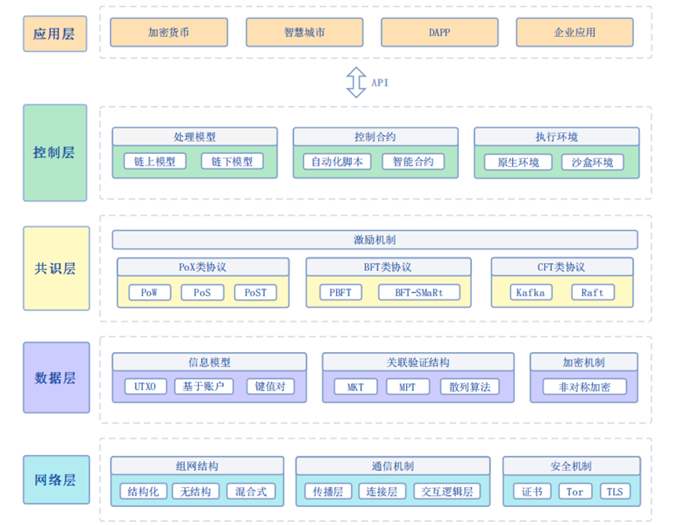
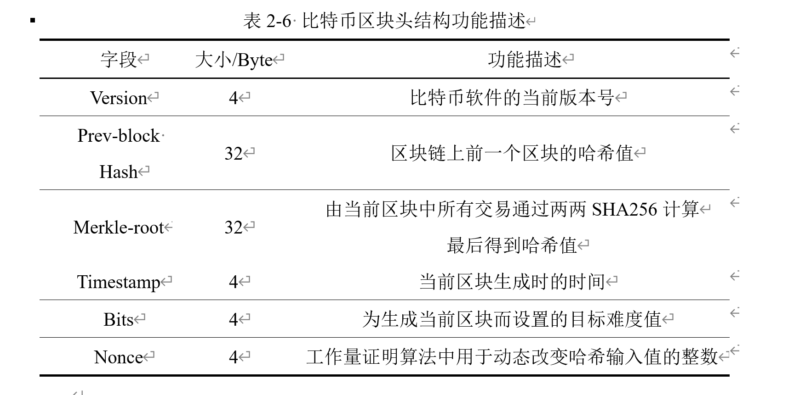
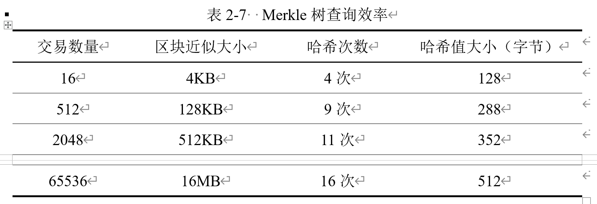
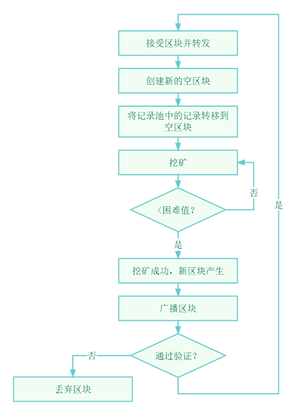

# 
**网络安全技术实验报告**

Lab5 研究报告

 网络空间安全学院 信息安全专业

 2112492 刘修铭 1027

研究报告要层次清晰、论点清楚、论据准确；

研究报告写作要理论联系实际，同学们应结合课堂讲授内容，广泛收集与研究报告有关资料，含有一定案例，参考一定文献资料。 

## 选题

区块链网络安全漏洞分析

通过查找相关文献，了解区块链网络构建的方法、原理，详细分析区块链网络中可能存在的安全漏洞。

## 区块链介绍

### 概述

**区块链**（英语：blockchain[[1\]](https://zh.wikipedia.org/zh-cn/区块链#cite_note-te20151031-1)[[2\]](https://zh.wikipedia.org/zh-cn/区块链#cite_note-fortune20160515-2)[[3\]](https://zh.wikipedia.org/zh-cn/区块链#cite_note-nyt20160521-3)或block chain[[4\]](https://zh.wikipedia.org/zh-cn/区块链#cite_note-primer-4)[[5\]](https://zh.wikipedia.org/zh-cn/区块链#cite_note-obmh-5)）是借由[密码学](https://zh.wikipedia.org/wiki/密碼學)[[1\]](https://zh.wikipedia.org/zh-cn/区块链#cite_note-te20151031-1)[[6\]](https://zh.wikipedia.org/zh-cn/区块链#cite_note-cryptocurrencytech-6)与[共识机制](https://zh.wikipedia.org/wiki/共識機制)等技术建立与存储庞大交易资料链的[点对点](https://zh.wikipedia.org/wiki/對等網路)网络系统。

从广义上讲，区块链技术是利用块链式数据结构来验证和存储数据、利用分布式节点共识算法来生成和更新数据、利用密码学的方式来保证数据传输和访问的安全性、利用由自动化脚本代码组成的智能合约来编程和操作数据的一种全新的分布式基础架构与计算范式。简而言之，区块链技术具备去中心化和过程可信两大特点，是一种融合多种现代技术的新型分布式计算和存储范式，支持多方共同维护相同数据，从而保证数据的安全性和业务的公平性。区块链的工作流程主要包括生成区块、共识验证、账本维护3个步骤。

区块链由哈希运算、数字签名、共识算法、智能合约以及P2P（Peer to Peer）网络等多种基础技术融合而成，共同组建了如图所示的体系结构，自上而下分别为网络层、数据层、共识层、控制层和应用层。

网络层作为区块链信息交互的基础，承载着节点间的共识过程和数据传输，主要包括建立在基础网络上的P2P网络及其安全机制；数据层作为区块链技术体系中的核心，定义了各节点中数据的联系和组织方式，利用多种算法和机制保证数据的强关联性和验证的高效性，通过非对称加密等密码学原理实现了承载应用信息的匿名保护；共识层封装各类共识算法和驱动节点共识行为的奖惩机制，使账本数据能在不可信环境下实现全网统一；控制层是各类应用与账本产生交互的中枢，包括沙盒环境、自动化脚本、智能合约和权限管理等，提供区块链可编程特性，实现对区块数据、业务数据、组织结构的控制；应用层包括区块链的相关应用场景和实践案例，并通过调用控制合约提供的接口进行数据交互。

### 数据结构介绍

区块链是将各区块以生成时间为序链接而成的分布式数据库。区块链的链式结构的基本单位即为区块，其结构决定着交易信息的存储形式。每一个区块包含了前一个区块的[加密散列](https://zh.wikipedia.org/wiki/密碼雜湊函數)、相应时间戳记以及交易资料（通常用[默克尔树](https://zh.wikipedia.org/wiki/哈希树)（Merkle tree）算法计算的散列值表示）[[7\]](https://zh.wikipedia.org/zh-cn/区块链#cite_note-IPblockchain-7)，这样的设计使得区块内容具有难以篡改的特性。但如果掌握区块链节点51%以上的运算力，就能操控区块链的内容。如果一开始写入的内容是错误的内容，那么区块链技术只是让错误的内容难以被篡改。[[8\]](https://zh.wikipedia.org/zh-cn/区块链#cite_note-storm.mg-8)

区块由区块头（Header）和区块体（Body）两部分组成。不同区块链平台的数据结构在部分细节上略有差异，以比特币为例，区块头封装了当前版本号（Version）、前一区块哈希（Prev-block Hash）、用于当前区块工作量证明的目标难度值（Bits）、用于工作量证明算法的随机数（Nonce）、用于验证区块体交易哈希的Merkle根（Merkle-root）以及当前区块的生成时间戳（Timestamp）等信息

区块体中存放的是一段时间内产生的交易数量以及完整的交易记录，该交易记录已经验证。区块体中的信息构成了区块链中最为核心的数据结构，即交易账本。所有的交易记录基于 Merkle 树的哈希计算，最后生成Merkle根（最后的哈希值），并记入区块头的Merkle根字段。该字段可以保证区块体中的交易数据不被篡改。

Merkle树是一种树形数据结构，有二叉树和多叉树两种形式。作为区块链中最重要的数据结构，在区块链中使用Merkle树来快速归纳和校验区块数据的存在性和完整性。每个区块都会将存储的交易信息构建成一棵独立的Merkle树，树的叶子节点存储的是真实交易的Hash值（比特币使用双SHA256哈希）。Merkle 树运算过程一般是将区块体的数据进行分组哈希，并将生成的新哈希值插入到Merkle树中，如此递归直到只剩最后一个根哈希值并记为区块头的Merkle根。最常见的Merkle树为比特币采用的二叉Merkle树。在二叉Merkle树中，从下而上，同层的节点两两成对进行哈希运算，形成上一层的节点值。重复该过程，直到最后一个节点，也即树根。树根的哈希值成为区块中所有交易的唯一标识，并将它保存到区块头部的“Merkle根”字段中，用于工作量证明。其他变种还包括以太坊的Merkle patricia tree等。**<u>[11]曾诗钦,霍如,黄韬,刘江,汪硕,冯伟.区块链技术研究综述：原理、进展与应用[J] .通信学报,2020,41(01):134-151</u>**

Merkle树的优点如下：

1. 极大地提高了区块链的运行效率和可扩展性。Merkle树可以实现交易数据与哈希值的分离。在轻量级应用中，区块头只需包含Merkle树根的哈希值而不必封装所有底层数据，这使得区块链技术可以高效地运行在智能手机甚至物联网等计算和存储能力受限的设备上。

2. 可支持“简化支付验证”（simplified payment verification，SPV）协议。即在不下载区块链系统所有数据的情况下，仅依靠本区块中某一交易节点到Merkle根的路径信息，即可对交易数据进行检验。如在图2-11中，仅需节点Hash3、Hash12和Hash1~4即可验证“交易4”的存在性和正确性。根据二叉树的特性，只需要计算 $\log_2N$ 次，N为一个区块中包含的交易总数)，就可以判断出此交易是否存在此区块中，可以从下表中更加清晰地看出 Merkle 树查询的效率。

当交易数量从16条激增打65536条时，Merkle树的查询次数增加较慢。由此，说明Merkle树极大地降低了区块链运行所需带宽和验证时间，并使得仅保存部分相关区块链数据的轻量级客户端成为可能。

各个区块以区块的生成时间（区块头部的“时间戳”字段）为序，链接起来形成区块链。在区块链结构中，对当前区块头中的前一区块哈希(Prev-block Hash)、随机数(Nonce)和Merkle根(Merkle-root)等元数据进行哈希运算（比特币中为两次SHA256运算）即可得到该区块的哈希值，该值即为链接指针。所有区块按照生成顺序以Prev-block Hash字段为链接指针链接在一起，就形成了一条区块链表，即一个完整的账本，如图2-11所示。依靠Prev-block Hash字段，所有区块之间依据生成时间环环相扣，如果其中任何一个区块被篡改，都将会引发在其后生成的所有区块的哈希值发生连锁改变。由此，可以通过Prev-block Hash字段验证当前区块直至创世区块的所有区块的正确性。

### 区块链中的密码学技术

区块链系统运用了包括哈希算法、加密算法和数字签名等在内的多种现代密码学技术，以实现数据的安全性与可靠性，并建立信任机制。

#### 哈希算法

哈希算法，即散列算法。它可以将任意长度的输入通过一定的计算，生成一个固定长度的字符串，输出的字符串称为该输入的哈希值。哈希算法具备的正向快速、输入敏感、逆向困难、强抗碰撞等诸多优良特征，非常适合用于存储区块链数据。

在区块链中，哈希算法主要有两个应用：

一是通过哈希构建区块链的链式结构，实现防篡改，保证数据的安全性和可靠性。每个区块头都包含了上一个区块数据的哈希值，这些哈希层层嵌套，最终将所有区块串联起来，形成区块链。因此，若要篡改一笔交易，则在该交易所在区块之后生成的所有区块的哈希值都要篡改，计算量巨大，且须在正确区块产生之前快速运算出伪造的区块。对于节点数较多的网络而言，连续伪造的区块运算速度都超过其他节点几乎是不可能实现的。由此，交易数据的安全性和可靠性即得到保障。

二是通过哈希构建Merkle树，实现内容改变的快速检测。根据前文介绍，Merkle树的节点均为哈希值。在验证交易内容时，只需验证Merkle树即可。若树根哈希值验证不通过，则验证两个叶子节点，在验证其中哈希验证不通过的节点的叶子节点，最终即可准确识别被篡改的交易。

比特币区块链通常采用双SHA256哈希函数，该算法在比特币协议中被称为hash256或者dhash，即将任意长度的原始数据经过两次SHA256哈希运算后转换为长度为256位（32字节）的二进制数字来统一存储和识别。此外，在比特币区块链中还有一种算法是先计算SHA-256，再计算RipeMD160，这种算法在比特币协议中通常被称为hash160。SHA256 主要用于加密交易形成区块，RipeMD160则用于生成比特币的地址。SHA256 算法具有巨大的散列空间（$2^{256}$）和抗碰撞（避免不同输入值产生相同哈希值）等特性，可满足比特币的任何相关标记需要而不会出现冲突。SHA256对于小于$2^{64}$位的消息，会输出一个256位Hash值。SHA256的计算过程主要分为消息预处理和主循环消息预处理两个阶段。在消息预处理阶段，会将原始数据转化成n个512bit 大小的块，之后对每个块使用SHA256压缩函数进行处理，经过n次迭代后，输出原始数据的Hash值，计算流程如图所示。

#### 加密算法

现代密码学中的加密算法主要分为两类，分别是对称加密算法和非对称加密算法（公钥密码算法）。对称加密算法又称单钥密码算法，指的是加密过程和解密过程使用相同密钥的加密算法。其安全性主要由两个因素决定：一是加密算法足够强大，仅仅基于密文本身去解密信息在计算上是不可能的；二是密钥的安全性，密钥空间要足够大，加密方法的安全性根本上是依赖密钥的秘密性，而不仅是算法的秘密性。其优点在于加密和解密的效率高以及在使用长密钥时破解难度大，但在应用过程中需要提前将密钥分享，代价高昂，且存在着密钥泄露问题。此外，数字签名也是难题之一。目前常用的对称加密算法包括 DES(Data Encryption Standard)、IDEA(International Data Encryption Algorithm)、 AES(Advanced Encryption Standard)等。

非对称加密算法又称双钥密码算法，它使用的加密钥匙（又称为公钥）和解密钥匙（又称为私钥）是不同的，且加密钥匙是公开的，通过加密钥匙计算解密钥匙是困难的。其优势在于在应用过程中不需要将私钥分享，只需分享公钥，就可以解读加密数据，密钥的分配和管理简单，但算法实现速度远赶不上单钥密码体制。目前常用的非对称加密算法包括 RSA(Rivest Shamir Adleman)和 ECC(Elliptic Curve Cryptography)等。

区块链中的加密算法主要是非对称加密算法，主要用于信息加密、数字签名和登录认证等。其中信息加密场景主要是由信息发送者（记为A）使用接受者（记为B）的公钥对信息加密后再发送给B，B利用自己的私钥对信息解密，比特币交易的加密即属于此场景。数字签名场景则是由发送者A采用自己的私钥加密信息后发送给B， B使用A的公钥对信息解密、从而可确保信息是由A发送的。登录认证场景则是由客户端使用私钥加密登录信息后发送给服务器，后者接收后采用该客户端的公钥解密并认证登录信息。<u>**[12]王化群,吴涛.区块链中的密码学技术[J] .南京邮电大学学报(自然科学版),2017,37(06):61-67.**</u>

以比特币系统为例，其非对称加密机制如图所示。

比特币系统中应用的是 ECC 算法，此算法是基于椭圆曲线的一种非对称加密算法，是目前认为最安全的加密算法之一，PKI、OpenSSL等也开始采用ECC算法。算法的安全性依赖于椭圆曲线上的离散对数数学问题。相比于其他非对称加密算法，其优势主要有两点：一是密钥长度较短，可以减缓带宽和存储的压力，尤其是对比于目前应用广泛的RSA算法，其密钥长度较长，导致其加密和解密过程效率较低；二是所有的用户可以选择同一个有限域上不同的椭圆曲线，可使得所有的用户使用同样的操作完成域运算。

#### 区块链共识机制

共识是区块链的核心价值之一。区块链是一个点对点的、去中心化的分布式系统，网络中的节点互相独立、缺乏信任，各节点产生数据的时间不同、获取数据的来源未知，存在节点故意广播错误数据的可能性，这将导致女巫攻击、双花攻击等安全风险；此外，节点故障、网络拥塞带来的数据异常也无法预测。该错误即为拜占庭将军问题（the Byzantine generals problem）在区块链中的具体表现，即拜占庭错误——相互独立的组件可以做出任意或恶意的行为，并可能与其他错误组件产生协作。为此，区块链系统中设计共识算法，以解决拜占庭将军问题，在不可信的环境下实现账本数据的全网统一，保证区块链系统稳定运行。

早期的共识算法一般也称为分布式一致性算法。与目前主流的区块链共识算法相比，分布式一致性算法主要面向分布式数据库操作，且大多不考虑拜占庭容错问题，即假设系统节点只发生宕机和网络故障等非人为问题，而不考虑恶意节点篡改数据等问题。应用比较广泛的传统的分布式一致性算法包括Paxos和Raft等，其特点是网络中的节点都是忠诚的，并且所有节点都是由一个机构统一维护。但区块链是一个去中心化的网络结构，网络中的所有节点互相独立、互不信任，存在着恶意节点篡改数据的可能性，因此传统的分布式一致算法不适用于区块链系统。目前区块链系统应用的共识算法主要包括 PoW、PoS、DPoS和PBFT等。**<u>[13]靳世雄,张潇丹,葛敬国,史洪彬,孙毅,李鸣,林业明,姚忠将.区块链共识算法研究综述[J] .信息安全学报,2021,6(02):85-100</u>**

##### PoW(Proof of Work)工作量证明机制

PoW共识机制由中本聪2008年在其比特币奠基性论文中提出，早期的比特币区块链即高度依赖节点算力的PoW共识机制来保证比特币网络分布式记账的一致性，其核心思想是通过引入分布式节点的算力竞争来保证数据一致性和共识的安全性。通俗而言，在比特币系统中，各节点（即矿工）都要保存完整的交易信息，且每个节点都有记账权。但各节点所处环境不同，不能保证所有节点同时记录同一笔交易，这可能会导致各个节点的记账内容不同，造成混乱，PoW共识机制就是来确认哪个节点拥有记账的权利。各节点基于各自的计算机算力相互竞争来共同解决一个求解复杂但验证容易的SHA256数学难题（即挖矿），最快解决该难题的节点将获得区块记账权和系统自动生成的比特币奖励。比特币系统通过灵活调整挖矿难度来控制区块的平均生成时间为10分钟左右。PoW共识机制具体流程如图所示：

PoW共识机制是具有重要意义的创新，其借助比特币特有的价值属性激励节点参与挖矿，并在共识过程中通过竞争区块的记账权实现了比特币的货币发行和交易支付行为，采用的验证和竞争机制保障了系统的安全性和去中心化。但PoW共识机制同时存在着显著的缺陷，其强大算力造成的资源浪费（如电力）历来为研究者所诟病，且长达10分钟的出块时间使其相对不适合于额度小、交易量大的商业应用，其可扩展性受到了限制。

##### PoS (Proof of Stake)权益证明机制

PoS共识是为解决PoW共识机制的资源浪费和安全性缺陷而提出的替代方案，PoS通过权益证明来替代PoW中的基于节点哈希算力的证明来竞争新区块的记账权，但其本质还是通过求解SHA256数学难题来争夺记账权以达成共识。PoS 最先由点点币（Peercoin,PPC）投入使用。该算法通过计算节点持有币的数量和时间的乘积，即币龄，用来作为获得记账权的标准。节点的币龄和求解SHA256的难度成反比，也即节点的币龄越大，其越容易争夺到记账权。节点在获得记账权后币龄会清空，每清空规定数量币龄会得到相应奖励。

与 PoW 算法相比，PoS 算法拥有一些明显的优点，如放弃单纯的算力竞争而节约了能源，提高了节点性能，采用清零机制解决了算力过于集中，限制只有在线用户才能获得收益从而解决“公地悲剧”（tragedy of the commons）的发生等。但PoS更容易出现分叉，安全性和容错性相对较低，某些拥有权益的节点无意全力投入到记账竞争中，加入网络较早并且拥有较多数字货币的节点拥有长久的优势，会造成网络的去中心化失效，记账权一直集中在有限的几个节点上。

##### DPoS (Delegated Proof of Stake)股份授权证明机制

为了有效解决PoS共识机制存在的不足，2014年4月，Larimer等在PoS的基础上提出了DPoS共识算法，以提高持币者参与挖矿的积极性和主动性。DPoS共识机制的基本思路类似于“董事会决策”，即系统中每个股东节点可以将其持有的股份权益作为选票授予一个代表，获得票数最多且愿意成为代表的前101个节点将进入“董事会”。“董事会”成员按照约定的记账时间轮流对交易进行打包结算并且签署（即生成）一个新区块。每个区块被签署之前，必须先确保前一个区块已经被受信任的代表节点所签署。“董事会”的授权代表节点可以从每笔交易的手续费中获得收入，同时要成为授权代表节点必须缴纳一定量的保证金，其金额相当于生产一个区块收入的 100倍。授权代表节点必须对其他股东节点负责，如果其错过签署相对应的区块，则股东将会收回选票从而将该节点 “投出”董事会，“董事会”的成员按照维护周期（一般为一天）更新一次。因此，授权代表节点通常必须保证 99 %以上的在线时间以实现盈利目标。

显然，与PoW共识机制必须信任最高算力节点和PoS共识机制必须信任最高权益节点不同的是，DPoS共识机制中每个节点都能够自主决定其信任的授权节点且由这些节点轮流记账生成新区块，因而大幅减少了参与验证和记账的节点数量，可以实现快速共识验证。DPoS共识机制虽然是对 PoS 效率和性能的优化，但采取的委托权益的方式实质上是对区块链去中心化标准的降低。此外，参与节点需要一定的数量才能保证选出的节点具有代表性，因此不适用于节点较少的应用场景。

##### PBFT (Practical Byzantine Fault Tolerance)实用拜占庭容错机制

PBFT共识机制最早出现在MIT的Miguel和Barbara Liskov的学术论文中，在Hyperledger（超级账本）和Antshares（小蚁）中即采用该共识机制。与前三种共识算法不同，PBFT算法不涉及到数字货币以及工作量证明等机制，而是一种状态机副本复制算法，通过三个阶段的不断验证最终达到commited状态后才表示达成共识，期间允许对验证结果的误判。此算法解决了拜占庭将军问题，且允许网络中存在不超过 $\frac{(N-1)}{3}$ 个拜占庭节点，其中N为网络中节点数的总数。PBFT通过优化算法将计算复杂度降低到多项式级，其共识效率和吞吐量要远高于上面三种共识算法。

由于PBFT共识中可以生成新区块的节点（primary节点）是唯一的，因此不会存在分叉现象。但由于每个节点都需要频繁地接收从其他节点发送过来的交易数据，同时也要将本节点的交易数据尽快发送出去，因此网络的开销较大，导致基于PBFT共识机制的区块链的系统性能不高，只能满足规模不大的联盟链应用场景。

#### 以太坊技术

2013年年末，Vitalik Buterin对外发布了以太坊白皮书，以太坊项目的开启标志着区块链2.0时代的到来。以太坊是一个提供给用户各种模块用以搭建应用的公共区块链平台，是在比特币去中心化架构基础上进行的改良。其中标志性创新是引入了智能合约，旨在能够让每一位用户都有自定义去中心化应用的权利，各类规则都可以写进智能合约里。当满足某些条件时，这些应用将触发智能合约与区块链网络产生交互，以此实现其网络和存储功能，更重要的是衍生出更多场景应用和价值产物，例如以太猫，利用唯一标识为虚拟猫赋予价值；GitCoin，众筹软件开发平台等。相较于以比特币为代表的区块链1.0，以以太坊为代表的区块链2.0的优势在于：支持智能合约；适应大部分应用场景的交易速度；支持信息加密；无资源消耗等。

以太坊平台研发一门编程语言Solidity用以编写智能合约，并提供了EVM（以太坊虚拟机）来运行智能合约。以太坊的整体架构如图2-17所示，共分为底层服务、核心层和顶层应用三层。

**1.****底层服务**

以太坊的底层服务中封装了 P2P 网络、非关系型数据库LevelDB、非对称加密算法等密码学算法以及分片优化等服务。以太坊是一个区块链平台，因此也是一个点对点的网络拓扑结构。P2P 网络中每一个节点彼此对等，不存在中心节点，各个节点共同提供服务，不存在任何特殊节点，网络中的节点能够生成或审核新数据网络中。以太坊中的数据和区块等信息存储在LevelDB数据库，并运用密码学保证数据的安全性、完整性。分片优化则是以太坊对区块链进行了改进，使之能够并行的验证交易，加快了区块的生成速率。这些底层服务共同促使区块链系统平稳地运行。

**2.****核心层**

核心层封装了区块链核心技术、共识算法和以太坊虚拟机（EVM），其以区块链技术为主体，辅以以太坊特有的共识算法，并以EVM作为运行智能合约的载体，该层是以太坊的核心组成部分。以太坊平台提供了两种共识算法PoW和PoS供开发人员选择，初步实现了插拔式共识算法机制。同时，以太坊提供了智能合约的运行环境 EVM，这是以太坊的主要创新，它是以太坊中智能合约的运行环境，使得以太坊能够实现更复杂的逻辑。

**3.****顶层应用**

应用层封装API接口、智能合约以及去中心化应用（Dapp）等。以太坊提供Web3.js 和Web3j等API接口来实现Web端或移动端与智能合约进行数据交互， 并通过RPC 机制来调用智能合约。这一层是与Dapp的开发人员和用户最为接近的一层，企业可以根据自己的业务逻辑，实现自身特有的智能合约，以帮助企业高效地执行业务。

##### 以太坊区块结构

比特币的数据结构采用基于交易的模型，其特点是可以快速验证每笔交易，但缺点是无法对用户余额进行高效查询。为了提高对交易状态和余额的查询效率，使区块链平台支持更加广泛的应用，以太坊提出了基于账户的模型。针对某一账户来说，不同时刻可能存在不同的状态，反映了账户中各属性值（如以太币余额、从该账户地址发出去的交易数、合约状态数据的Merkle Patricia树根、合约代码的哈希值等）随时间的变化情况，一旦发生了某笔交易，涉及该交易的账户状态将会发生变化。因此，以太坊的区块结构在比特币区块链的基础上进行了一些调整，以太坊的区块主要由区块头、交易列表和叔区块头组成。

##### 以太坊智能合约

智能合约的概念最早于1994年由美国计算机科学家Nick Szabo提出，他对智能合约的定义为：“一个智能合约是一套以数字形式定义的承诺，包括合约参与方可以在上面执行这些承诺的协议”，其设计初衷是在无需第三方可信权威的情况下，作为执行合约条款的计算机交易协议，嵌入某些由数字形式控制具有价值的物理实体，担任合约各方共同信任的代理，高效安全履行合约并创建多种智能资产。自动贩卖机、销售点情报管理系统（Point of sales，简称POS）、电子数据交换系统（Electronic data intercharge，简称EDI）都可看作是智能合约的雏形。囿于当时计算场景的限制，缺少运行智能合约的平台，若不加保护地运行智能合约，智能合约的执行逻辑可能会被中途修改，很长一段时间内智能合约没有得到广泛的应用。

直到区块链的出现，学者们发现其与智能合约天然契合：区块链可借助智能合约的可编程性封装分布式节点的复杂行为；智能合约可借助区块链的去中心化基础架构在去信任、可执行环境中有效实现。区块链逐渐成为智能合约最主要的计算场景，智能合约也被赋予了新的含义，以太坊平台将智能合约融合到其整个生态系统中。运行在区块链上的智能合约以数字规则的形式来表示合约双方的承诺，包含一组预定义的状态，并可以在交易的驱动下进行状态转移。其继承了区块链三个方面的特点，即公开透明、不可篡改、永久运行。

在以太坊中，智能合约是存储在区块链上的包含合约代码和存储空间的虚拟账户，也拥有着和用户账户一样的账户地址，通过账户地址可以获取到智能合约，不同的是合约账户有独自的存储空间来记录此合约发生的所有操作。智能合约的执行过程如图所示。

部署在区块链上的智能合约是一段能够在本地产生原智能合约代码的数据串，可以理解区块链为一个数据库，而客户端通过发起一笔交易，告诉以太坊节点需要调用的函数及相关参数，所有的以太坊节点都会接收到这笔交易，然后从区块链这个数据库中读取了存储的智能合约运行代码，在本地 EVM运行出结果。为避免节点作恶，节点运行智能合约的结果将与其他以太坊节点进行对比，最后确认无误后才将结果写入到区块链中，从而实现智能合约的正确执行。

## 区块链安全性

据网络系统的安全需求，结合区块链的特点，区块链系统构建的基本安全目标是通过密码学和网络安全等技术手段，保护区块链系统中的数据安全、共识安全、隐私保护、智能合约安全和内容安全，各安全目标之间的关系如图所示。其中，数据安全是区块链的首要安全目标。共识安全、智能合约安全、隐私保护和内容安全等安全目标与数据安全联系紧密，是数据安全目标在区块链各层级中的细化，也是区块链设计中需要特别考虑的安全要素。

### 数据安全

数据安全是区块链的基本安全目标。区块链作为一种去中心化的存储系统，需要存储包括交易、用户信息、智能合约代码和执行中间状态等海量数据。这些数据至关重要，是区块链安全防护的首要实体。本文采用 CIA 信息安全三元组来阐述区块链的数据安全，即保密性（Confidentiality）、完整性（Integrity）和可用性（Availability）。  

**1.****保密性**

规定了不同用户对不同数据的访问控制权限，仅有权限的用户才可以对数据进行相应的操作，信息不能被未授权用户知晓和使用，引申出隐私保护性质。保密性具体要求区块链设置相应的认证规则、访问控制和审计机制。认证规则规定了每个节点加入区块链的方式和有效的身份识别方式，是实现访问控制的基础。访问控制规定了访问控制的技术方法和每个用户的访问权限。在无许可区块链中，如何通过去中心化方式实现有效的访问控制尤为重要。审计监管是指区块链能够提供有效的安全事件监测、追踪、分析、追责等一整套监管方案。

**2.****完整性**

完整性是指区块链中的任何数据不能被未经过授权的用户或者以不可察觉的方式实施伪造、修改、删除等非法操作。具体指用户发布的交易信息不可篡改、不可伪造；矿工挖矿成功生成区块并获得全网共识后不可篡改、不可伪造；智能合约的状态变量、中间结果和最终输出不可篡改、不可伪造；区块链系统中一切行为不可抵赖，如攻击者无法抵赖自己的双重支付（Double spending）攻击行为。完整性在交易等底层数据层面上往往需要数字签名、哈希函数等密码组件支持。在共识层面上，数据完整性的实现则更加依赖共识安全。

**3.****可用性**

可用性是指数据可以在任何时间被有权限的用户访问和使用。区块链中的可用性包括四个方面。首先，可用性要求区块链具备在遭受攻击时仍然能够继续提供可靠服务的能力，需要依赖支持容错的共识机制和分布式入侵容忍等技术实现。其次，可用性要求当区块链受到攻击导致部分功能受损的情况下，具备短时间内修复和重构的能力，需要依赖网络的可信重构等技术实现。另外，可用性要求区块链可以提供无差别服务。即使是新加入网络的节点依旧可以通过有效方式获取正确的区块链数据，保证新节点的数据安全。可用性亦指用户的访问数据请求可以在有限时间内得到区块链网络响应，进一步可引申出可扩展性的含义。可扩展性是指区块链具有高吞吐量、低响应时延， 即使在网络节点规模庞大或者通信量激增的情况下，仍能提供稳定的服务。

### 共识安全

共识机制是区块链的核心，共识安全对区块链的数据安全起到重要的支撑作用。此处采用一致性（Consistency）和活性（Liveness）两个安全属性来衡量和评估区块链的共识安全。

**1.****一致性**

要求任何已经被记录在区块链上并达成共识的交易都无法更改，即一旦网络中节点在一条区块链上达成共识，那么任意攻击者都无法通过有效手段产生一条区块链分叉，使得网络中的节点抛弃原区块链，在新区块链分叉上达成共识。一致性是共识机制最重要的安全目标。根据共识机制在达成共识的过程中是否出现短暂分叉，一致性又分为弱一致性和强一致性。弱一致性是指在网络节点达成共识的过程中有短暂分叉的出现。一些情况下，节点可能会无法立即在两个区块链分叉中做出选择，形成左右摇摆的情况。强一致性是指网络中新区块一旦生成，网络节点即可判断是否对它达成共识，不会出现阶段性分叉。

**2.****活性**

要求诚实节点提交的合法数据终将由全网节点达成共识并被记录在区块链上。合法数据包括诚实节点提交的合法交易、正确执行的智能合约中间状态变量、结果等。活性保证了诚实节点能够抵抗拒绝服务攻击，维护区块链持续可靠运行

### 隐私保护

隐私保护是对用户身份信息等用户不愿公开的敏感信息的保护。在区块链中，主要针对用户身份信息和交易信息两部分内容。因此，区块链的隐私保护可划分为身份隐私保护和交易隐私保护。

**1.****身份隐私保护**

要求用户的身份信息、物理地址、IP 地址与区块链上的用户公钥、地址等公开信息之间是不关联的。任何未授权节点仅依靠区块链上公开的数据无法获取有关用户身份的任何信息，也不能通过网络监听、流量分析等网络技术手段对用户交易和身份进行追踪。

**2.****交易隐私保护**

要求交易本身的数据信息对非授权节点匿名。在比特币中特指交易金额、交易的发送方公钥、接收方地址以及交易的购买内容等其他交易信息。任何未授权节点无法通过有效的技术手段获取交易相关的知识。在一些需要高隐私保护强度的区块链中，还要求割裂交易与交易之间的关联性，即非授权节点无法有效推断两个交易是否具有前后连续性、是否属于同一用户等关联关系

### 智能合约安全

根据智能合约的整个生命周期运作流程，智能合约安全可以被划分为编写安全和运行安全两部分。

**1.****编写安全**

侧重智能合约的文本安全和代码安全两方面。文本安全是实现智能合约稳定运行的第一步。智能合约开发人员在编写智能合约之前，需要根据实际功能设计完善的合约文本，避免由合约文本错误导致智能合约执行异常甚至出现死锁等情况。代码安全要求智能合约开发人员使用安全成熟的语言，严格按照合约文本进行编写，确保合约代码与合约文本的一致性，且代码编译后没有漏洞。

**2.****运行安全**

涉及智能合约在实际运行过程中的安全保护机制，是智能合约在不可信的区块链环境中安全运行的重要目标。运行安全指智能合约在执行过程中一旦出现漏洞甚至被攻击，不会对节点本地系统设备造成影响，也不会使调用该合约的其他合约或程序执行异常，包括模块化和隔离运行两方面。模块化要求智能合约标准化管理，具有高内聚低耦合的特点，可移植，可通过接口实现智能合约的安全调用。遭受攻击后的异常结果并不会通过合约调用的方式继续蔓延，保证了智能合约的可用性。隔离运行要求智能合约在虚拟机等隔离环境中运行，不能直接运行在参与区块链的节点本地系统上，防止运行智能合约的本地操作系统遭受攻击。

### 内容安全

内容安全是在数据安全的基础上衍生出来的应用层安全属性，要求区块链上传播和存储的数据内容符合道德规范和法律要求，防止不良或非法内容在区块链网络中传播，保证区块链网络中信息的纯净度。内容安全的保障重点是加强区块链中信息在传播和存储过程中的控制和管理。由于区块链具有不可篡改的特点，一旦非法内容被记录在区块链上，将很难被修改或撤销，也将影响公众和政府对区块链应用的态度。在区块链应用生态中需要网络监测、信息过滤等技术，保证区块链的内容安全。此外，内容安全还需要设置有效的监管机制对已经记录在区块链中的非法内容进行撤销、删除等操作，维护区块链网络健康发展。

## 区块链存在的安全漏洞

> https://github.com/slowmist/Cryptocurrency-Security-Audit-Guide/blob/main/Blockchain-Common-Vulnerability-List_CN.md

>  篇幅有限，仅介绍部分漏洞

### 51%攻击

> https://medium.com/@NervosCN/%E4%BB%80%E4%B9%88%E6%98%AF%E5%8A%A0%E5%AF%86%E8%B4%A7%E5%B8%81%E7%9A%84-51-%E6%94%BB%E5%87%BB-8e81c2cd5690

#### 介绍

51%攻击是一种针对加密货币的攻击，当一个矿工或一组矿工成功劫持并控制了区块链 50% 以上的哈希率。通过拥有超过 50% 的区块链哈希率控制，恶意攻击者可以操纵区块链上的加密货币交易记录。

对加密货币执行 51% 攻击的难度取决于网络的累积哈希率。也就是说，攻击者对具有非常高哈希率的区块链执行 51% 攻击更具挑战性。反之亦然，对具有较低哈希率的网络执行攻击相应地更容易。

当一个或一组攻击者控制了工作量证明区块链中超过一半的总计算能力时，他们可以操纵交易并进行双花，而网络中的任何其他人都无法对此做任何事情。同时，根据区块链的共识机制，较长的链会被网络接受为有效链。当私有链的长度超过主链时，原交易在公共链上被逆转，攻击者就能再次使用之前已经花费的币。

当没有人控制超过一半的哈希率时，没有人可以更改交易并期望大多数人会接受它。但如果攻击者掌握了区块链的大部分哈希率，诚实节点将无力阻止它，即使他们都怀疑它。

必须认识到，对权益证明 (PoS) 区块链的 51% 攻击与对工作量证明 (PoW) 区块链的 51% 攻击不同。使用 PoS 的区块链，攻击者必须拥有区块链上一半以上的抵押加密货币，而不是大部分哈希率。

像比特币这样的区块链，在没有人控制超过一半的哈希率时是安全的，而像以太坊这样的权益证明区块链，在没有人控制超过一半的加密货币时是安全的。

控制超过一半的工作量证明区块链哈希率的攻击者，可以轻松操纵加密货币交易。这些交易操纵会严重影响目标加密货币的价格和可信度。

攻击者可以强制执行他们的操纵交易验证版本，因为他们控制了一半以上的哈希率，并且他们可以逆转最近确认的交易，将相同的加密货币花费两次。这种策略称为双花。攻击者这样做是为了多次花费相同数量的代币。

不仅是双花问题，51% 攻击还使攻击者能够进行 Denial-of-Service (DoS) 攻击，攻击者可以在受损链最终变为永久性之前，过滤掉其他矿工或验证者的地址。

想象这样一个场景，商店里的每个人都可以用同样的 10 美元钞票购买 20 件衬衫。那么这家商店就会破产，因为每个人都会滥用它。当区块链被 51% 的攻击者滥用时，也会发生这种情况。

攻击者将继续重复使用相同的加密货币，并尽快将它们转储为其他加密货币，并通过一些阴暗的加密货币洗钱行为将它们转移到法定货币。

#### 实例

##### Bitcoin Gold 攻击

* **事件时间**：2018年
* **事件概述**：Bitcoin Gold是比特币的一个分支，它在2018年遭受了多次51%攻击。攻击者成功进行了大规模的双重支付，据估计总损失超过1800万美元。
* **攻击方式**：攻击者租用了大量的计算能力以获得网络的主导地位，然后进行了双重支付攻击。

##### Ethereum Classic 攻击

* **事件时间**：2019年
* **事件概述**：Ethereum Classic（ETC）在2019年遭遇了几次51%的攻击，导致价值数百万美元的ETC被双重支付。
* **攻击方式**：与Bitcoin Gold类似，攻击者通过控制超过50%的网络哈希率，实现了链重组和双重支付。

#### 防御措施

* **增加哈希率**：提高网络的整体哈希率，使单一攻击者难以控制绝大多数计算力。
* **采用更安全的共识算法**：比如权益证明（PoS）或委托权益证明（DPoS），这些算法不仅仅依赖于计算能力。
* **提高确认数**：对于大额交易，可以要求更多的确认数，以增加双重支付攻击的难度。
* **网络监听和警告系统**：监测网络异常，如不寻常的算力集中，及时发出警告。

### double spending 攻击

#### 介绍

攻击者在短时间内两次使用同一份数字货币，从而欺骗系统；或攻击者利用交易的先后顺序来欺骗系统，比如在交易确认前 double spending。

双花攻击(Double Spend Attack)即一笔钱花了两次，双重支付，利用货币的数字特性两次或多次使用“同一笔钱”完成支付。双花不会产生新的 Token，但能把自己花出去的钱重新拿回来。简单说就是，攻击者将一笔 Token 转到另外一个地址，通常是转到交易所进行套现，然后再利用一些攻击手法对转账交易进行回滚。目前有常见的几种手法能够引发双花攻击：

1. Race Attack

这种攻击主要通过控制矿工费来实现双花。攻击者同时向网络中发送两笔交易，一笔交易发给自己(为了提高攻击成功的概率，他给这笔交易增加了足够的矿工费)，一笔交易发给商家。由于发送给自己的交易中含有较高的手续费，会被矿工优先打包进区块的概率比较高。这时候这笔交易就会先于发给商家的那笔交易，那么发给商家的交易就会被回滚。对于攻击者来说，通过控制矿工费，就实现了同一笔 Token 的“双花”。

2. Finney Attack

攻击者主要通过控制区块的广播时间来实现双花，攻击对象针对的是接受 0 确认的商家。假设攻击者挖到区块，该区块中包含着一个交易，即 A 向 B 转了一定数量的 Token，其中 A 和 B 都是攻击者的地址。但是攻击者并不广播这个区块，而是立即找到一个愿意接受 0 确认交易的商家向他购买一个物品，向商家发一笔交易，用 A 向商家的地址 C 支付，发给商家的交易广播出去后，攻击者再把自己之前挖到的区块广播出去，由于发给自己的交易先于发给商家的交易，对于攻击者来说，通过控制区块的广播时间，就实现了同一笔 Token 的“双花”。

3. Vector76 attack

Vector76 Attack 又称“一次确认攻击”，也就是交易确认一次后仍然可以回滚，是 Finney Attack 和 Race Attack 的组合。

攻击者创建两个节点，节点 A 连接到商家节点，节点 B 连接到区块链网络中的其他节点。接着，攻击者用同一笔 Token 发起两笔交易，一笔交易发送给商家地址，我们称为交易 1；一笔交易发送给自己的钱包地址，我们称为交易 2。与上面说的 Race Attack 一样，攻击者对交易 2 添加了较高的矿工费从而提高了矿工的打包概率，此时，攻击者并没有把这两笔交易广播到网络中去。

接着，攻击者开始在交易 1 所在的分支上进行挖矿，这条分支我们命名为分支 1。攻击者挖到区块后，并没有广播出去，而是同时做了两件事：在节点 A 上发送交易 1，在节点 B 上发送交易 2。

由于节点 A 只连接了商家节点，所以当商家节点想把交易 1 传给其它对等节点时，连接了更多节点的节点 B，已经把交易 2 广播给了网络中的大部分节点。于是，从概率上来讲，交易 2 就更有可能被网络认定为是有效的，交易 1 被认定为无效。

交易 2 被认为有效后，攻击者立即把自己之前在分支 1 上挖到的区块，广播到网络中。这时候，这个接受一次确认就支付的商家，会确认交易成功，然后攻击者就可以立即变现并转移资产。

同时，由于分支 2 连接的更多节点，所以矿工在这个分支上挖出了另一个区块，也就是分支 2 的链长大于分支 1 的链长。于是，分支 1 上的交易就会回滚，商家之前支付给攻击者的交易信息就会被清除，但是攻击者早已经取款，实现了双花。

4. 51% attack

攻击者占有超过全网 50% 的算力，在攻击者控制算力的这段时间，他可以创造一条高度大于原来链的新链。那么旧链中的交易会被回滚，攻击者可以使用同一笔 Token 发送一笔新的交易到新链上。

#### 实例

目前已知公链安全事件的攻击手法多为 51% 攻击，截止发稿日由于攻击者掌握大量算力发起 51% 攻击所造成的损失共 19,820,000 美金。2019 年 1 月 6 日，慢雾区预警了 ETC 网络的 51% 算力攻击的可能性，据 Coinbase 博客报道该攻击者总共发起了 15 次攻击，其中 12 次包含双花，共计被盗 219,500 ETC(按当时市价约为 110 万美元)，攻击者经过精心准备，通过租借大量算力向 ETC 发动了 51% 攻击，累计收益超 10 倍，Gate.io、Yobit、Bitrue 等交易所均受到影响。所幸在整个 ETC 生态社区的努力下，一周后攻击者归还了攻击所得收益，幸而没有造成进一步的损失。

#### 防御措施

针对双重支付（Double Spending）攻击，区块链网络可以采取多种防御措施来增强安全性和减少此类攻击的风险。以下是一些有效的防御策略：

1. **增加确认次数**

对于所有交易，特别是大额交易，可以增加所需的确认次数。在比特币网络中，一笔交易通常在6个确认后被视为最终确定。增加确认次数意味着攻击者需要更长的时间和更多的资源来成功执行双重支付。

2. **使用中心化或半中心化的验证机制**

尽管这种方法与区块链的去中心化精神相悖，但某些网络选择使用中心化或半中心化的机构来验证交易的合法性，以快速识别并阻止双重支付尝试。

3. **部署网络监听工具**

通过部署专门的网络监控工具来实时监控不寻常的网络活动，如异常的算力变化、交易模式等，这些都可能是双重支付或其他攻击行为的迹象。

4. **利用先进的共识机制**

传统的工作量证明（PoW）机制容易受到51%攻击的影响，进而引发双重支付。采用如权益证明（PoS）、委托权益证明（DPoS）或拜占庭容错（BFT）等其他共识机制，可以降低这种风险。

5. **交易锁定机制**

某些区块链实现了交易锁定功能，这意味着在交易被最终确认之前，其使用的资金被锁定，无法用于其他任何交易。

6. **二次验证**

对于涉及高价值的交易，可以要求额外的安全验证步骤，如多重签名或二次人工审核，这增加了双重支付的难度。

7. **改进网络协议**

持续对区块链协议进行更新和改进，以修补已知的安全漏洞，并引入新的安全特性来抵抗双重支付及其他类型的攻击。

8. **教育用户**

最后，对用户进行教育，让他们了解双重支付的风险和预防措施，特别是在进行大额交易时，增强他们的安全意识。

### 粉尘攻击

#### 介绍

攻击者发送微小金额的数字货币到大量地址，以追踪用户的交易行为

粉尘攻击（Dusting Attack），是一种新型的恶意攻击活动，黑客和诈骗者将通过向用户私人钱包中发送极少量的代币以此来试图破坏比特币和加密货币用户的匿名性。简单来说，黑客会使用这项攻击来获得用户身份，然后通过用户隐私来威胁用户，一些不愿意暴露出自己正在使用加密货币的人只得为此交付高额赎金。

在加密货币的世界中，“粉尘”是指人们通常可以将其忽略的极少量的货币或代币。就拿比特币为例，比特币的最小单位是1 satoshi（也就是0.00000001比特币），通常我们将小于几百satoshis的数量视为粉尘。

比特币转账中存在着免手续费的情况，而且有人频繁恶意地进行小额交易，会造成比特币网络的拥堵。因为，比特币的交易区间只有1M的大小，所以，那么多手续费极低甚至免费的小额交易，拥挤在比特币网络，必然会导致比特币网络的拥堵，而粉尘攻击最大的危害就是导致比特币网络拥堵。

在比特币交易手续费的设计中，每一个交易都会分配一个优先级，这个优先级是由币龄、交易的字节数和交易的数量来决定的，交易数量越大、币龄（这些币在区块中存在的时间）越高优先级就越高，就越有机会免交易手续费。如果你需要大量的小额比特币转账，又想免费转出，这时候你可以加一个数额大的、币龄高的比特币金额，就会将平均优先级提高，从而可以免费转出比特币。

黑客们向用户的钱包地址发送“粉尘”，一旦用户使用这些“粉尘”，这些微小金额就和用户未花费的的交易输出（UTXO）混合在一起，黑客就可以追踪用户的钱包地址，以获得用户的身份，然后通过用户隐私来威胁用户。

#### 实例

2019年共发生超8起公链被攻击事件，在8月9日，黑客向莱特币发起“粉尘攻击”，受影响的地址达294582个。

#### 防御措施

* 安全性较高的数字货币交易所，如binance、coinbase等提供每日一次的将粉尘转换成平台币的服务，有助于防止粉尘攻击。用户可以累积“粉尘”，直到能够将其转换为一整个代币，然后用户就可将其套现至银行帐户中
* 用户可以使用VPN隐藏身份并提高安全性
* 某些钱包允许用户把小数额的不明转入标记为粉尘攻击，那么这个粉尘UTXO将永远不会被选中进行交易。
* 将被攻击的地址和其他地址的资产做隔离，单独将大额资产的地址转到另一个新HD钱包
* 如果钓鱼式攻击通过备忘标签中含有消息的粉尘支付来实施，您只需忽略它们即可，并且无论它们承诺什么，切勿点击链接。

### Dos 攻击

#### 介绍

在网络拥堵时，交易可能需要较长时间确认，攻击者可以利用这一点进行“拒绝服务攻击”（DoS）。

DoS攻击，或者说拒绝服务攻击，是一种用于破坏合法用户访问目标网络或网站资源的方法。通常这是通过使大量流量的目标（一般是网站服务器）过载，或通过发送导致目标资源出现故障或完全崩溃的恶意请求来实现的。

1. 缓冲区溢出攻击

最常见的漏洞利用类型，缓冲区溢出攻击依赖于向目标发送超过开发人员最初构建系统可处理能力的流量。这种类型的攻击让攻击者使目标完全崩溃、或是控制目标进程。

2. ICMP洪水攻击

ICMP洪水攻击针对目标网络上配置错误的设备，迫使计算机将虚假数据包分发到目标网络上的每个节点（计算机）而不是单个节点，从而使网络过载。这种攻击通常可以称为“死亡之Ping”或“smurf攻击”。

3. SYN洪水攻击

SYN洪水攻击发送连接请求到（目标）网络服务器，但从不完全验证连接。然后它将继续（发送请求）目标网络服务器上的所有剩余打开端口，直到它强制服务器端崩溃。

4. DoS攻击与DDoS攻击

另一个您可能遇到的相似的术语是DDoS攻击，它代表分布式拒绝服务攻击。Dos和DDoS攻击之间的区别在于，许多恶意计算机被定向到针对单个资源。与单一来源的DoS攻击相比，分布式拒绝服务攻击更有可能成功破坏目标。攻击者更倾向于这种方法，因为因为攻击来自多个点，从而使追溯攻击来源变得更难。

#### 实例

第一例被记录的拒绝服务攻击事件发生在2000年2月，当时一名15岁的加拿大黑客以这种攻击攻击亚马逊和eBay网络服务器。从那时起，越来越多的人利用DoS攻击来破坏许多行业的目标（网站）。

#### 防御措施

区块链网络面对的分布式拒绝服务（Distributed Denial of Service, DDoS）攻击，尽管其去中心化特性提供了一定的天然防护，但仍然需要采取特定措施来增强防御。以下是一些有效的防御措施：

1. **提高网络冗余和分散性**

提高节点的地理和网络分散性可以帮助抵御集中在特定区域或网络的DDoS攻击。更多的节点意味着攻击者需要同时攻击多个节点才能有效干扰网络。

2. 限制请求率

对区块链节点接受的请求进行速率限制，可以防止单个用户或一组用户消耗过多资源。通过设置合理的请求阈值，可以阻止恶意实体通过大量请求来耗尽网络资源。

3. 使用专门的DDoS保护服务

许多企业级解决方案提供DDoS保护作为服务。这些服务可以帮助检测异常流量并缓解攻击，确保节点在攻击期间保持在线和功能正常。

4. 端点过滤和验证

实施端点验证和IP过滤可以防止未授权的访问尝试。节点可以配置防火墙规则，仅允许已知和信任的IP地址进行连接和交互。

5. **异步请求处理**

通过异步处理入站请求，节点可以在处理大量请求时避免阻塞。这样，即使在攻击期间，节点也能保持响应其他正常请求的能力。

6. 加强节点配置和安全

加强节点服务器的配置，确保它们能够处理大量的网络流量和请求。同时，通过定期更新和打补丁来减少安全漏洞，可以提高网络的整体安全性。

7. 多样化的共识机制

采用如权益证明（PoS）或委托权益证明（DPoS）等共识机制，相比于工作量证明（PoW），可以减少对计算资源的依赖，从而降低因大规模计算需求导致的潜在DDoS风险。

8. 建立应急响应计划

拥有一套明确的应急响应计划对于快速识别、隔离和缓解DDoS攻击是非常重要的。确保所有节点操作者都了解在攻击发生时的具体应对措施。

### 套利攻击

#### 介绍

区块链套利攻击通常涉及利用加密货币市场的价格不一致来获取无风险利润的策略。然而，在区块链领域，"套利攻击"有时指的是利用智能合约或区块链协议中的漏洞来进行套利，这超出了传统金融套利的范畴。这种攻击形式通常在去中心化金融（DeFi）平台上更为常见。以下是几种常见的区块链套利攻击类型：

1. **简单的市场套利**

这是最基础的形式，投资者在一个交易所购买某种加密货币，并在另一个交易所以更高的价格出售它。这种套利策略本身不是攻击，但在自动化和高频交易的环境下，它需要高度的优化和速度。

2. **跨协议套利**

在这种情况下，套利者会利用不同的加密货币协议或智能合约之间的交互差异。例如，如果两个协议为同一种加密货币提供不同的定价，套利者可以在一个协议中购买低价的资产，并在另一个协议中以高价卖出。

3. 时间差套利（Race Condition）**

在区块链上，由于交易确认时间存在延迟，套利者可以利用这种时间差异。例如，一个套利者可能会观察到一个交易已经在网络中广播但尚未被确认，并快速发起另一个交易来利用这个未确认的交易的影响。

4. **闪电贷套利**

闪电贷是DeFi中的一种无需抵押的瞬间借贷机制。套利者可以借用巨额资金，执行套利交易，然后在一个区块内还款。这种类型的套利可以在没有实际拥有相应资金的情况下执行复杂的套利策略。

5. **Oracle操纵套利**

由于许多DeFi项目依赖于预言机（Oracle）提供的价格信息，套利者可能通过操纵预言机数据来影响智能合约的执行结果。例如，如果套利者可以影响一个货币的预言机报价，他们可能能够在DeFi平台上以不公平的价格买卖该货币。

#### 实例

**事件相关方背景**

**攻击者：** 黑客通过创建了攻击合约地址 A，并在合约的构造函数中发起攻击。

**被攻击项目：** WUSDMaster 是一个质押 BSC_USDT 换取 WUSD 的合约，可以通过质押 (stake) BSC_USDT 来获得 WUSD， 通过赎回 (redeem) 将 WUSD 燃烧，然后换成 BSC_USDT，在这过程中一部分资金会转给金库 (Treasury)， WUSDMaster 会用 WEX 补贴给用户。

**攻击事件的核心点**

WUSDMaster 合约的 stake 函数中，会在质押的时候 1:1 兑换 BSC_USDT 和 WUSD，但是它还进行了一次 swap 操作，正是因为这个 swap 操作导致可以被黑客利用进行套利。

**核心问题点** **：** 允许数量 1:1 兑换 BSC_USDT 和 WUSD 的同时，WUSDMaster 的 swap 操作会额外导致 WaultSwapPair(BSC_USDT-WEX) 的池子中的代币失衡，从而形成套利空间。

**注意：** BSC_USDT 和 WUSD 也可以理解为价格上也是 1:1

最终攻击者获利 370 枚 BEP_ETH，并通过 Anyswap 进行资金转移，约损失 93 万美元。

#### 防御措施

1. **增强协议安全性**：确保智能合约和协议经过充分的安全审计，减少漏洞。
2. **改进预言机设计**：使用多个独立可靠的数据源，提高预言机数据的准确性和抗操纵能力。
3. **限制交易速度或引入滑点**：对可能被套利的交易施加额外的费用或滑点，以减少高频套利交易的利润空间。
4. **使用复杂的价格更新机制**：采用时间加权或体积加权的价格机制，降低单个交易对价格影响的可能性。
5. **监控和限制大额闪电贷**：对使用闪电贷的交易进行严格监控，设定限额，防止大规模操纵。

通过这些防御策略，区块链项目可以更好地保护自己不受套利攻击的影

响，同时维护市场的公正和效率。

## 参考文献
