# 
**网络安全技术实验报告**

Lab5 研究报告

 网络空间安全学院 信息安全专业

 2112492 刘修铭 1027

研究报告要层次清晰、论点清楚、论据准确；

研究报告写作要理论联系实际，同学们应结合课堂讲授内容，广泛收集与研究报告有关资料，含有一定案例，参考一定文献资料。 

## 选题

区块链网络安全漏洞分析：通过查找相关文献，了解区块链网络构建的方法、原理，详细分析区块链网络中可能存在的安全漏洞

## 区块链介绍

### 概述

区块链技术是利用块链式数据结构来验证和存储数据、利用分布式节点共识算法来生成和更新数据、利用密码学的方式来保证数据传输和访问的安全性、利用由自动化脚本代码组成的智能合约来编程和操作数据的一种全新的分布式基础架构与计算范式，由哈希运算、数字签名、共识算法、智能合约以及P2P网络等多种基础技术融合而成。

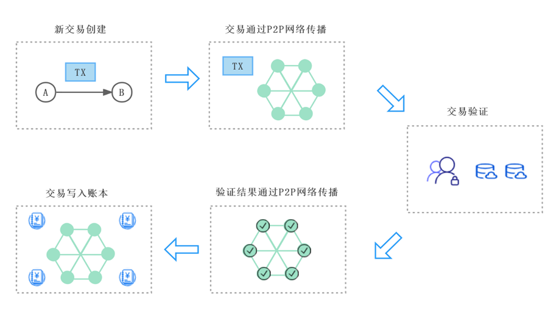

### 数据结构介绍

区块链是通过时间序链接区块的分布式数据库，每区块包含前区块散列、时间戳和交易数据，确保数据难以篡改。

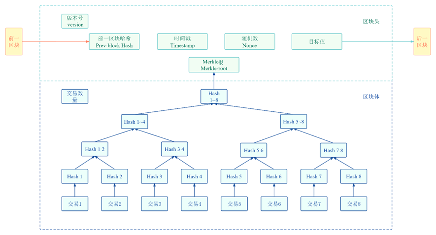

区块由头部和体两部分组成。区块头包含版本号、前一区块哈希、目标难度值、随机数、Merkle根和时间戳等信息。区块体包含交易记录，形成交易账本。交易基于Merkle树计算，生成Merkle根记录于区块头，确保数据不被篡改。Merkle树递归合并交易哈希至根节点，快速验证交易，保障数据完整性，根哈希关键于工作量证明。**<u>[11]曾诗钦,霍如,黄韬,刘江,汪硕,冯伟.区块链技术研究综述：原理、进展与应用[J] .通信学报,2020,41(01):134-151</u>**

区块链通过区块头的Prev-block Hash链接，形成一个时间顺序的完整账本。任何区块的篡改都会影响后续所有区块的哈希值，从而保障整条链的数据完整性和安全性。

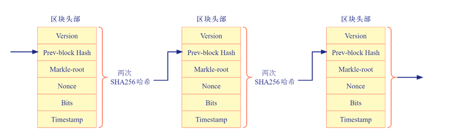

### 区块链中的密码学技术

区块链系统运用了包括哈希算法、加密算法和数字签名等在内的多种现代密码学技术，以实现数据的安全性与可靠性，并建立信任机制。

#### 哈希算法

哈希算法在区块链中主要用于构建防篡改的链式结构和Merkle树，保障数据安全。每个区块头包含前一区块的哈希值，形成交易的串联。Merkle树通过哈希节点实现快速检测内容变化。比特币使用双SHA256确保哈希的唯一性和抗碰撞性，对交易加密并生成地址。

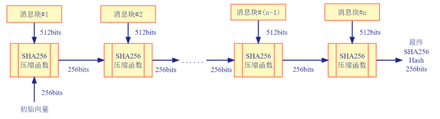

#### 加密算法

密码学在区块链中主要应用非对称加密算法，用于信息加密、数字签名和登录认证。信息加密中，发送者使用接收者公钥加密，接收者用私钥解密。数字签名中，发送者用私钥加密，接收者用公钥验证。登录认证中，客户端用私钥加密登录信息，服务器用公钥验证。此机制确保数据安全和身份验证。<u>**[12]王化群,吴涛.区块链中的密码学技术[J] .南京邮电大学学报(自然科学版),2017,37(06):61-67.**</u>

以比特币系统为例，其非对称加密机制如图所示。

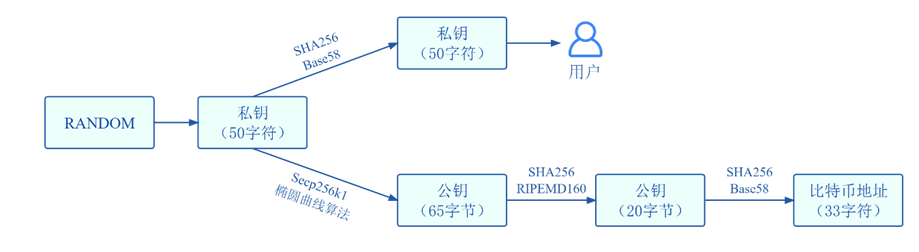

#### 区块链共识机制

区块链共识算法解决数据一致性与安全性问题。PoW依赖算力竞争确保共识，而PoS则依赖币龄与持币量。DPoS引入代表机制优化性能，PBFT解决拜占庭问题提高效率，适合联盟链场景。这些算法从不同方面提升区块链的安全性和效率，确保分布式账本的正确性和不可篡改性。**<u>[13]靳世雄,张潇丹,葛敬国,史洪彬,孙毅,李鸣,林业明,姚忠将.区块链共识算法研究综述[J] .信息安全学报,2021,6(02):85-100</u>**

几种共识机制的对比如图所示：

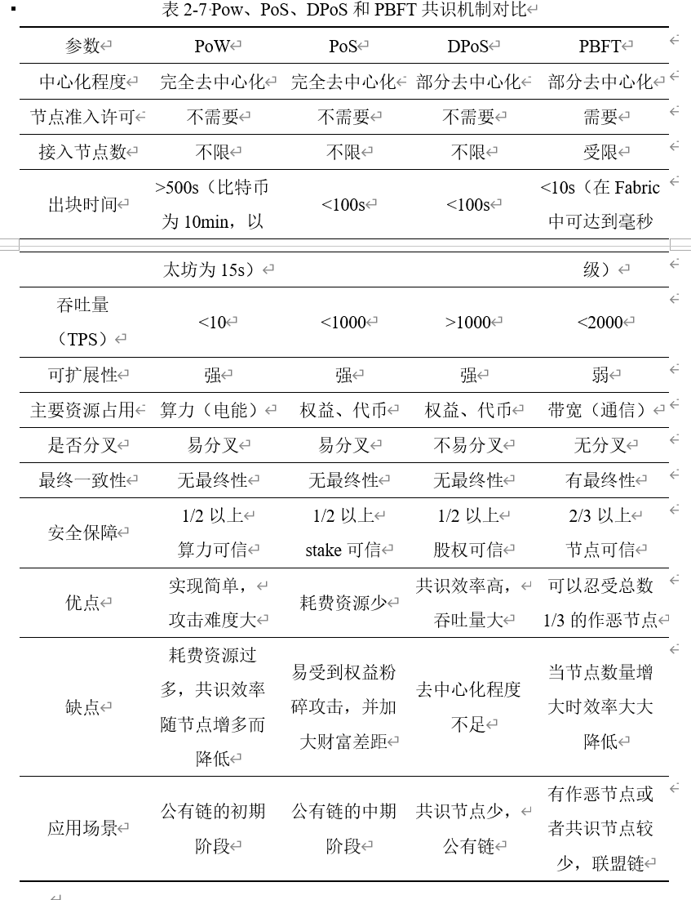

#### 以太坊技术

以太坊标志区块链2.0时代，引入智能合约，支持定制应用，通过智能合约与区块链交互，增强应用场景和价值产生，使用Solidity语言和EVM。其架构分为底层服务、核心层、顶层应用。底层包括P2P网络、LevelDB、密码学算法。核心层有区块链技术、共识算法、EVM。顶层应用提供API、智能合约、Dapp，支持数据交互和业务执行。

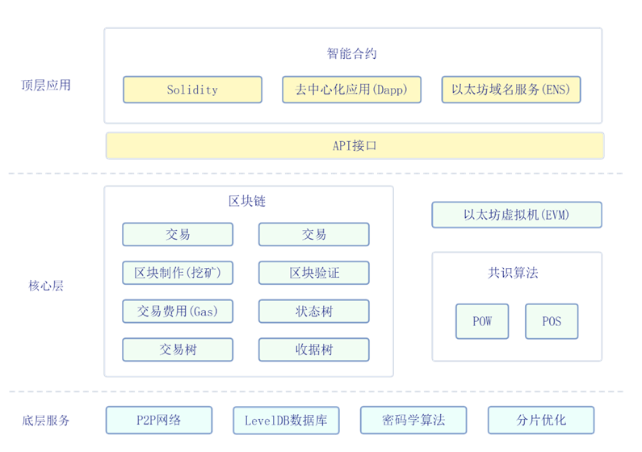

以太坊采用基于账户的模型，区块结构包括区块头、交易列表、叔区块头，支持状态和余额的高效查询，适应广泛应用。

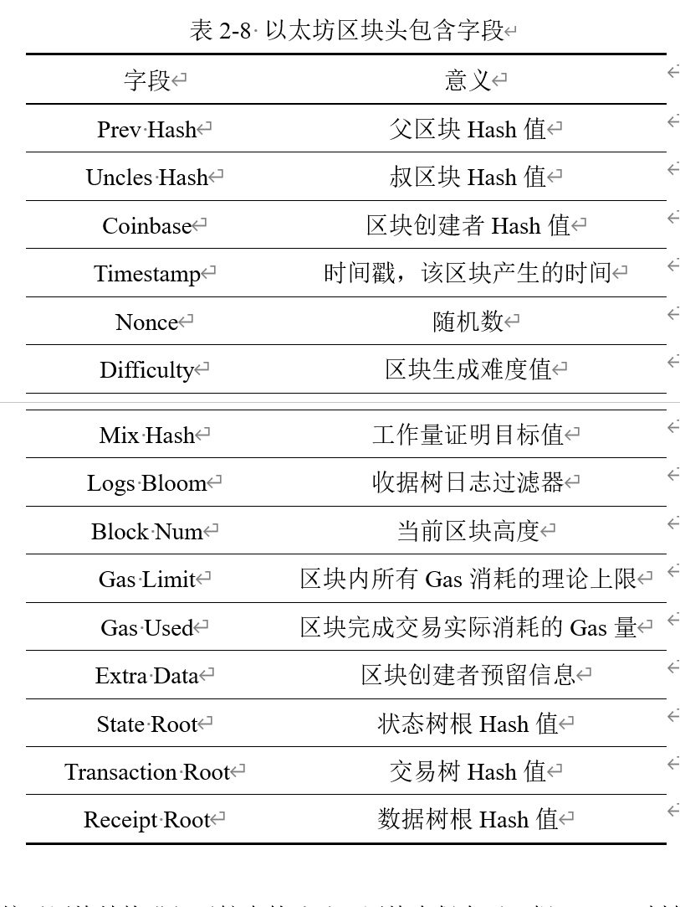

以太坊智能合约是区块链上的虚拟账户，具有代码和存储空间，通过客户端交易触发，节点验证后执行并更新区块链。

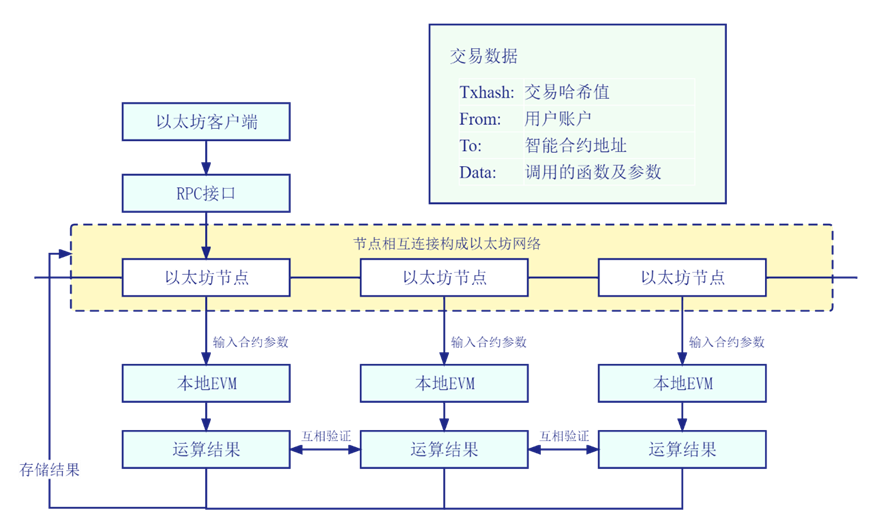

## 区块链安全性

### 综述

区块链系统构建的基本安全目标是通过密码学和网络安全等技术手段，保护区块链系统中的数据安全、共识安全、隐私保护、智能合约安全和内容安全，各安全目标之间的关系如图所示。

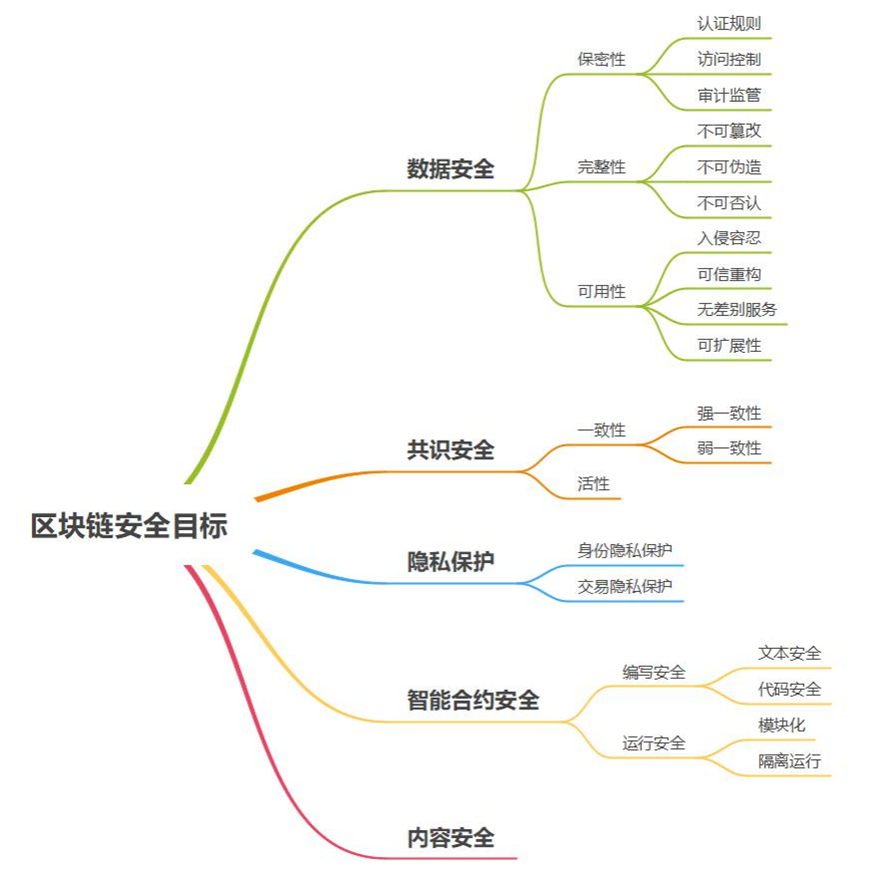

* 数据安全：数据安全是区块链的基本安全目标，依赖CIA三元组：保密性、完整性、可用性。保密性通过认证和访问控制保护数据；完整性确保数据不被非法修改；可用性保证数据随时可访问，支持容错和可扩展性。
* 共识安全：共识机制的安全性关键于一致性和活性。一致性确保已达成共识的交易不被更改，防止区块链分叉；活性保证合法数据最终被全网节点接受，抵抗拒绝服务攻击，维持区块链的连续运行。区块链中，还要求割裂交易与交易之间的关联性，即非授权节点无法有效推断两个交易是否具有前后连续性、是否属于同一用户等关联关系
* 智能合约安全：智能合约安全分为编写安全和运行安全。编写安全关注合约文本准确性和代码无漏洞。运行安全确保合约在区块链环境中隔离运行，防止漏洞扩散，维护系统稳定。
* 内容安全：内容安全在区块链中确保数据符合法律和道德规范，防止非法内容传播，通过信息过滤和监管机制实现。

### 区块链存在的安全漏洞

> https://github.com/slowmist/Cryptocurrency-Security-Audit-Guide/blob/main/Blockchain-Common-Vulnerability-List_CN.md

>  篇幅有限，仅介绍部分漏洞

#### 51%攻击

> https://medium.com/@NervosCN/%E4%BB%80%E4%B9%88%E6%98%AF%E5%8A%A0%E5%AF%86%E8%B4%A7%E5%B8%81%E7%9A%84-51-%E6%94%BB%E5%87%BB-8e81c2cd5690

##### 介绍

51%攻击允许控制者通过超过一半的哈希率操纵PoW区块链交易，实施双花。攻击者可以逆转交易，重复使用已花费的加密货币，当其链长度超过主链时，便成为有效链。

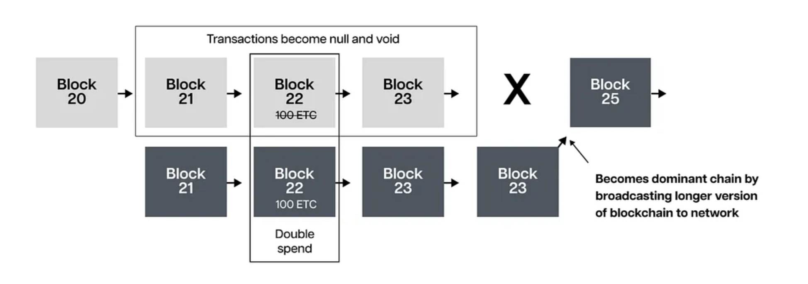

##### 实例

在2018年，Bitcoin Gold遭遇多次51%攻击，攻击者通过租用算力实现双重支付，损失超过1800万美元。2019年，Ethereum Classic也遭受类似攻击，导致重大财产损失。这些事件揭示了加密货币网络在面对可租用算力时的安全脆弱性，即使是知名的区块链也可能遭受重大安全威胁。

##### 防御措施

为防止51%攻击，可增加网络哈希率，使用PoS或DPoS共识算法，提高大额交易确认数，并部署网络监听与警告系统监测异常算力集中。这些措施可增强区块链的安全性和抵抗攻击的能力。

#### double spending 攻击

##### 介绍

双花攻击利用数字货币的特性多次使用同一笔资金。常见手法包括Race Attack、Finney Attack、Vector76 Attack及51%攻击，通过控制矿工费、区块广播时间或算力，攻击者回滚交易以重复使用资金。

##### 实例

2019年1月，ETC遭受51%攻击，慢雾预警，攻击者利用租借算力实施12次双花，盗取约110万美元。所幸在社区努力下，攻击者一周后归还所得。

##### 防御措施

为防御双重支付攻击，区块链可采纳多策略：提高交易确认次数、使用中心化验证机制加快交易审核、部署网络监控工具检测异常、实行交易锁定防资金重用、为大额交易加入多重签名等二次验证措施。

#### 粉尘攻击

##### 介绍

粉尘攻击通过向私人钱包发送微量代币追踪交易，侵犯用户匿名性。黑客利用粉尘追踪用户地址，可能威胁要求赎金。此攻击也可引发比特币网络拥堵，通过分析混合的交易输出，黑客可获得用户身份信息。

##### 实例

2019年共发生超8起公链被攻击事件，在8月9日，黑客向莱特币发起“粉尘攻击”，受影响的地址达294582个。

##### 防御措施

为防止粉尘攻击，可采取以下措施：交易所如binance、coinbase提供粉尘转换服务；使用VPN隐藏身份；标记小额不明转账以避免使用；将大额资产转移到新的HD钱包隔离风险；忽略含备忘标签的可疑小额支付，避免点击链接。

#### Dos 攻击

##### 介绍

拒绝服务攻击（DoS）通过使目标系统过载或崩溃阻断合法用户访问。常见形式包括缓冲区溢出、ICMP flood（死亡之Ping）、SYN flood 攻击，以及更难追踪的分布式拒绝服务攻击（DDoS），后者由多点发起，更难防御。

##### 实例

第一例被记录的拒绝服务攻击事件发生在2000年2月，当时一名15岁的加拿大黑客以这种攻击攻击亚马逊和eBay网络服务器。从那时起，越来越多的人利用DoS攻击来破坏许多行业的目标（网站）。

##### 防御措施

区块链网络防御DDoS攻击的措施包括：增加节点冗余、限制请求速率、使用DDoS保护服务、实施端点过滤、异步处理请求、加强节点安全配置、采用多样化共识机制及建立应急响应计划。这些策略联合使用提高网络的抵抗力和安全性。

#### 套利攻击

##### 介绍

区块链套利攻击利用市场不一致或智能合约漏洞获利。常见类型包括简单市场套利、跨协议套利、时间差套利、闪电贷套利和操纵预言机的Oracle套利。这些策略在DeFi平台上尤为常见，套利者利用交互差异和延迟获得利益。

##### 实例

攻击者利用WUSDMaster合约中stake函数的漏洞，通过1:1兑换BSC_USDT和WUSD同时执行swap操作，造成WaultSwapPair池子代币失衡实现套利。此攻击导致370枚BEP_ETH被盗并通过Anyswap转移，损失约93万美元。

##### 防御措施

为防御区块链套利攻击，可采取以下策略：确保合约安全审计，使用多源预言机增强数据准确性，限制交易速度并引入滑点减少套利利润，采用复杂价格更新机制，以及监控并限制大额闪电贷，从而维护市场公正和系统安全。

## 参考文献
